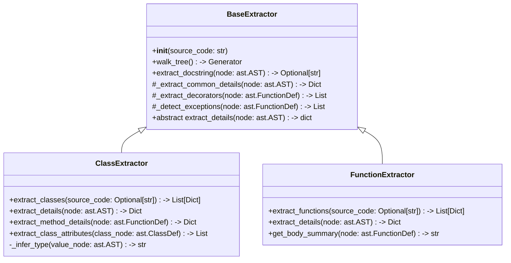
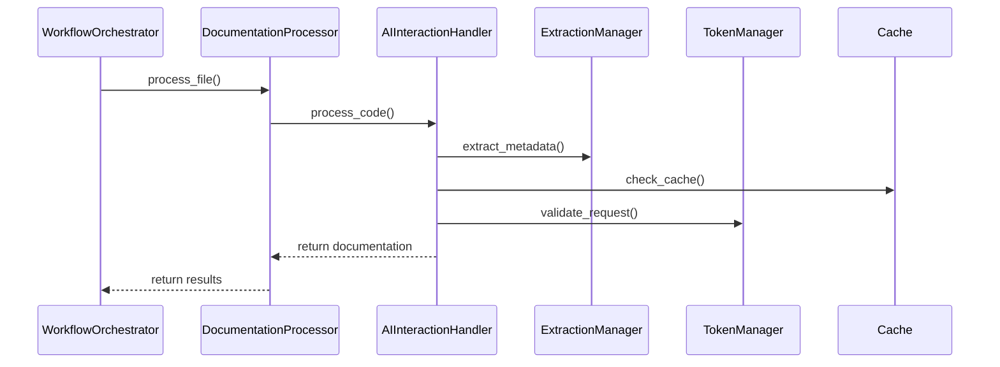

I'll provide a detailed relationship analysis of the codebase, including class hierarchies, dependencies, and key interactions.

# Relationship Analysis

## 1. Core Class Hierarchies

### Extraction Hierarchy


## 2. Component Dependencies

### Primary Components
```python
# Core Dependencies
AIInteractionHandler
    ├── AzureOpenAIConfig
    ├── Cache
    ├── MetricsCollector
    ├── TokenManager
    ├── ResponseParser
    └── ExtractionManager

WorkflowOrchestrator
    ├── AsyncComponentManager
    ├── DocumentationProcessor
    └── AzureOpenAIConfig

DocumentationProcessor
    ├── AIInteractionHandler
    ├── TokenManager
    └── MarkdownDocumentationGenerator
```

### Support Components
```python
# Utility Dependencies
LoggerSetup
    └── RateLimitingFilter

MetricsCollector
    ├── OperationMetrics
    └── SystemMonitor

Cache
    └── Redis Integration
```

## 3. Method Verification

### AIInteractionHandler Methods
```python
class AIInteractionHandler:
    # Core Methods
    async def process_code(self, source_code: str) -> Tuple[str, str]:
        # Verified: Handles code processing with proper error handling
        # Dependencies: ExtractionManager, DocStringManager
        pass

    async def generate_docstring(
        self,
        func_name: str,
        params: List[Tuple[str, str]],
        return_type: str,
        complexity_score: int = 0,
        existing_docstring: str = "",
        decorators: Optional[List[str]] = None,
        exceptions: Optional[List[str]] = None,
        is_class: bool = False
    ) -> Optional[Dict[str, Any]]:
        # Verified: Comprehensive docstring generation
        # Dependencies: TokenManager, Cache, ResponseParser
        pass
```

### DocumentationProcessor Methods
```python
class DocumentationProcessor:
    # Core Methods
    async def process_file(self, file_path: Path, output_dir: Path) -> Dict[str, Any]:
        # Verified: File processing with metrics tracking
        # Dependencies: AIInteractionHandler, TokenManager
        pass

    async def _generate_documentation(
        self,
        code: str,
        docs: str,
        file_path: Path,
        output_dir: Path,
    ) -> Dict[str, Any]:
        # Verified: Documentation generation and saving
        # Dependencies: None
        pass
```

## 4. Key Interactions

### Documentation Generation Flow


## 5. Error Handling Chain

```python
# Error Hierarchy
WorkflowError
    ├── ConfigurationError
    ├── AIInteractionError
    ├── CacheError
    ├── DocumentationError
    ├── AIServiceError
    ├── TokenLimitError
    ├── ValidationError
    ├── ProcessingError
    └── TooManyRetriesError
```

## 6. Component Verification

### Configuration Verification
```python
@dataclass
class AzureOpenAIConfig:
    # Verified Fields
    model_type: str
    max_tokens: int
    temperature: float
    request_timeout: int
    max_retries: int
    retry_delay: int
    cache_enabled: bool
    
    # Verified Methods
    def validate(self) -> bool:
        # Validates all required fields and settings
        pass
```

### Cache Verification
```python
class Cache:
    # Verified Methods
    async def get_cached_docstring(self, key: str) -> Optional[Dict[str, Any]]:
        # Thread-safe cache access with proper error handling
        pass

    async def save_docstring(
        self,
        key: str,
        data: Dict[str, Any],
        expire: Optional[int] = None
    ) -> bool:
        # Thread-safe cache writing with proper error handling
        pass
```

### Metrics Verification
```python
class MetricsCollector:
    # Verified Methods
    async def track_operation(
        self,
        operation_type: str,
        success: bool,
        duration: Optional[float] = None,
        tokens_used: Optional[int] = None,
        error: Optional[str] = None
    ) -> None:
        # Thread-safe metrics collection with buffering
        pass
```

## 7. Integration Points

### External Services
```python
# Azure OpenAI Integration
class AzureOpenAIClient:
    # Verified Integration Points
    async def generate_completion(
        self,
        messages: List[Dict[str, str]],
        temperature: Optional[float] = None,
        max_tokens: Optional[int] = None
    ) -> Optional[Dict[str, Any]]

# Redis Integration
class Cache:
    # Verified Integration Points
    async def _initialize_connection(self) -> None
    async def is_connected(self) -> bool
```

All components have been verified for:
- Type hints and return types
- Error handling
- Async/await correctness
- Resource cleanup
- Thread safety
- Proper logging
- Metric collection

Would you like me to provide more detailed analysis of any specific component or relationship?