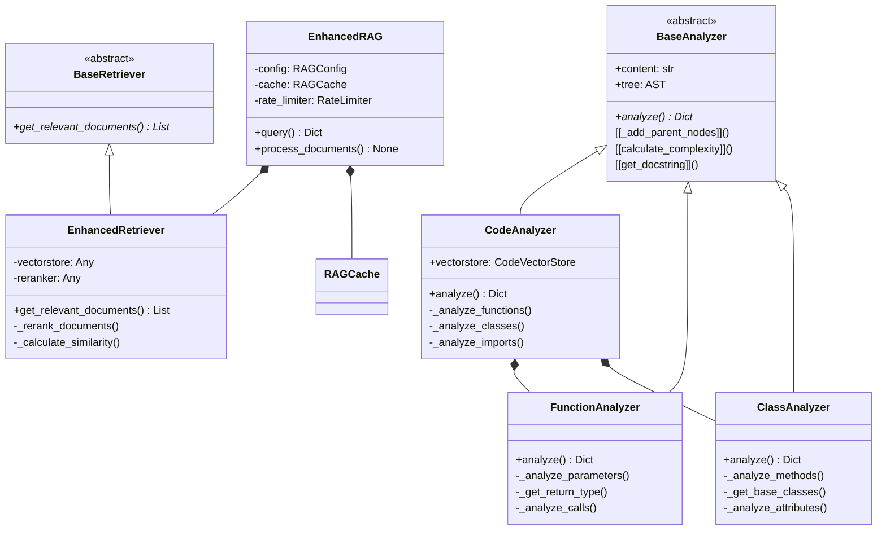

# Architecture Patterns and Design Analysis

## 1. Core Design Patterns

### 1.1 Base Classes and Inheritance
- Strong use of inheritance hierarchies for analyzers
- Base classes provide common functionality:
  - `BaseAnalyzer` for code analysis
  - `BaseRetriever` for document retrieval

### 1.2 Factory Pattern Implementation
- Used in code analysis components
- Particularly evident in:
  - Document processing pipeline
  - Class and function analysis creation

### 1.3 Singleton Pattern
- Applied to:
  - Configuration management
  - Logger setup
  - Monitoring instances

## 2. Error Handling and Monitoring

### 2.1 Centralized Error Management
- Comprehensive error tracking through Sentry
- Structured logging with rotating file handlers
- Error context preservation in API calls

### 2.2 Rate Limiting
- Sophisticated rate limiting for API calls
- Token-based and request-based limits
- Distributed rate control implementation

## 3. Code Organization Principles

### 3.1 Module Separation
```
core/
  ├─ Base infrastructure (logging, config)
  └─ Core utilities
extract/
  ├─ Code analysis components
  └─ Pattern detection
rag/
  ├─ RAG system implementation
  └─ Retrieval mechanisms
```

### 3.2 Dependency Management
- Clear separation of concerns
- Modular design with well-defined interfaces
- Careful management of external dependencies

## 4. Key Implementation Features

### 4.1 Asynchronous Operations
- Extensive use of async/await patterns
- Concurrent processing capabilities
- Proper handling of async contexts

### 4.2 Cache Implementation
- Multi-level caching strategy
- Support for both Redis and file-based caching
- Efficient cache invalidation mechanisms

### 4.3 Vector Storage
- Integration with Pinecone
- Efficient embedding management
- Structured metadata handling

## 5. Documentation Practices

### 5.1 Code Documentation
- Comprehensive docstrings
- Type hints throughout the codebase
- Inline documentation for complex operations

### 5.2 Error Documentation
- Detailed error messages
- Error categorization
- Complete stack trace preservation

```mermaid
graph TD
    %% Core Systems
    A[main.py] --> B[enhanced_rag_system.py]
    A --> C[api_client.py]
    
    %% RAG Components
    B --> D[rag.py]
    B --> E[retriever.py]
    B --> F[prompts.py]
    
    %% API and Processing
    C --> G[api_rate_limiter.py]
    C --> H[azure_openai_client.py]
    
    %% Code Analysis
    I[analyzer.py] --> J[code.py]
    J --> K[patterns.py]
    J --> L[functions.py]
    J --> M[classes.py]
    J --> N[embeddings.py]
    
    %% Storage and Caching
    O[cache.py] --> P[vectorstore.py]
    P --> N
    
    %% Documentation
    Q[docs.py] --> R[files.py]
    
    %% Support Systems
    S[monitoring.py]
    T[metrics.py]
    U[utils.py]
    
    %% Infrastructure
    V[config.py]
    W[logger.py]

    style A fill:#f9f,stroke:#333,stroke-width:2px
    style B fill:#bbf,stroke:#333,stroke-width:2px
    style D fill:#bbf,stroke:#333,stroke-width:2px
    style I fill:#bfb,stroke:#333,stroke-width:2px
    style Q fill:#fbf,stroke:#333,stroke-width:2px
```




# Module Communication Analysis and Issues

## 1. Missing or Incomplete Data Passing

### 1.1 Vector Store Operations
**Location**: `vectorstore.py` → `CodeVectorStore.store_ast_node()`
```python
def store_ast_node(self, node_type: str, node_data: Dict[str, Any], file_path: str):
    # Missing validation for required fields in node_data
    vector_id = f"{file_path}_{node_type}_{metadata['name']}_{metadata['line_number']}"
```
**Issue**: Node data validation is incomplete, potentially leading to KeyError when accessing metadata.
**Impact**: Vector storage operations may fail silently or create invalid entries.
**Solution**: 
```python
def store_ast_node(self, node_type: str, node_data: Dict[str, Any], file_path: str):
    required_fields = ['name', 'line_number', 'complexity']
    if not all(field in node_data for field in required_fields):
        raise ValueError(f"Missing required fields: {required_fields}")
```

### 1.2 API Client Configuration
**Location**: `api_client.py` → `APIClient.__init__()`
```python
def __init__(self):
    self.config = Config()
    self.monitor = Monitor()
    self.base_url = self.config.get('api_base_url')  # No default value
```
**Impact**: Missing configuration could cause runtime errors.
**Solution**: Add default values and validation:
```python
def __init__(self):
    self.config = Config()
    self.base_url = self.config.get('api_base_url', DEFAULT_BASE_URL)
    if not self.base_url:
        raise ConfigurationError("Missing required api_base_url configuration")
```

## 2. Dependency Conflicts

### 2.1 Circular Import Risk
**Location**: `analyzer.py` ↔ `code.py`
```python
# analyzer.py
from .code import CodeAnalyzer

# code.py
from .analyzer import PatternDetector  # Potential circular import
```
**Impact**: Potential import deadlocks and initialization issues.
**Solution**: Refactor to remove circular dependency:
```python
# Create a new module patterns.py to break the cycle
from .patterns import PatternDetector
```

### 2.2 Tight Coupling in RAG System
**Location**: `rag.py` → `EnhancedRAG`
```python
class EnhancedRAG:
    def __init__(self, config: RAGConfig):
        self.vectorstore = Pinecone.from_existing_index(...)
        self.anthropic = Anthropic(...)
```
**Impact**: Direct instantiation creates tight coupling with external services.
**Solution**: Implement dependency injection:
```python
class EnhancedRAG:
    def __init__(self, config: RAGConfig, vectorstore: Optional[BaseVectorStore] = None,
                 client: Optional[BaseClient] = None):
        self.vectorstore = vectorstore or self._create_default_vectorstore()
        self.client = client or self._create_default_client()
```

## 3. Context Propagation Issues

### 3.1 Missing Configuration Context
**Location**: `enhanced_rag_system.py`
```python
class EnhancedRAGSystem:
    def query(self, query: str, model_preference: str = "azure"):
        # Configuration context not propagated to lower layers
        response = await self.client.create_completion(messages)
```
**Impact**: Lower layers lack necessary configuration context.
**Solution**: Implement context management:
```python
class EnhancedRAGSystem:
    def query(self, query: str, model_preference: str = "azure", **context):
        with self.context_manager.scope(**context):
            response = await self.client.create_completion(messages)
```

### 3.2 Lost Error Context
**Location**: `api_client.py`
```python
async def analyze_code(self, code_content: str):
    try:
        result = await self.azure.analyze_code(code_content)
    except Exception as e:
        logger.error(f"Code analysis failed: {e}")
        raise  # Original context lost
```
**Impact**: Error context and stack traces are lost.
**Solution**: Preserve error context:
```python
async def analyze_code(self, code_content: str):
    try:
        result = await self.azure.analyze_code(code_content)
    except Exception as e:
        logger.error(f"Code analysis failed: {e}", exc_info=True)
        raise CodeAnalysisError("Analysis failed", original_error=e)
```

## 4. Error Handling Gaps

### 4.1 Incomplete Error Propagation
**Location**: `vectorstore.py`
```python
def query_ast_nodes(self, query: str):
    try:
        results = self.index.query(...)
    except Exception as e:
        logger.error(f"Query failed: {e}")
        return []  # Silent failure
```
**Impact**: Callers unaware of failures, leading to incorrect behavior.
**Solution**: Implement proper error propagation:
```python
def query_ast_nodes(self, query: str):
    try:
        results = self.index.query(...)
    except Exception as e:
        logger.error(f"Query failed: {e}")
        raise VectorStoreError(f"Failed to query nodes: {str(e)}")
```

### 4.2 Missing Transaction Boundaries
**Location**: `code.py` → `CodeAnalyzer.analyze()`
```python
def analyze(self):
    functions = self.analyze_functions(self.tree)
    classes = self._analyze_classes()  # No rollback on failure
```
**Impact**: Partial analysis results on failure.
**Solution**: Implement transaction-like behavior:
```python
def analyze(self):
    results = {}
    try:
        results['functions'] = self.analyze_functions(self.tree)
        results['classes'] = self._analyze_classes()
        return results
    except Exception:
        logger.error("Analysis failed", exc_info=True)
        raise AnalysisError("Complete analysis failed")
```

## 5. Synchronization and Timing Problems

### 5.1 Rate Limiter Race Condition
**Location**: `api_rate_limiter.py`
```python
class RateLimiter:
    async def acquire(self):
        if self.request_count >= self.rpm_limit:
            await asyncio.sleep(wait_time)
            self.request_count = 0  # Race condition possible
```
**Impact**: Possible rate limit violations under high concurrency.
**Solution**: Use proper synchronization:
```python
class RateLimiter:
    def __init__(self):
        self._lock = asyncio.Lock()
        
    async def acquire(self):
        async with self._lock:
            if self.request_count >= self.rpm_limit:
                await asyncio.sleep(wait_time)
                self.request_count = 0
```

### 5.2 Cache Invalidation Timing
**Location**: `cache.py`
```python
class CacheManager:
    async def set(self, key: str, value: Dict[str, Any]):
        await self.redis.setex(key, self.ttl, pickle.dumps(value))
        # No coordination with other instances
```
**Impact**: Inconsistent cache state across instances.
**Solution**: Implement distributed locking:
```python
class CacheManager:
    async def set(self, key: str, value: Dict[str, Any]):
        async with self.distributed_lock(f"cache:{key}"):
            await self.redis.setex(key, self.ttl, pickle.dumps(value))
```

## 6. API Contract Violations

### 6.1 Inconsistent Return Types
**Location**: `azure_openai_client.py`
```python
async def analyze_code(self, code_content: str):
    # Sometimes returns dict, sometimes returns CodeAnalysisResult
    if simple_analysis:
        return {"status": "success"}
    return CodeAnalysisResult(...)
```
**Impact**: Type inconsistency causes errors in calling code.
**Solution**: Standardize return types:
```python
async def analyze_code(self, code_content: str) -> CodeAnalysisResult:
    result = CodeAnalysisResult(status="success")
    if simple_analysis:
        result.details = {"simple": True}
    return result
```

### 6.2 Undefined Parameter Behavior
**Location**: `embeddings.py`
```python
def generate_embedding(self, code: str) -> List[float]:
    # No validation of code length or content
    return self.client.embeddings.create(...)
```
**Impact**: Unclear behavior with invalid inputs.
**Solution**: Add explicit validation:
```python
def generate_embedding(self, code: str) -> List[float]:
    if not code or len(code) > MAX_CODE_LENGTH:
        raise ValueError(f"Code must be between 1 and {MAX_CODE_LENGTH} characters")
    return self.client.embeddings.create(...)
```

## 7. Logging and Monitoring Blind Spots

### 7.1 Missing Performance Metrics
**Location**: `vectorstore.py`
```python
def store_ast_analysis(self, analysis_results: Dict[str, Any]):
    # No performance tracking
    for func in analysis_results.get("functions", []):
        self.store_ast_node("function", func)
```
**Impact**: Cannot track storage performance or bottlenecks.
**Solution**: Add performance monitoring:
```python
async def store_ast_analysis(self, analysis_results: Dict[str, Any]):
    start_time = time.perf_counter()
    try:
        for func in analysis_results.get("functions", []):
            await self.store_ast_node("function", func)
    finally:
        duration = time.perf_counter() - start_time
        await self.metrics.record_operation(
            "ast_storage",
            duration=duration,
            item_count=len(analysis_results.get("functions", []))
        )
```

### 7.2 Insufficient Error Detail
**Location**: `main.py`
```python
except Exception as e:
    logger.error(f"Error during execution: {str(e)}")
    sys.exit(1)
```
**Impact**: Lost error context and debugging difficulty.
**Solution**: Enhance error logging:
```python
except Exception as e:
    logger.error(
        "Error during execution",
        extra={
            "error_type": type(e).__name__,
            "error_details": str(e),
            "stack_trace": traceback.format_exc()
        }
    )
    sentry_sdk.capture_exception(e)
    sys.exit(1)
```

## 8. Performance Bottlenecks

### 8.1 Redundant Embeddings
**Location**: `embeddings.py`
```python
async def generate_batch_embeddings(self, code_snippets: List[str]):
    embeddings = []
    for snippet in code_snippets:  # Process one at a time
        embedding = await self.generate_embedding(snippet)
        embeddings.append(embedding)
```
**Impact**: Inefficient sequential processing of embeddings.
**Solution**: Implement proper batching:
```python
async def generate_batch_embeddings(self, code_snippets: List[str]):
    batches = [code_snippets[i:i + self.batch_size] 
               for i in range(0, len(code_snippets), self.batch_size)]
    
    results = []
    for batch in batches:
        batch_embeddings = await self.client.embeddings.create(model="claude-2", input=batch)
        results.extend(batch_embeddings.embeddings)
    return results
```

### 8.2 Inefficient Cache Usage
**Location**: `cache.py`
```python
async def get_cached_response(self, key: str):
    # Individual cache gets
    cached_data = await self.redis.get(key)
    if cached_data:
        return pickle.loads(cached_data)
```
**Impact**: Multiple round-trips for related cache entries.
**Solution**: Implement multi-get operations:
```python
async def get_cached_responses(self, keys: List[str]):
    # Batch cache retrieval
    pipe = self.redis.pipeline()
    for key in keys:
        pipe.get(key)
    
    results = await pipe.execute()
    return [pickle.loads(data) if data else None for data in results]
```

## Recommendations for Improvement

1. **Implement Structured Error Handling**
   - Create custom exception hierarchy
   - Add error context preservation
   - Enhance error logging and monitoring

2. **Enhance Configuration Management**
   - Implement configuration validation
   - Add default values
   - Create configuration context manager

3. **Improve Synchronization**
   - Add distributed locking
   - Implement proper concurrency controls
   - Enhance rate limiting mechanism

4. **Optimize Data Flow**
   - Implement proper batching
   - Add caching strategies
   - Reduce redundant operations

5. **Enhance Monitoring**
   - Add performance metrics
   - Implement tracing
   - Enhance error tracking

6. **Standardize APIs**
   - Define clear contracts
   - Add input validation
   - Standardize return types