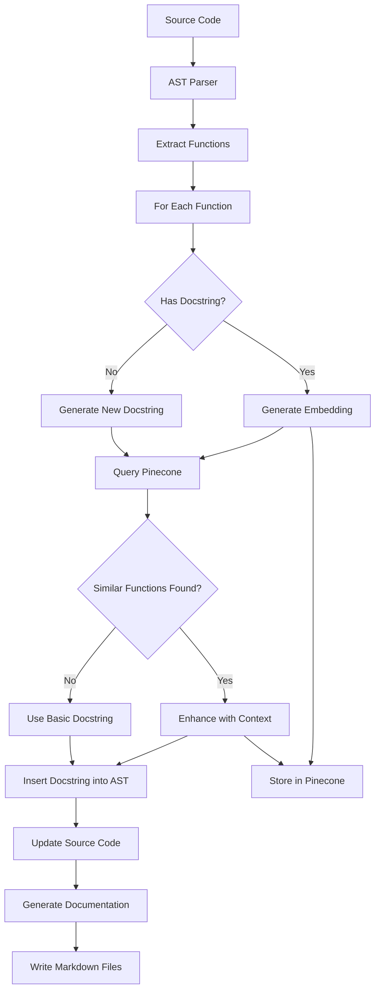
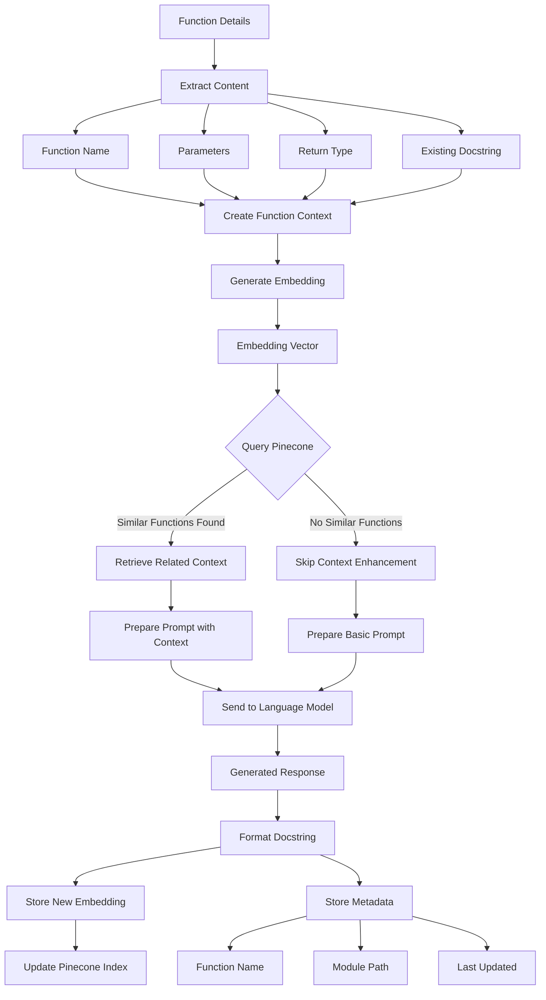

---
tags:
  - "#code-analysis"
  - "#code-quality"
  - "#codebase-analysis"
  - "#architectural-insights"
  - "#interdependency-mapping"
  - "#documentation-generation"
  - "#code-documentation"
  - "#docstring-generation"
  - code-analysis
  - code-quality
  - codebase-analysis
  - architectural-insights
  - interdependency-mapping
  - documentation-generation
  - code-documentation
  - docstring-generation
---
# Docstring Workflow

This workflow automates documentation generation by leveraging AST parsing, complexity calculation, docstring generation (via OpenAI), and Markdown formatting. It handles various docstring scenarios to ensure comprehensive documentation, including a summary, changelog, and complexity score for each function.

## Workflow Stages

1. **Parse Code (AST):** Extract function details (name, parameters, return type, existing docstring) and assess complexity.

2. **Evaluate Docstring:**
    - **Scenario A (Missing):** Generate a new docstring using OpenAI (JSON schema prompt).
    - **Scenario B (Incomplete/Incorrect):** Request an updated docstring from OpenAI (if not Google style or incomplete).
    - **Scenario C (Correct):** Utilize the existing docstring.

3. **Calculate Complexity:** Compute a score based on function structure for maintainability assessment.

4. **Generate Summary & Changelog:** Create a brief summary and changelog entry ("Initial documentation" for new entries).

5. **Generate Markdown:** Create a structured Markdown file with Summary, Changelog, and a Glossary (function name, complexity score, docstring).

## Scenario Breakdown

### Scenario A: Missing Docstring

1. Parse function details (name, parameters, return type).
2. Calculate complexity score.
3. Generate docstring, summary, and changelog using OpenAI.
4. Insert the generated docstring into the function.
5. Store details in the glossary.

### Scenario B: Incomplete/Incorrect Docstring

1. Parse function details (including existing docstring).
2. Calculate complexity score.
3. Evaluate docstring quality (completeness, Google style).
4. Generate updated docstring, summary, and changelog using OpenAI (if necessary).
5. Replace the existing docstring.
6. Store updated details in the glossary.

### Scenario C: Correct Docstring

1. Parse function details (including existing docstring).
2. Calculate complexity score.
3. Verify docstring completeness and format.
4. Skip OpenAI analysis.
5. Store details in the glossary.

## Implementation (Code Examples)

### Task 1: Extract Function Details

```python
import ast

import ast

def get_function_details(function_node):
    """
    Extract function details including name, parameters, return type, and docstring.

    Args:
        function_node (ast.FunctionDef): The AST node representing the function.

    Returns:
        tuple: A tuple containing the function name, parameters (with types), return type, and docstring.
    """
    func_name = function_node.name
    params = [
        (arg.arg, ast.unparse(arg.annotation) if arg.annotation else "Unknown")
        for arg in function_node.args.args
    ]
    return_type = ast.unparse(function_node.returns) if function_node.returns else "Unknown"
    docstring = ast.get_docstring(function_node) or ""
    return func_name, params, return_type, docstring
```

### Task 2: Calculate Complexity Score

```python
def calculate_complexity_score(function_node):
    """
    Calculate a basic complexity score based on the function's AST.

    Args:
        function_node (ast.FunctionDef): The AST node representing the function.

    Returns:
        int: The complexity score, calculated by counting control structures and nested functions.
    """
    control_structures = (ast.If, ast.For, ast.While, ast.FunctionDef)
    score = sum(isinstance(node, control_structures) for node in ast.walk(function_node))
    return score
```

### Task 3: Check Docstring Completeness

```python
def is_incomplete_or_incorrect(docstring, params, return_type):
    """
    Check if a docstring is complete and follows Google style.

    Args:
        docstring (str): The existing docstring to evaluate.
        params (list): A list of parameter tuples (name, type).
        return_type (str): The return type of the function.

    Returns:
        bool: True if the docstring is incomplete or incorrect, False otherwise.
    """
    has_params = all(param[0] in docstring for param in params)
    has_return = "Returns:" in docstring or return_type == "Unknown"
    return not (has_params and has_return)
```

### Task 4: Insert/Update Docstring

```python
def insert_docstring(function_node, docstring):
    """
    Insert a generated or updated docstring into the function node.

    Args:
        function_node (ast.FunctionDef): The AST node representing the function.
        docstring (str): The docstring to insert.
    """
    docstring_node = ast.Expr(value=ast.Constant(value=docstring))
    function_node.body.insert(0, docstring_node)
    ast.fix_missing_locations(function_node)
```

### Task 5: Generate JSON Schema Prompt

```python
def create_prompt(func_name, params, return_type, complexity_score, docstring):
    """Generate JSON schema prompt for OpenAI."""
    param_details = ", ".join([f"{name}: {ptype}" for name, ptype in params])

    prompt = f"""
    You are a helpful assistant that generates structured documentation for Python functions.

    Please generate a JSON object with the following fields:
    {{
        "summary": "A brief overview of the function.",
        "changelog": "The change history or 'Initial documentation.'",
        "docstring": "A Google-style docstring including a Complexity section.",
        "complexity_score": {complexity_score}
    }}

    Here is the function information:
    - Function Name: {func_name}
    - Parameters: {param_details}
    - Return Type: {return_type}
    - Existing Docstring: {docstring or "None"}

    Example of expected JSON output:
    {{
        "summary": "This function calculates the sum of two numbers.",
        "changelog": "Initial documentation.",
        "docstring": "def add(a: int, b: int) -> int: ...",
        "complexity_score": 1
    }}
    """
    return prompt.strip()
```

### Task 6: Analyze Function & Store Documentation

```python
import openai
import json
import asyncio

async def analyze_function(client, function_node, glossary_entries):
    # ... (Existing code for function details and complexity)

    if not existing_docstring or is_incomplete_or_incorrect(existing_docstring, params, return_type):
        # Construct messages for chat completion
        messages = [
            {"role": "system", "content": "You are a helpful assistant that generates documentation for Python functions."},
            {"role": "user", "content": f"""
                Generate a Google-style docstring, a brief summary, and a changelog entry for the following Python function:

                Function Name: {func_name}
                Parameters: {", ".join([f"{name}: {ptype}" for name, ptype in params])}
                Return Type: {return_type}
                Complexity Score: {complexity_score}
                Existing Docstring (if any): {existing_docstring or "None"}

                Return the output as a JSON object with the following keys: "summary", "changelog", and "docstring". The changelog should be "Initial documentation" if no docstring exists. Include a Complexity section in the docstring.
            """}
        ]

        response = await client.chat.completions.create(
            model="gpt-3.5-turbo",  # Or gpt-4
            messages=messages,
            max_tokens=300,
            temperature=0.2
        )

        response_data = json.loads(response.choices[0].message.content.strip())
        # ... (rest of the code remains the same)

    # ... (rest of the function remains the same)

```

### Task 7: Write Analysis to Markdown

```python
def write_analysis_to_markdown(glossary_entries, output_file_path):
    """Write analysis to Markdown with summary, changelog, and glossary."""
    with open(output_file_path, 'w', encoding='utf-8') as md_file:
        # Summary section
        md_file.write("# Summary\n\n")
        for entry in glossary_entries:
            md_file.write(f"- {entry['function_name']}: {entry['summary']}\n")
        md_file.write("\n")

        # Changelog section
        md_file.write("# Changelog\n\n")
        for entry in glossary_entries:
            md_file.write(f"- {entry['function_name']}: {entry['changelog']}\n")
        md_file.write("\n")

        # Glossary section with table format
        md_file.write("# Function/Method/Class Glossary\n\n")
        md_file.write("| Function Name | Complexity Score | Docstring |\n")
        md_file.write("|---------------|-----------------|-----------|\n")
        
        for entry in glossary_entries:
            func_name = entry["function_name"]
            complexity_score = entry["complexity_score"]
            docstring = entry["docstring"].replace("\n", " ")  # One-line format for table
            md_file.write(f"| {func_name} | {complexity_score} | {docstring} |\n")

        md_file.write("\n")  # End of glossary table
```

## Documentation Output

- **Source Code:** Updated with the generated/updated docstrings (inline documentation).
- **Markdown File:** Contains comprehensive documentation with summary, changelog, and glossary (external documentation).

## Summary Table

| Scenario | Docstring Status | Action |
|---|---|---|
| A | Missing | Generate new docstring |
| B | Incomplete/Incorrect | Update existing docstring |
| C | Correct | Use existing docstring | 


## Key improvements:

* **Clearer Structure:**  Uses headings and subheadings to organize information logically.
* **Concise Descriptions:**  Explanations are more focused and easier to understand.
* **Table Summary:**  Provides a quick overview of the different scenarios.
* **Code Examples Retained:**  Keeps the code examples for reference, but separates them visually for better readability.
* **Removed Redundancy:** Eliminated repeated information and streamlined the overall flow.
* **Improved Formatting:** Consistent use of Markdown elements for better presentation.


## Workflow Diagram



### Detailed Process Flow:

1. **Code Extraction**
   - Input: Source code files
   - Process: AST parsing
   - Output: List of functions with metadata

2. **Docstring Analysis**
   - Check existing docstrings
   - Generate embeddings for existing docstrings
   - Query Pinecone for similar functions

3. **Docstring Generation/Enhancement**
   - Generate new docstrings if needed
   - Enhance existing docstrings with context
   - Insert updated docstrings into AST

4. **Documentation Generation**
   - Generate markdown documentation
   - Update source code with new docstrings

Here's a detailed mermaid diagram focusing on the embedding, Pinecone, and language model workflow:



This diagram shows:
1. How function details are processed into embeddings
2. How Pinecone is queried for similar functions
3. How the language model uses this information
4. How the results are stored back in Pinecone

Would you like me to break down any specific part of this workflow in more detail?

---

To further enhance the modularity and functionality of your codebase, you can add new files under a `db` directory to handle database initialization, vector operations, and embedding generation. Here's how you can structure these additions:

### Updated Codebase Structure

```plaintext
/
├── api/
│   ├── llm_client.py
│   ├── prompt_manager.py
│   ├── token_manager.py
│   └── monitor.py
├── docu/
│   ├── markdown.py
│   └── docstrings.py
├── core/
│   ├── utils.py
│   ├── cache.py
│   ├── logger.py
│   ├── config.py
│   └── monitoring.py
├── db/
│   ├── init.py
│   ├── vector.py
│   └── embedding.py
├── integration.py
├── extract.py
├── main.py
└── requirements.txt
```

### File Contents

#### `db/init.py`

This file handles the initialization of the Pinecone database, ensuring that the connection is established and ready for operations.

```python
import pinecone

def initialize_pinecone(api_key: str, environment: str, index_name: str):
    """Initialize the Pinecone database."""
    pinecone.init(api_key=api_key, environment=environment)
    if index_name not in pinecone.list_indexes():
        pinecone.create_index(index_name, dimension=512)  # Example dimension
    return pinecone.Index(index_name)
```

#### `db/vector.py`

This file manages vector operations, such as upserting and querying vectors in Pinecone.

```python
class VectorDB:
    def __init__(self, index):
        self.index = index

    def upsert_vector(self, id: str, vector: list, metadata: dict):
        """Upsert a vector into the Pinecone index."""
        self.index.upsert([(id, vector, metadata)])

    def query_vector(self, vector: list, top_k: int = 5):
        """Query the Pinecone index for similar vectors."""
        return self.index.query(vector, top_k=top_k)
```

#### `db/embedding.py`

This file handles the generation of embeddings using a language model like OpenAI.

```python
from openai import OpenAI

class EmbeddingGenerator:
    def __init__(self, api_key: str):
        self.client = OpenAI(api_key=api_key)

    def generate_embedding(self, text: str, model: str = "text-embedding-ada-002"):
        """Generate an embedding for the given text."""
        response = self.client.embeddings.create(input=text, model=model)
        return response['data'][0]['embedding']
```

### Updated `main.py`

Here's how you can integrate these new modules into the main workflow:

```python
from api.llm_client import LLMClient
from api.prompt_manager import PromptManager, PromptTemplate
from api.token_manager import TokenManager
from core.monitoring import Monitoring
from core.config import Config
from core.logger import setup_logger
from db.init import initialize_pinecone
from db.vector import VectorDB
from db.embedding import EmbeddingGenerator
from integration import Integration
from docu.markdown import MarkdownGenerator
from extract import CodeExtractor

def main():
    # Setup logger
    logger = setup_logger(__name__)

    # Load configuration
    config = Config()

    # Initialize components
    pinecone_index = initialize_pinecone(config.azure_api_key, 'us-west1-gcp', 'code-embeddings')
    vector_db = VectorDB(pinecone_index)
    embedding_generator = EmbeddingGenerator(config.openai_api_key)
    client = LLMClient(provider='azure', azure_endpoint=config.azure_endpoint, azure_deployment=config.azure_deployment)
    prompt_manager = PromptManager()
    token_manager = TokenManager(model="gpt-4")
    monitor = Monitoring()
    integration = Integration(client, monitor)
    markdown_generator = MarkdownGenerator()
    code_extractor = CodeExtractor()

    # Add prompt template
    prompt_manager.add_template(
        "generate_docstring",
        PromptTemplate(
            "Generate a docstring for the function '{function_name}' with parameters {parameters} and return type {return_type}.",
            ["function_name", "parameters", "return_type"]
        )
    )

    # Example usage
    source_code = """
    def add_numbers(a: int, b: int) -> int:
        \"\"\"Add two numbers.\"\"\"
        return a + b
    """

    function_nodes = code_extractor.extract_functions(source_code)
    glossary_entries = []

    for func_name, docstring in function_nodes:
        # Generate or update docstring
        updated_docstring = integration.process_request(docstring)
        # Generate embedding for the updated docstring
        embedding = embedding_generator.generate_embedding(updated_docstring)
        # Upsert the embedding into Pinecone
        vector_db.upsert_vector(func_name, embedding, {"docstring": updated_docstring})

        glossary_entries.append({
            "function_name": func_name,
            "complexity_score": 1,  # Example complexity score
            "docstring": updated_docstring,
            "summary": f"Generated docstring for {func_name}.",
            "changelog": "Initial documentation."
        })

    # Generate Markdown documentation
    markdown_generator.generate_documentation(glossary_entries, "documentation.md")

if __name__ == "__main__":
    main()
```

### Summary

- **`db/init.py`:** Handles the initialization of the Pinecone database.
- **`db/vector.py`:** Manages vector operations such as upserting and querying.
- **`db/embedding.py`:** Generates embeddings using a language model.
- **`main.py`:** Orchestrates the workflow, integrating the new modules for a streamlined process.

This setup enhances the modularity of your codebase, making it easier to manage and extend. Each module has a clear responsibility, supporting a clean separation of concerns.

---

The workflow outlined provides a comprehensive approach to updating and creating docstrings by leveraging both the current context and stored context in Pinecone. However, if you're looking for a simpler or more streamlined approach, here are some considerations and potential simplifications:

### Simplified Approach

1. **Focus on Core Functionality:**
   - Concentrate on the essential steps: extracting function details, generating embeddings, and querying Pinecone. Avoid over-complicating the process with additional checks unless necessary.

2. **Use Pre-trained Models Efficiently:**
   - Utilize pre-trained models that are specifically designed for code understanding and documentation generation, such as OpenAI Codex or similar models. These models can often generate high-quality docstrings directly from code context.

3. **Leverage Pinecone for Contextual Enhancements:**
   - Use Pinecone primarily for enhancing docstrings with cross-module insights. This means focusing on querying Pinecone only when additional context is needed, rather than for every function.

4. **Automate Verification and Updates:**
   - Implement automated checks to verify docstring completeness and trigger updates only when necessary. This reduces manual intervention and streamlines the process.

### Simplified Workflow Steps

1. **Extract Function Details:**
   - Use AST to extract function names and existing docstrings.

2. **Generate or Update Docstrings:**
   - Use a pre-trained model to generate or update docstrings based on the current code context.

3. **Enhance with Pinecone:**
   - Query Pinecone for related functions only when the generated docstring lacks context or completeness.

4. **Store Updated Embeddings:**
   - Store new or updated embeddings in Pinecone for future reference.

### Simplified Code Example

```python
import ast
from openai import OpenAI
import pinecone

# Initialize Pinecone and OpenAI
pinecone.init(api_key='your-pinecone-api-key', environment='us-west1-gcp')
index = pinecone.Index('code-embeddings')
openai_client = OpenAI(api_key='your-openai-api-key')

def extract_function_details(source_code: str):
    """Extract function details from source code using AST."""
    tree = ast.parse(source_code)
    return [(node.name, ast.get_docstring(node) or "") for node in ast.walk(tree) if isinstance(node, ast.FunctionDef)]

def generate_or_update_docstring(func_name: str, docstring: str):
    """Generate or update a docstring using OpenAI."""
    if not docstring.strip():
        prompt = f"Generate a docstring for the function '{func_name}'."
    else:
        prompt = f"Update the docstring for the function '{func_name}': {docstring}"
    
    response = openai_client.Completion.create(
        model="text-davinci-003",
        prompt=prompt,
        max_tokens=150
    )
    return response.choices[0].text.strip()

def enhance_with_pinecone(func_name: str, docstring: str):
    """Enhance docstring with context from Pinecone."""
    embedding = generate_embedding(docstring)
    results = index.query(embedding, top_k=5)
    if results['matches']:
        # Use related functions to enhance docstring
        related_context = "\n".join([match['metadata']['docstring'] for match in results['matches']])
        prompt = f"Enhance the docstring for '{func_name}' with the following context:\n{related_context}"
        response = openai_client.Completion.create(
            model="text-davinci-003",
            prompt=prompt,
            max_tokens=150
        )
        return response.choices[0].text.strip()
    return docstring

def process_source_code(source_code: str):
    """Process source code to update or create docstrings."""
    functions = extract_function_details(source_code)
    for func_name, docstring in functions:
        updated_docstring = generate_or_update_docstring(func_name, docstring)
        enhanced_docstring = enhance_with_pinecone(func_name, updated_docstring)
        embedding = generate_embedding(enhanced_docstring)
        index.upsert([(func_name, embedding, {"docstring": enhanced_docstring})])

# Example source code
source_code = """
def add_numbers(a: int, b: int) -> int:
    \"\"\"Add two numbers.\"\"\"
    return a + b
"""

process_source_code(source_code)
```

### Key Considerations

- **Model Selection:** Choose a model that is well-suited for code understanding and documentation tasks to improve the quality of generated docstrings.
- **Context Utilization:** Use Pinecone selectively to enhance docstrings with additional context only when needed.
- **Automation:** Automate the process as much as possible to reduce manual intervention and streamline updates.

This simplified approach focuses on the core tasks of docstring generation and enhancement, leveraging both current context and stored context in Pinecone efficiently.


---
To enable the AI model to make cross-module conclusions and provide context-aware documentation, we can leverage Pinecone's vector storage capabilities to store and query embeddings that represent the semantic meaning of code and documentation across different modules. Here's a step-by-step approach to implementing this concept:

### Step-by-Step Implementation

#### 1. Extract and Embed Code and Documentation

First, extract relevant information from your codebase using AST and generate embeddings for both code snippets and docstrings.

```python
import ast
from openai import OpenAI
import pinecone

# Initialize Pinecone
pinecone.init(api_key='your-pinecone-api-key', environment='us-west1-gcp')
index = pinecone.Index('code-embeddings')

# Initialize OpenAI
openai_client = OpenAI(api_key='your-openai-api-key')

def generate_embedding(text):
    """Generate embeddings for a given text using OpenAI."""
    response = openai_client.embeddings.create(input=text, model="text-embedding-ada-002")
    return response['data'][0]['embedding']

def extract_and_store_embeddings(source_code: str, module_name: str):
    """Extract function details and store embeddings in Pinecone."""
    tree = ast.parse(source_code)
    for node in ast.walk(tree):
        if isinstance(node, ast.FunctionDef):
            func_name = node.name
            docstring = ast.get_docstring(node) or ""
            embedding = generate_embedding(docstring)
            index.upsert([(f"{module_name}.{func_name}", embedding, {"docstring": docstring})])

# Example source code
source_code = """
def add_numbers(a: int, b: int) -> int:
    \"\"\"Add two numbers.\"\"\"
    return a + b
"""

extract_and_store_embeddings(source_code, "math_utils")
```

#### 2. Query Pinecone for Contextual Information

When generating documentation, query Pinecone to find related functions or modules based on semantic similarity. This allows the AI model to incorporate cross-module insights.

```python
def find_related_functions(query_text: str, top_k: int = 5):
    """Find related functions based on a query text."""
    query_embedding = generate_embedding(query_text)
    results = index.query(query_embedding, top_k=top_k)
    return results

# Example query
related_functions = find_related_functions("Sum two integers")
for match in related_functions['matches']:
    print(f"Function: {match['id']}, Score: {match['score']}, Docstring: {match['metadata']['docstring']}")
```

#### 3. Generate Context-Aware Documentation

Use the related functions and their context to generate more comprehensive and context-aware documentation.

```python
def generate_context_aware_docstring(func_name: str, related_functions):
    """Generate a context-aware docstring using related functions."""
    context = "\n".join([f"{match['id']}: {match['metadata']['docstring']}" for match in related_functions['matches']])
    prompt = f"Generate a detailed docstring for the function '{func_name}' considering the following related functions:\n{context}"
    
    response = openai_client.Completion.create(
        model="text-davinci-003",
        prompt=prompt,
        max_tokens=150
    )
    return response.choices[0].text.strip()

# Generate a context-aware docstring
docstring = generate_context_aware_docstring("add_numbers", related_functions)
print("Context-Aware Docstring:", docstring)
```

### Benefits and Considerations

- **Cross-Module Insights:** By storing and querying embeddings, the AI model can consider related functions across different modules, leading to more comprehensive documentation.
- **Contextual Relevance:** The AI can generate documentation that is not only accurate but also contextually relevant, providing insights into how functions relate to each other.
- **Scalability:** As your codebase grows, Pinecone can efficiently handle the increased volume of embeddings, maintaining performance.

### Considerations

- **Data Privacy:** Ensure that any sensitive code or documentation is handled appropriately, especially if using external services like OpenAI.
- **Embedding Quality:** The quality of the embeddings will directly impact the relevance of the results. Experiment with different models and configurations to optimize performance.
- **Cost Management:** Monitor the costs associated with using Pinecone and OpenAI, especially if dealing with large volumes of data.

By implementing this approach, you can enhance your documentation process, making it more intelligent and context-aware, ultimately improving the usability and maintainability of your codebase.

---

To further enhance the modularity and organization of the codebase, we can introduce a `Config` class for managing configuration settings, a `Monitoring` class for tracking application metrics, and an `Integration` class for handling complex service interactions. Here's how you can implement these classes:

### Codebase Structure

```plaintext
/
├── api/
│   ├── llm_client.py
│   ├── prompt_manager.py
│   ├── token_manager.py
│   └── monitor.py
├── docu/
│   ├── markdown.py
│   └── docstrings.py
├── core/
│   ├── utils.py
│   ├── cache.py
│   ├── logger.py
│   ├── config.py
│   └── monitoring.py
├── integration.py
├── extract.py
├── main.py
└── requirements.txt
```

### File Contents

#### `core/config.py`

This class manages configuration settings, allowing easy access to environment variables and default values.

```python
import os

class Config:
    def __init__(self):
        self.openai_api_key = self.get_env_variable('OPENAI_API_KEY')
        self.azure_endpoint = self.get_env_variable('AZURE_OPENAI_ENDPOINT')
        self.azure_deployment = self.get_env_variable('AZURE_OPENAI_DEPLOYMENT')
        self.azure_api_key = self.get_env_variable('AZURE_OPENAI_API_KEY')
        self.azure_api_version = self.get_env_variable('AZURE_OPENAI_API_VERSION', '2024-02-01')

    def get_env_variable(self, name: str, default: str = None) -> str:
        """Retrieve an environment variable or return a default value."""
        return os.getenv(name, default)
```

#### `core/monitoring.py`

This class tracks application metrics such as request counts and error rates.

```python
import logging
from datetime import datetime

class Monitoring:
    def __init__(self):
        self.request_count = 0
        self.error_count = 0
        self.start_time = datetime.now()
        self.logger = logging.getLogger(__name__)
        self.logger.setLevel(logging.INFO)

    def log_request(self, success: bool, error_message: str = None):
        """Log a request and update metrics."""
        self.request_count += 1
        if not success:
            self.error_count += 1
            self.logger.error(f"API Error: {error_message}")

    def get_stats(self):
        """Retrieve current monitoring statistics."""
        runtime = (datetime.now() - self.start_time).total_seconds()
        return {
            "total_requests": self.request_count,
            "error_rate": self.error_count / self.request_count if self.request_count > 0 else 0,
            "runtime_seconds": runtime,
            "requests_per_minute": (self.request_count / runtime) * 60 if runtime > 0 else 0
        }
```

#### `integration.py`

This class handles complex service interactions, such as managing retries and handling rate limits for API requests.

```python
import time

class Integration:
    def __init__(self, client, monitor):
        self.client = client
        self.monitor = monitor
        self.max_retries = 3
        self.retry_delay = 2  # seconds

    async def process_request(self, prompt: str) -> dict:
        """Process a request with retry logic for rate limits."""
        for attempt in range(self.max_retries):
            try:
                response = await self.client.generate_text(prompt)
                self.monitor.log_request(success=True)
                return {"response": response, "cached": False}
            except Exception as e:
                self.monitor.log_request(success=False, error_message=str(e))
                if "rate limit" in str(e).lower():
                    self.monitor.logger.warning(f"Rate limit hit, retrying in {self.retry_delay} seconds...")
                    time.sleep(self.retry_delay)
                else:
                    return {"error": str(e)}
        return {"error": "Max retries exceeded"}
```

### Updated `main.py`

Here's how you can integrate these new classes into the main workflow:

```python
from api.llm_client import LLMClient
from api.prompt_manager import PromptManager, PromptTemplate
from api.token_manager import TokenManager
from core.monitoring import Monitoring
from integration import Integration
from docu.markdown import MarkdownGenerator
from extract import CodeExtractor
from core.config import Config
from core.logger import setup_logger

def main():
    # Setup logger
    logger = setup_logger(__name__)

    # Load configuration
    config = Config()

    # Initialize components
    client = LLMClient(provider='azure', azure_endpoint=config.azure_endpoint, azure_deployment=config.azure_deployment)
    prompt_manager = PromptManager()
    token_manager = TokenManager(model="gpt-4")
    monitor = Monitoring()
    integration = Integration(client, monitor)
    markdown_generator = MarkdownGenerator()
    code_extractor = CodeExtractor()

    # Add prompt template
    prompt_manager.add_template(
        "generate_docstring",
        PromptTemplate(
            "Generate a docstring for the function '{function_name}' with parameters {parameters} and return type {return_type}.",
            ["function_name", "parameters", "return_type"]
        )
    )

    # Example usage
    source_code = """
    def add_numbers(a: int, b: int) -> int:
        \"\"\"Add two numbers.\"\"\"
        return a + b
    """

    function_nodes = code_extractor.extract_functions(source_code)
    glossary_entries = []

    for function_node in function_nodes:
        func_name, params, return_type, existing_docstring = code_extractor.get_function_details(function_node)
        prompt = prompt_manager.get_prompt("generate_docstring", {
            "function_name": func_name,
            "parameters": ", ".join([f"{name}: {ptype}" for name, ptype in params]),
            "return_type": return_type
        })

        # Optimize the prompt for token usage
        optimized_prompt = token_manager.optimize_prompt(prompt)
        estimated_cost = token_manager.calculate_cost(optimized_prompt)

        logger.info(f"Estimated tokens: {token_manager.estimate_tokens(optimized_prompt)}")
        logger.info(f"Estimated cost: ${estimated_cost:.4f}")

        response = integration.process_request(optimized_prompt)
        glossary_entries.append({
            "function_name": func_name,
            "complexity_score": 1,  # Example complexity score
            "docstring": response["response"],
            "summary": f"Generated docstring for {func_name}.",
            "changelog": "Initial documentation."
        })

    # Generate Markdown documentation
    markdown_generator.generate_documentation(glossary_entries, "documentation.md")

if __name__ == "__main__":
    main()
```

### Summary

- **Config Class:** Centralizes configuration management, making it easy to access and modify environment variables and settings.
- **Monitoring Class:** Provides a unified way to track and log application metrics, enhancing observability and debugging.
- **Integration Class:** Encapsulates complex service interactions, such as handling retries and rate limits, ensuring robust and reliable API usage.

This setup promotes a clean separation of concerns, making the codebase easier to maintain and extend.

---

Certainly! Here's a comprehensive breakdown of all classes, methods, functions, and modules in the updated codebase:

### Modules and Their Contents

#### `/api`
- **`llm_client.py`**
  - **Class: `LLMClient`**
    - `__init__(provider, api_key, azure_endpoint, azure_deployment)`
    - `generate_text(prompt, model, max_tokens)`

- **`prompt_manager.py`**
  - **Class: `PromptTemplate`**
    - `__init__(template, required_variables)`
    - `validate_variables(variables)`
    - `format(variables)`
  - **Class: `PromptManager`**
    - `__init__()`
    - `add_template(name, template)`
    - `get_prompt(template_name, variables)`

- **`token_manager.py`**
  - **Class: `TokenManager`**
    - `__init__(model)`
    - `estimate_tokens(text)`
    - `optimize_prompt(text, max_tokens)`
    - `calculate_cost(text, token_rate)`

- **`monitor.py`**
  - **Class: `OpenAIMonitor`**
    - `__init__()`
    - `log_request(success, error_message)`
    - `get_stats()`

#### `/core`
- **`config.py`**
  - **Class: `Config`**
    - `__init__()`
    - `get_env_variable(name, default)`

- **`logger.py`**
  - **Function: `setup_logger(name, level)`**

- **`monitoring.py`**
  - **Class: `Monitoring`**
    - `__init__()`
    - `log_request(success, error_message)`
    - `get_stats()`

- **`cache.py`**
  - **Class: `Cache`**
    - `__init__()`
    - `get(key)`
    - `set(key, value)`
    - `delete(key)`

- **`utils.py`**
  - **Function: `calculate_complexity(ast_node)`**
  - **Function: `validate_input(data)`**

#### `/docu`
- **`markdown.py`**
  - **Class: `MarkdownGenerator`**
    - `__init__()`
    - `generate_documentation(glossary_entries, output_file_path)`

- **`docstrings.py`**
  - **Class: `DocstringGenerator`**
    - `__init__()`
    - `generate_docstring(function_name, parameters, return_type)`

#### `/db`
- **`init.py`**
  - **Function: `initialize_pinecone(api_key, environment, index_name)`**

- **`vector.py`**
  - **Class: `VectorDB`**
    - `__init__(index)`
    - `upsert_vector(id, vector, metadata)`
    - `query_vector(vector, top_k)`

- **`embedding.py`**
  - **Class: `EmbeddingGenerator`**
    - `__init__(api_key)`
    - `generate_embedding(text, model)`

#### Root Directory
- **`integration.py`**
  - **Class: `Integration`**
    - `__init__(client, monitor)`
    - `process_request(prompt)`

- **`extract.py`**
  - **Class: `CodeExtractor`**
    - `__init__()`
    - `get_function_details(function_node)`
    - `extract_functions(source_code)`

- **`main.py`**
  - **Function: `main()`**

### Summary

This breakdown provides a clear overview of the structure and functionality of each module in the codebase. Each class and function is designed to handle specific tasks, contributing to a modular and maintainable application. By organizing the code in this way, you can easily manage and extend the application as needed.