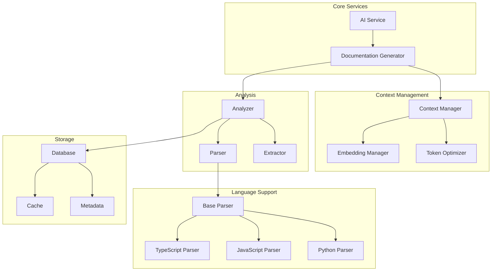

```
doc_generator/
├── config/
│   ├── __init__.py
│   ├── base.py          # Base configuration models
│   ├── service.py       # AI service configurations
│   └── settings.py      # Application settings
│
├── core/
│   ├── __init__.py
│   ├── context/
│   │   ├── __init__.py
│   │   ├── manager.py   # Context management
│   │   ├── optimizer.py # Context optimization
│   │   ├── token.py     # Token management
│   │   └── embedding.py # Embedding management
│   │
│   ├── analysis/
│   │   ├── __init__.py
│   │   ├── analyzer.py  # Integrated analyzer
│   │   ├── extractor.py # Code extraction
│   │   └── parser.py    # Code parsing
│   │
│   ├── storage/
│   │   ├── __init__.py
│   │   ├── database.py  # Database operations
│   │   ├── metadata.py  # Metadata management
│   │   └── cache.py     # Caching system
│   │
│   └── services/
│       ├── __init__.py
│       ├── ai.py        # AI service interface
│       └── docs.py      # Documentation generation
│
├── languages/
│   ├── __init__.py
│   ├── base.py         # Base language parser
│   ├── python.py       # Python parser
│   ├── javascript.py   # JavaScript parser
│   └── typescript.py   # TypeScript parser
│
├── utils/
│   ├── __init__.py
│   ├── validation.py   # Input validation
│   ├── errors.py       # Error definitions
│   └── logging.py      # Logging configuration
│
├── tests/
│   ├── __init__.py
│   ├── conftest.py
│   ├── core/
│   │   ├── test_context.py
│   │   ├── test_analyzer.py
│   │   └── test_storage.py
│   │
│   ├── languages/
│   │   ├── test_python.py
│   │   └── test_javascript.py
│   │
│   └── utils/
│       └── test_validation.py
│
├── data/
│   ├── .gitignore
│   ├── cache/          # Cache storage
│   └── metadata.db     # SQLite database
│
├── docs/
│   ├── api/            # API documentation
│   ├── examples/       # Usage examples
│   └── guides/         # User guides
│
├── scripts/
│   ├── setup.py        # Installation script
│   └── cleanup.py      # Cleanup script
│
├── .env.template       # Environment template
├── config.yaml        # Default configuration
├── main.py           # Application entry
├── README.md         # Project documentation
└── requirements.txt  # Dependencies
```

## Directory Purposes

1. **config/**
   - Configuration management
   - Environment settings
   - Service configurations

2. **core/**
   - Main functionality organized by domain
   - Clean separation of concerns
   - Modular components

3. **languages/**
   - Language-specific parsers
   - Extensible for new languages
   - Common language utilities

4. **utils/**
   - Shared utilities
   - Common functions
   - Error handling

5. **tests/**
   - Mirrors main structure
   - Comprehensive test coverage
   - Testing utilities

6. **data/**
   - Runtime data storage
   - Cache management
   - Database files

7. **docs/**
   - Project documentation
   - API references
   - Usage guides

8. **scripts/**
   - Installation helpers
   - Maintenance scripts
   - Utility scripts

## Key Files

1. **Main Entry Points:**
   - `main.py`: Application entry point
   - `config.yaml`: Default configuration
   - `.env.template`: Environment setup

2. **Core Components:**
   - `core/context/manager.py`: Context management
   - `core/analysis/analyzer.py`: Code analysis
   - `core/storage/database.py`: Data persistence

3. **Language Support:**
   - `languages/base.py`: Base parser class
   - `languages/python.py`: Python support
   - `languages/javascript.py`: JavaScript support

4. **Documentation:**
   - `README.md`: Project overview
   - `docs/`: Detailed documentation
   - `requirements.txt`: Dependencies

## Development Workflow

1. **Configuration:**
   ```bash
   cp .env.template .env
   # Edit .env with your settings
   ```

2. **Installation:**
   ```bash
   python scripts/setup.py
   pip install -r requirements.txt
   ```

3. **Running:**
   ```bash
   python main.py [args]
   ```

4. **Testing:**
   ```bash
   pytest tests/
   ```

## Key Benefits

1. **Organization:**
   - Clear directory structure
   - Logical component grouping
   - Easy to navigate

2. **Modularity:**
   - Independent components
   - Clean interfaces
   - Easy to extend

3. **Maintainability:**
   - Clear file purposes
   - Separated concerns
   - Easy testing

4. **Scalability:**
   - Easy to add features
   - Clean extension points
   - Organized growth
---
# Enhanced AI Documentation Generator Analysis

## 1. Project Overview

### 1.1 Core Purpose and Architecture

The Documentation Generator is designed to serve multiple audience segments:

**Primary Users:**
- Software Development Teams: Generate comprehensive API documentation and docstrings
- Technical Writers: Create and maintain system documentation
- Project Managers: Generate high-level architectural documentation
- Open Source Contributors: Document changes and maintain contribution guidelines

**Key Focus Areas:**
- Automated docstring generation for functions and classes
- API documentation with usage examples
- System architecture documentation
- Cross-references and dependency tracking
- Multi-language support for mixed codebases

**Architectural Goals:**
- Modularity for easy extension
- Context-aware documentation
- Efficient resource utilization
- Language agnostic design

### 1.2 Key Components and Structure



## 2. Key Design Patterns and Principles

### 2.1 Design Patterns

1. **Factory Pattern**
   - **Usage:** Language parser creation
   - **Purpose:** Enables dynamic parser instantiation based on file types
   - **Benefits:**
     - Easy addition of new language support
     - Centralized parser creation logic
     - Runtime parser selection
   ```python
   class ParserFactory:
       @classmethod
       def create_parser(cls, language: str) -> BaseParser:
           parsers = {
               'python': PythonParser,
               'javascript': JavaScriptParser,
               'typescript': TypeScriptParser
           }
           parser_class = parsers.get(language)
           if not parser_class:
               raise UnsupportedLanguageError(language)
           return parser_class()
   ```

2. **Singleton Pattern**
   - **Usage:** Configuration and resource management
   - **Purpose:** Ensure consistent settings and resource sharing
   - **Benefits:**
     - Single source of truth for settings
     - Resource reuse
     - Coordinated cleanup
   ```python
   class Config:
       _instance = None
       def __new__(cls):
           if cls._instance is None:
               cls._instance = super().__new__(cls)
               cls._instance.load_settings()
           return cls._instance
   ```

3. **Observer Pattern**
   - **Usage:** Context updates and event handling
   - **Purpose:** Decouple event producers from consumers
   - **Benefits:**
     - Flexible event handling
     - Easy addition of new listeners
     - Reduced coupling
   ```python
   class ContextUpdateEvent:
       def __init__(self, segment_id: str, changes: Dict[str, Any]):
           self.segment_id = segment_id
           self.changes = changes

   class ContextManager:
       def __init__(self):
           self.listeners: List[Callable[[ContextUpdateEvent], Awaitable[None]]] = []

       async def notify_update(self, event: ContextUpdateEvent):
           tasks = [listener(event) for listener in self.listeners]
           await asyncio.gather(*tasks)
   ```

4. **Strategy Pattern**
   - **Usage:** Language parsing and token optimization
   - **Purpose:** Allow interchangeable algorithms
   - **Benefits:**
     - Pluggable parsing strategies
     - Runtime strategy selection
     - Easy testing of alternatives
   ```python
   class TokenOptimizationStrategy(Protocol):
       async def optimize(self, segments: List[str]) -> List[str]: ...

   class RelevanceBasedOptimization(TokenOptimizationStrategy):
       async def optimize(self, segments: List[str]) -> List[str]:
           # Optimize based on relevance scores
           pass

   class TokenLimitOptimization(TokenOptimizationStrategy):
       async def optimize(self, segments: List[str]) -> List[str]:
           # Optimize based on token limits
           pass
   ```

5. **Adapter Pattern**
   - **Usage:** AI service integration
   - **Purpose:** Provide uniform interface for different AI providers
   - **Benefits:**
     - Easy provider switching
     - Consistent error handling
     - Simplified testing
   ```python
   class AIService(Protocol):
       async def generate_documentation(self, code: str) -> str: ...

   class OpenAIAdapter(AIService):
       async def generate_documentation(self, code: str) -> str:
           # OpenAI-specific implementation
           pass

   class AzureAIAdapter(AIService):
       async def generate_documentation(self, code: str) -> str:
           # Azure-specific implementation
           pass
   ```

### 2.2 Core Principles

1. **Asynchronous First**
   - All I/O operations are async
   - Resource cleanup uses async context managers
   - Proper task management and cancellation
   ```python
   class AsyncResourceManager:
       async def __aenter__(self):
           await self.initialize()
           return self

       async def __aexit__(self, exc_type, exc_val, exc_tb):
           await self.cleanup()

       async def initialize(self):
           # Async initialization
           pass

       async def cleanup(self):
           # Async cleanup
           pass
   ```

2. **Robust Error Handling**
   - Custom exception hierarchy
   - Error recovery strategies
   - Detailed error context
   ```python
   class DocumentationError(Exception):
       """Base error for documentation generation."""

   class ParserError(DocumentationError):
       """Errors during code parsing."""
       def __init__(self, message: str, file_path: str, line_number: int):
           self.file_path = file_path
           self.line_number = line_number
           super().__init__(f"{message} in {file_path}:{line_number}")
   ```

## 3. Dependencies and Technical Stack

### 3.1 Primary Dependencies

1. **AI and Machine Learning**
   - OpenAI API (^1.0.0)
   - sentence-transformers (^2.2.2)
   - torch (^2.0.0)

2. **Database and Storage**
   - aiosqlite (^0.19.0)
   - sqlalchemy (^2.0.0)
   - aiofiles (^23.1.0)

3. **Concurrency**
   - asyncio
   - aiohttp (^3.8.5)
   - backoff (^2.2.1)

4. **Text Processing**
   - tiktoken (^0.5.1)
   - pydantic (^2.4.2)
   - jinja2 (^3.1.2)

### 3.2 Development Dependencies

1. **Code Quality**
   - black (^23.9.1)
   - flake8 (^6.1.0)
   - mypy (^1.5.1)

2. **Testing**
   - pytest (^7.4.2)
   - pytest-asyncio (^0.21.1)
   - pytest-cov (^4.1.0)

3. **Documentation**
   - sphinx (^7.2.6)
   - sphinx-rtd-theme (^1.3.0)
   - autodoc (^0.7.1)

## 4. Component Integration Details

### 4.1 Context Management Integration

The context management system integrates multiple components to provide efficient context handling:

```python
class ContextManager:
    def __init__(self,
                 token_manager: TokenManager,
                 embedding_manager: EmbeddingManager,
                 optimizer: TokenOptimizationStrategy):
        self.token_manager = token_manager
        self.embedding_manager = embedding_manager
        self.optimizer = optimizer
        self.segments: Dict[str, CodeSegment] = {}
        self._lock = asyncio.Lock()

    async def add_segment(self, 
                         segment_id: str, 
                         content: str,
                         metadata: Dict[str, Any]) -> None:
        """Add a code segment with optimized context."""
        async with self._lock:
            # Count tokens
            token_count = await self.token_manager.count_tokens(content)
            
            # Generate embeddings
            embedding = await self.embedding_manager.embed_text(content)
            
            # Create segment
            segment = CodeSegment(
                content=content,
                token_count=token_count,
                embedding=embedding,
                metadata=metadata
            )
            
            # Store segment
            self.segments[segment_id] = segment
            
            # Optimize context window
            await self._optimize_context()

    async def _optimize_context(self) -> None:
        """Optimize context window based on strategy."""
        segments = list(self.segments.values())
        optimized = await self.optimizer.optimize(segments)
        
        # Update segments based on optimization
        self.segments = {
            seg.id: seg for seg in optimized
        }
```

### 4.2 Event System Implementation

The event system enables loose coupling between components while maintaining responsiveness:

```python
from enum import Enum, auto
from dataclasses import dataclass
from typing import Any, Dict, List, Callable, Awaitable

class EventType(Enum):
    CONTEXT_UPDATED = auto()
    TOKEN_LIMIT_REACHED = auto()
    OPTIMIZATION_COMPLETED = auto()
    ERROR_OCCURRED = auto()

@dataclass
class Event:
    type: EventType
    data: Dict[str, Any]
    timestamp: float = field(default_factory=time.time)

class EventBus:
    def __init__(self):
        self.listeners: Dict[EventType, List[Callable[[Event], Awaitable[None]]]] = defaultdict(list)
        self._lock = asyncio.Lock()

    async def subscribe(self, 
                       event_type: EventType, 
                       listener: Callable[[Event], Awaitable[None]]) -> None:
        """Subscribe to specific event type."""
        async with self._lock:
            self.listeners[event_type].append(listener)

    async def publish(self, event: Event) -> None:
        """Publish event to subscribers."""
        listeners = self.listeners[event.type]
        tasks = [listener(event) for listener in listeners]
        await asyncio.gather(*tasks, return_exceptions=True)

# Example usage:
class ContextManager:
    def __init__(self, event_bus: EventBus):
        self.event_bus = event_bus

    async def update_context(self, segment_id: str, content: str) -> None:
        try:
            # Update context
            # ...

            # Notify subscribers
            await self.event_bus.publish(Event(
                type=EventType.CONTEXT_UPDATED,
                data={'segment_id': segment_id}
            ))

        except Exception as e:
            await self.event_bus.publish(Event(
                type=EventType.ERROR_OCCURRED,
                data={'error': str(e)}
            ))
```

This enhanced analysis provides more detailed context about the system's architecture, patterns, and integration points. The code examples demonstrate practical implementations of the concepts discussed.

Would you like me to expand on any particular aspect or provide more specific examples for certain components?
