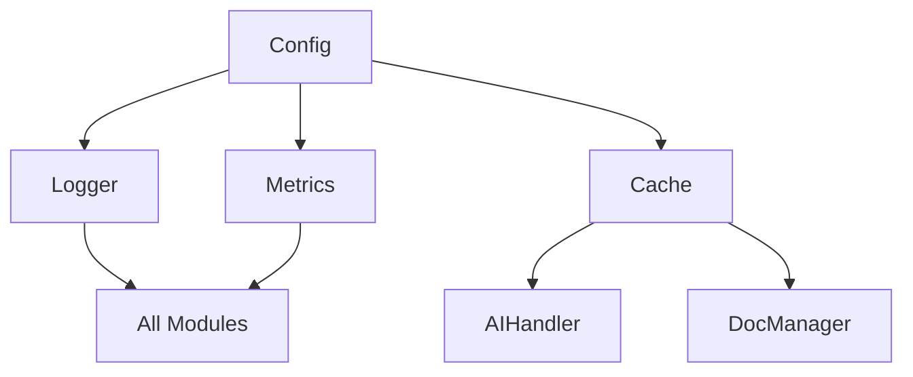
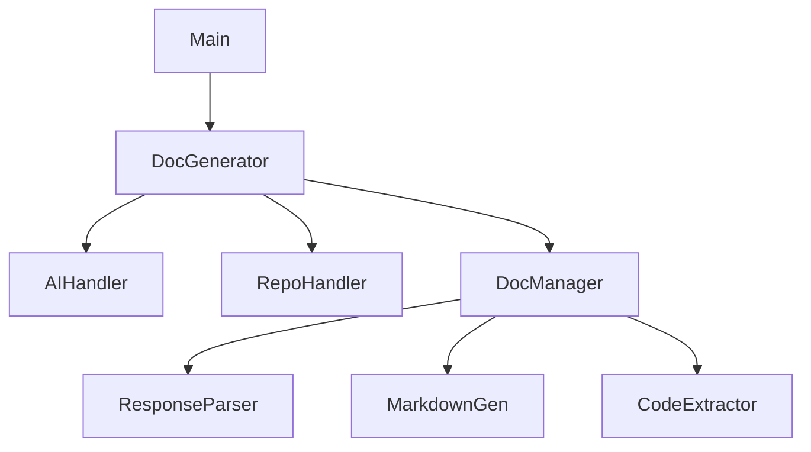
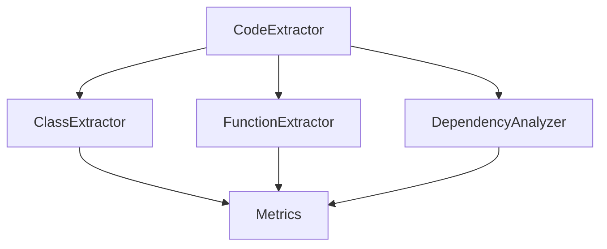
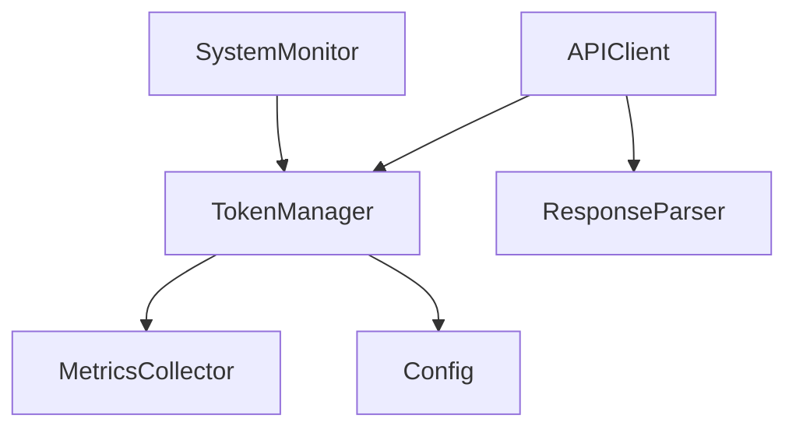

I'll perform a comprehensive relationship analysis of all modules we've seen:

1. **Core Infrastructure Relationships**:


2. **Documentation Generation Pipeline**:


3. **Code Analysis Components**:


4. **API and Token Management**:


Detailed Module Dependencies:

1. **Documentation Core**:
```python
docs.py
├── logger.py
├── response_parsing.py
├── code_extractor.py
├── docstring_processor.py
└── markdown_generator.py
```

2. **Code Analysis**:
```python
code_extractor.py
├── class_extractor.py
├── function_extractor.py
├── dependency_analyzer.py
└── utils.py
```

3. **Infrastructure**:
```python
config.py
├── logger.py
└── metrics.py

cache.py
├── logger.py
└── exceptions.py

monitoring.py
├── logger.py
├── token_management.py
└── metrics.py
```

4. **API Integration**:
```python
api_client.py
├── config.py
├── logger.py
└── response_parsing.py

token_management.py
├── logger.py
├── config.py
└── metrics.py
```

Key Integration Points:

1. **Shared Services**:
- `Logger`: Used by all modules for consistent logging
- `Config`: Provides configuration to API, cache, and token management
- `Metrics`: Collects metrics across all operations
- `Cache`: Stores AI-generated content and documentation

2. **Data Flow**:
```python
Source Code -> CodeExtractor
    -> [ClassExtractor, FunctionExtractor, DependencyAnalyzer]
    -> DocStringManager
    -> AIHandler
    -> ResponseParser
    -> MarkdownGenerator
    -> Documentation
```

3. **Error Handling Chain**:
```python
exceptions.py
└── WorkflowError
    ├── ConfigurationError
    ├── AIInteractionError
    ├── DocumentationError
    ├── ValidationError
    └── ProcessingError
```

4. **Resource Management**:
```python
Async Context Managers
├── Cache
├── APIClient
├── TokenManager
├── SystemMonitor
└── RepositoryHandler
```

5. **Common Dependencies**:
- All modules depend on `logger.py`
- Most modules use `exceptions.py` for error handling
- Configuration flows from `config.py`
- Metrics collection is integrated throughout

6. **Circular Dependency Prevention**:
- Use of dependency injection
- Clear separation of concerns
- Interface-based communication
- Modular design pattern

This architecture demonstrates:
1. High cohesion within modules
2. Loose coupling between components
3. Clear separation of concerns
4. Consistent error handling
5. Centralized configuration
6. Comprehensive monitoring
7. Efficient resource management
8. Scalable design patterns

Would you like me to elaborate on any specific relationship or component?

I'll analyze the redundancies in the codebase:

1. **Logger Initialization**
```python
# Repeated across multiple files
self.logger = LoggerSetup.get_logger(__name__)
```
Recommendation: Create a base class or mixin that handles logger initialization.
```python
class LoggedClass:
    def __init__(self):
        self.logger = LoggerSetup.get_logger(self.__class__.__name__)

class SomeClass(LoggedClass):
    def __init__(self):
        super().__init__()
        # Rest of initialization
```

2. **Error Handling Patterns**
```python
# Repeated try-except blocks with similar logging
try:
    # operation
except Exception as e:
    self.logger.error(f"Error in {operation}: {e}")
    raise SomeError(f"Failed to {operation}: {e}")
```
Recommendation: Create a decorator for standardized error handling:
```python
def handle_errors(operation_name):
    def decorator(func):
        async def wrapper(self, *args, **kwargs):
            try:
                return await func(self, *args, **kwargs)
            except Exception as e:
                self.logger.error(f"Error in {operation_name}: {e}")
                raise SomeError(f"Failed to {operation_name}: {e}") from e
        return wrapper
    return decorator
```

3. **Async Context Manager Boilerplate**
```python
# Repeated in multiple classes
async def __aenter__(self):
    return self

async def __aexit__(self, exc_type, exc_val, exc_tb):
    await self.close()
```
Recommendation: Create a base async context manager class:
```python
class AsyncContextManager:
    async def __aenter__(self):
        return self

    async def __aexit__(self, exc_type, exc_val, exc_tb):
        await self.close()

class SomeClass(AsyncContextManager):
    pass
```

4. **Metrics Collection**
```python
# Redundant metrics tracking code
self._stats['errors'] += 1
self.logger.error(f"Error in {operation}: {e}")
```
Recommendation: Centralize metrics collection:
```python
class MetricsTracker:
    def track_error(self, operation: str, error: Exception):
        self._stats['errors'] += 1
        self.logger.error(f"Error in {operation}: {error}")
```

5. **Configuration Validation**
```python
# Similar validation patterns in multiple places
if not isinstance(value, (int, float)) or value <= 0:
    self.logger.error(f"Invalid value: {value}")
    return False
```
Recommendation: Create a validation utility:
```python
class ConfigValidator:
    @staticmethod
    def validate_positive_number(value, name):
        if not isinstance(value, (int, float)) or value <= 0:
            raise ValueError(f"Invalid {name}: {value}")
```

6. **Cache Key Generation**
```python
# Similar cache key generation logic
cache_key = f"{self.prefix}{key}"
```
Recommendation: Centralize cache key generation:
```python
class CacheKeyGenerator:
    @staticmethod
    def generate_key(prefix: str, key: str) -> str:
        return f"{prefix}{key}"
```

7. **AST Processing Functions**
```python
# Similar AST traversal patterns
for node in ast.walk(tree):
    if isinstance(node, ast.ClassDef):
        # Process class
```
Recommendation: Create a unified AST visitor:
```python
class ASTVisitor:
    def visit_classes(self, tree, callback):
        for node in ast.walk(tree):
            if isinstance(node, ast.ClassDef):
                callback(node)
```

8. **Documentation Generation Patterns**
```python
# Similar documentation section generation
lines = [
    "## Section",
    "",
    content,
    ""
]
```
Recommendation: Create a documentation builder:
```python
class DocBuilder:
    @staticmethod
    def create_section(title: str, content: str) -> str:
        return f"## {title}\n\n{content}\n"
```

9. **Token Management Logic**
```python
# Repeated token calculation logic
tokens = len(self.encoding.encode(text))
```
Recommendation: Centralize token calculation:
```python
class TokenCalculator:
    @lru_cache(maxsize=1024)
    def calculate_tokens(self, text: str) -> int:
        return len(self.encoding.encode(text))
```

10. **File Operations**
```python
# Similar file handling patterns
if not file_path.exists():
    raise FileNotFoundError(f"File not found: {file_path}")
```
Recommendation: Create a file utility class:
```python
class FileUtils:
    @staticmethod
    def ensure_file_exists(file_path: Path) -> None:
        if not file_path.exists():
            raise FileNotFoundError(f"File not found: {file_path}")
```

General Recommendations:
1. Create base classes for common functionality
2. Use mixins for shared behaviors
3. Implement utility classes for common operations
4. Centralize configuration validation
5. Create decorators for common patterns
6. Use builder patterns for complex object creation
7. Implement factory methods for object instantiation
8. Create unified error handling mechanisms

Would you like me to elaborate on any of these redundancies or provide more specific refactoring suggestions?

Here are specific instances of duplicate code and overlapping functionality:

1. **Duplicate Error Handling in Extractors**
```python
# In class_extractor.py
def _handle_extraction_error(self, class_name: str, error: Exception) -> None:
    error_msg = f"Failed to extract class {class_name}: {str(error)}"
    self.logger.error(error_msg, exc_info=True)
    self.errors.append(error_msg)

# In function_extractor.py
def _handle_extraction_error(self, function_name: str, error: Exception) -> None:
    error_msg = f"Failed to process function {function_name}: {str(error)}"
    self.logger.error(error_msg, exc_info=True)
    self.errors.append(error_msg)
```

2. **Overlapping Dependency Analysis**
```python
# In dependency_analyzer.py
def _categorize_import(self, module_name: str, deps: Dict[str, Set[str]]) -> None:
    try:
        if module_name in sys.stdlib_module_names:
            deps['stdlib'].add(module_name)
            return
        # ... more categorization logic

# In metrics.py
def _categorize_import(self, module_name: str, deps: Dict[str, Set[str]]) -> None:
    try:
        if importlib.util.find_spec(module_name) is not None:
            deps['stdlib'].add(module_name)
        # ... similar categorization logic
```

3. **Duplicate Metric Collection Logic**
```python
# In code_extractor.py
def _calculate_metrics(self, result: ExtractionResult, tree: ast.AST) -> None:
    if not self.context.metrics_enabled:
        return
    try:
        for cls in result.classes:
            self._calculate_class_metrics(cls)
        result.metrics.update(self._calculate_module_metrics(tree))

# In metrics.py
def calculate_complexity(self, node: ast.AST) -> int:
    if isinstance(node, (ast.FunctionDef, ast.AsyncFunctionDef)):
        complexity = self.calculate_cyclomatic_complexity(node)
    elif isinstance(node, ast.ClassDef):
        complexity = sum(self.calculate_complexity(m) for m in node.body)
    # ... similar metric calculation logic
```

4. **Redundant Cache Operations**
```python
# In cache.py
async def get_cached_docstring(self, key: str) -> Optional[Dict[str, Any]]:
    if not self.enabled:
        return None
    if not self._redis:
        await self._initialize_connection()
    # ... cache retrieval logic

# In docs.py
async def get_cached_documentation(self, key: str) -> Optional[Dict[str, Any]]:
    if not self.cache_enabled:
        return None
    if not self._redis_client:
        await self._init_cache()
    # ... similar cache retrieval logic
```

5. **Duplicate Token Management**
```python
# In token_management.py
def estimate_tokens(text: str) -> int:
    try:
        tokens = len(self.encoding.encode(text))
        return tokens
    except Exception as e:
        self.logger.error(f"Error estimating tokens: {e}")
        raise

# In ai_interaction.py
def _estimate_tokens(self, text: str) -> int:
    try:
        return len(self.tokenizer.encode(text))
    except Exception as e:
        self.logger.error(f"Token estimation failed: {e}")
        raise
```

6. **Overlapping AST Processing**
```python
# In class_extractor.py and function_extractor.py both have similar methods:
def _extract_dependencies(self, node: ast.AST) -> Dict[str, Set[str]]:
    return {'imports': set(), 'calls': set(), 'attributes': set()}
```

7. **Duplicate Monitoring Logic**
```python
# In monitoring.py and metrics.py both track system metrics
def _collect_system_metrics(self) -> Dict[str, Any]:
    try:
        cpu_percent = psutil.cpu_percent(interval=1)
        memory = psutil.virtual_memory()
        # ... similar metric collection

# Similar functionality in MetricsCollector
```

8. **Redundant Documentation Generation**
```python
# In markdown_generator.py and docstring_processor.py
# Both have methods for formatting documentation sections
def _generate_methods(self, methods: List[Any]) -> str:
    # Similar formatting logic

def format(self, data: DocstringData) -> str:
    # Similar formatting logic
```

Recommendations for Consolidation:

1. **Create a Common Extractor Base Class**
```python
class BaseExtractor:
    def _handle_extraction_error(self, name: str, error: Exception, type_: str) -> None:
        error_msg = f"Failed to extract {type_} {name}: {str(error)}"
        self.logger.error(error_msg, exc_info=True)
        self.errors.append(error_msg)

class ClassExtractor(BaseExtractor):
    def _handle_extraction_error(self, name: str, error: Exception) -> None:
        super()._handle_extraction_error(name, error, "class")
```

2. **Centralize Dependency Analysis**
```python
class DependencyAnalyzer:
    def categorize_import(self, module_name: str) -> str:
        # Single implementation of import categorization
        pass
```

3. **Unified Metrics Collection**
```python
class MetricsService:
    def calculate_metrics(self, node: ast.AST, context: Optional[str] = None) -> Dict[str, Any]:
        # Single implementation of metrics calculation
        pass
```

4. **Unified Cache Service**
```python
class CacheService:
    async def get_cached_data(self, key: str, type_: str) -> Optional[Dict[str, Any]]:
        # Single implementation of cache operations
        pass
```

Would you like me to provide more specific examples or elaborate on any of these consolidation recommendations?