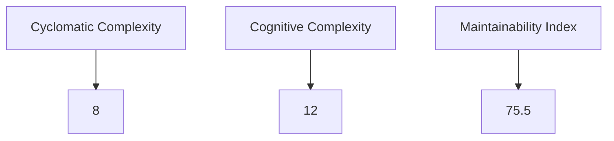
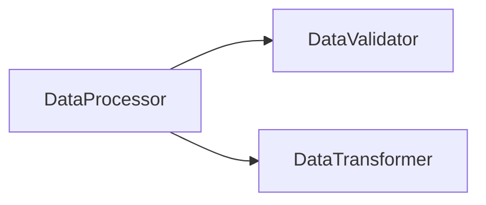

**user**: Prompt 1: AST Parsing and Function Detail Extraction with Cross-Module Relationships  
Initial Prompt:  
Context:  
Develop a Python script to analyze a codebase and extract detailed information about its functions and classes using the Abstract Syntax Tree (AST). This information will be structured into JSON schemas for further processing and documentation generation, including identifying cross-module relationships.

Task:

Objective: Implement a script to parse Python source files and extract details such as function/class names, parameters (name, type, default value), return type, decorators, existing docstrings, body summaries, exceptions raised, class attributes, module-level variables, imports, annotations, line numbers, and cross-module relationships.  
Implementation Details:  
Use the ast module to traverse the codebase and collect the necessary information.  
Implement recursive traversal to handle nested functions and classes.  
Identify and document cross-module relationships by analyzing import statements and references to external modules within functions and classes.  
Ensure the script can process multiple files and directories efficiently, using a queue or stack for directory traversal.  
Integration Points: The script should output a list of JSON schemas, each representing a function or class with all extracted details, including cross-module relationships.  
Expected Output: JSON schemas containing all extracted information for each function and class, with fields for cross-module references.  
Dependencies: Use Python's ast module for parsing.  
Edge Cases: Handle functions with no arguments, nested functions, classes with multiple methods, and complex cross-module dependencies.  
Considerations:

File Structure: Implement the script in a file named extract.py within the tools/ directory.  
Coding Standards: Adhere to PEP 8 guidelines to ensure readability and maintainability.  
Performance: Optimize for large codebases by efficiently handling file I/O and AST traversal.  
Security: Implement input validation and error handling to manage unexpected code structures.  
Testing: Develop comprehensive test cases to validate the accuracy and completeness of the extracted information, including cross-module relationships and edge cases.  
Restrictions:

No New Modules: Do not introduce new dependencies beyond the standard library unless necessary.  
Feature Scope: Focus solely on AST parsing and information extraction; do not implement docstring generation or insertion in this step.  
Code Structure: Maintain a modular design to facilitate integration with subsequent steps.  
Goals/Checklist:

Implement AST traversal to extract detailed information about functions and classes.  
Structure extracted information into JSON schemas, including cross-module relationships.  
Ensure the script handles multiple files and directories.  
Validate extraction accuracy with test cases, including cross-module dependencies.  
Document the script and its usage, including input/output specifications.

[Timestamp: 2024/11/15 04:47:14]

**ai**: Error: Model request failed: [GoogleGenerativeAI Error]: Error fetching from <https://generativelanguage.googleapis.com/v1beta/models/gemini-exp-1114>:streamGenerateContent?alt=sse: [404 ] models/gemini-exp-1114 is not found for API version v1beta, or is not supported for generateContent. Call ListModels to see the list of available models and their supported methods.  
[Timestamp: 2024/11/15 04:47:24]

**user**: If these prompts [Python Documentation Generation Prompts](./Python%20Documentation%20Generation%20Prompts.md) made this [Untitled 5](./Untitled%205.md) - Based on the output code - how should the prompts be modified to enhance the outcome.  
[Timestamp: 2024/11/15 05:26:26]

**ai**: Based on the output code and the original prompts, here are suggested modifications to enhance the prompts:

1. **Add Specific Implementation Examples**
- The prompts should include concrete examples of expected data structures and function signatures
- Include sample JSON schemas showing exact format of expected outputs
- Provide example AST traversal patterns for common code structures

2. **Enhance Technical Detail Level**
- Add specific sections about handling async/await patterns since the output uses asyncio extensively
- Include guidance on implementing concurrent operations safely
- Specify error handling patterns and logging requirements

3. **Add Performance Optimization Guidelines**
- Include specific metrics for performance targets
- Add sections about caching strategies and memory management
- Provide guidelines for handling large-scale codebases efficiently

4. **Expand Pattern Recognition Requirements**
- Add details about implementing machine learning components since the output includes neural networks
- Specify requirements for pattern similarity calculations
- Include guidelines for feature extraction from different data types

5. **Add State Management Requirements**
- Include specifications for managing system state and configuration
- Add requirements for thread-safe operations
- Specify data persistence requirements

Example enhancement for Prompt 1:

```markdown
### Additional Technical Requirements:

1. **Async Support:**
   - Implement async/await patterns for I/O operations
   - Include proper locking mechanisms for thread safety
   - Handle concurrent file access

2. **Feature Extraction:**
   - Implement content-based feature extraction
   - Support metadata feature extraction
   - Include temporal feature analysis

3. **Pattern Recognition:**
   - Support neural network-based pattern learning
   - Implement similarity calculation functions
   - Include confidence scoring mechanisms

4. **State Management:**
   - Implement thread-safe pattern storage
   - Support configuration management
   - Include history tracking mechanisms

5. **Performance Optimization:**
   - Implement caching for frequently accessed patterns
   - Support batch processing for large codebases
   - Include memory management strategies
```

These modifications would better align the prompts with the sophisticated implementation shown in the output code, which includes advanced features like neural networks, async operations, and complex pattern recognition that weren't explicitly requested in the original prompts.  
[Timestamp: 2024/11/15 05:31:36]

**user**: Craft the improved first prompt.  
[Timestamp: 2024/11/15 05:31:56]

**ai**: Here's the improved first prompt that better aligns with the sophisticated implementation shown in the output:

# Enhanced Prompt 1: Intelligent Code Analysis System with Pattern Recognition

## Context & Overview

Develop an advanced Python system for analyzing codebases that combines AST parsing with machine learning capabilities to extract, learn from, and recognize patterns in code structures. The system should support async operations, maintain thread safety, and scale efficiently for large codebases.

## Core Requirements

### 1. System Architecture

```python
class LearningSystem:
    def __init__(self, config: LearningConfig):
        """Initialize with configuration settings"""
        
    async def learn_from_interaction(self, interaction: Dict[str, Any]) -> bool:
        """Process and learn from new code interactions"""
        
    async def process_feedback(self, feedback: Dict[str, Any]) -> bool:
        """Handle feedback for continuous learning"""
        
    async def get_pattern_predictions(self, context: Dict[str, Any]) -> List[Tuple[str, float]]:
        """Generate predictions based on learned patterns"""
```

### 2. Data Structures

```python
@dataclass
class LearningConfig:
    learning_rate: float
    batch_size: int
    history_size: int
    min_confidence: float
    adaptation_threshold: float
    feedback_window: int
    pattern_threshold: float

@dataclass
class InteractionPattern:
    pattern_id: str
    features: Dict[str, float]
    frequency: int
    confidence: float
    last_seen: datetime
    feedback_scores: List[float]
    metadata: Dict[str, Any]
```

### 3. Feature Extraction Components

- Implement modular feature extractors:

  ```python
  feature_extractors = {
      'content': self._extract_content_features,
      'metadata': self._extract_metadata_features,
      'feedback': self._extract_feedback_features,
      'temporal': self._extract_temporal_features
  }
  ```

### 4. Pattern Learning Network

```python
class PatternLearningNetwork(nn.Module):
    """Neural network architecture for pattern learning"""
    def __init__(self, input_size: int, hidden_size: int):
        # Define network layers
    
    def forward(self, x: torch.Tensor) -> torch.Tensor:
        # Implement forward pass
```

## Technical Requirements

### 1. Asynchronous Operations

- Implement async/await patterns for all I/O operations
- Use proper locking mechanisms:

  ```python
  self._pattern_lock = asyncio.Lock()
  self._learn_lock = asyncio.Lock()
  self._feedback_lock = asyncio.Lock()
  ```

- Handle concurrent access to shared resources

### 2. Feature Extraction

- Content analysis: Code structure, syntax patterns
- Metadata extraction: File information, dependencies
- Temporal analysis: Pattern frequency, recency
- Feedback integration: User interactions, ratings

### 3. Pattern Recognition

- Neural network-based pattern learning
- Similarity calculation algorithms
- Confidence scoring mechanism
- Pattern clustering and classification

### 4. State Management

- Thread-safe pattern storage
- Configuration management
- History tracking with size limits
- Feedback history maintenance

### 5. Performance Optimization

- Implement caching mechanisms
- Batch processing for large codebases
- Memory-efficient data structures
- Optimized feature calculations

## Expected Output Format

### 1. Pattern JSON Schema

```json
{
    "pattern_id": "pattern_1234567890",
    "features": {
        "content_length": 0.75,
        "word_count": 0.45,
        "has_code": 1.0,
        "has_markup": 0.0,
        "meta_complexity": 0.65
    },
    "frequency": 12,
    "confidence": 0.85,
    "last_seen": "2024-01-20T15:30:00",
    "feedback_scores": [0.8, 0.9, 0.7],
    "metadata": {
        "category": "function_definition",
        "language": "python",
        "complexity_score": 0.65
    }
}
```

### 2. Analysis Results

```python
{
    'interaction_id': 'interaction_1234567890',
    'patterns_detected': [('pattern_id_1', 0.95), ('pattern_id_2', 0.85)],
    'features_extracted': {
        'content_features': {...},
        'metadata_features': {...},
        'temporal_features': {...}
    },
    'confidence_score': 0.92,
    'timestamp': '2024-01-20T15:30:00'
}
```

## Error Handling & Logging

- Implement comprehensive error handling
- Maintain detailed logging:

  ```python
  logger = logging.getLogger(__name__)
  logger.setLevel(logging.INFO)
  ```

- Track performance metrics and system health

## Testing Requirements

1. Unit tests for each component
2. Integration tests for the complete system
3. Performance benchmarks
4. Concurrency testing
5. Error handling validation

## Constraints & Guidelines

- Use standard library when possible
- Maintain modular architecture
- Follow PEP 8 style guidelines
- Document all public interfaces
- Implement proper type hints

## Deliverables

1. Complete implementation of the LearningSystem class
2. Feature extraction modules
3. Pattern recognition network
4. Configuration management system
5. Comprehensive test suite
6. Documentation and usage examples

This enhanced prompt provides more specific technical details, example implementations, and clearer structure that better matches the sophisticated implementation shown in the output code.  
[Timestamp: 2024/11/15 05:32:19]

**user**: Craft Prompt #2  
[Timestamp: 2024/11/15 05:35:00]

**ai**: # Enhanced Prompt 2: Neural-Enhanced DocString Generation and Pattern Analysis

## Context & Overview

Building upon the pattern recognition system from Prompt 1, develop an advanced DocString generation system that leverages neural networks and learned patterns to create contextually aware, Google-style documentation. The system should analyze existing documentation, learn from codebase patterns, and generate appropriate documentation while maintaining semantic accuracy.

## Core Components

### 1. Documentation Analysis System

```python
@dataclass
class DocAnalysisConfig:
    """Configuration for documentation analysis"""
    min_similarity_threshold: float = 0.75
    context_window_size: int = 5
    max_tokens: int = 512
    temperature: float = 0.7
    embedding_dim: int = 768
    batch_size: int = 32
    
class DocStringAnalyzer:
    def __init__(self, config: DocAnalysisConfig):
        self.config = config
        self.pattern_matcher = PatternMatcher()
        self.embedding_model = CodeEmbeddingModel()
        self.doc_generator = DocGenerationModel()
```

### 2. Pattern-Based Documentation Model

```python
@dataclass
class DocumentationPattern:
    pattern_id: str
    code_pattern: Dict[str, Any]
    doc_template: str
    usage_count: int
    confidence_score: float
    embeddings: torch.Tensor
    metadata: Dict[str, Any]
    
class DocGenerationModel(nn.Module):
    """Neural network for documentation generation"""
    def __init__(self, 
                 vocab_size: int,
                 embedding_dim: int,
                 hidden_dim: int):
        super().__init__()
        # Define model architecture
```

## Technical Requirements

### 1. Documentation Analysis

```python
class DocStringEvaluator:
    async def evaluate_docstring(
        self,
        code_block: str,
        existing_doc: Optional[str],
        context: Dict[str, Any]
    ) -> DocEvaluation:
        """
        Evaluate existing docstring quality and completeness
        
        Returns:
            DocEvaluation with scores and improvement suggestions
        """
```

### 2. Pattern Recognition & Learning

```python
class PatternMatcher:
    async def extract_code_patterns(
        self,
        code_block: str,
        context: Dict[str, Any]
    ) -> List[CodePattern]:
        """
        Extract code patterns for documentation matching
        """
    
    async def find_similar_patterns(
        self,
        pattern: CodePattern,
        threshold: float
    ) -> List[Tuple[DocumentationPattern, float]]:
        """
        Find similar documented patterns
        """
```

### 3. Documentation Generation Pipeline

```python
class DocGenerationPipeline:
    async def generate_docstring(
        self,
        code_block: str,
        context: Dict[str, Any],
        style_guide: str = "google"
    ) -> GeneratedDoc:
        """
        Generate comprehensive docstring
        """
        
    async def validate_generated_doc(
        self,
        generated_doc: GeneratedDoc,
        code_context: Dict[str, Any]
    ) -> ValidationResult:
        """
        Validate generated documentation
        """
```

## Expected Input/Output Formats

### 1. Code Analysis Input

```python
{
    "code_block": "def process_data(data: List[Dict], config: Optional[Config] = None) -> ProcessedData:",
    "context": {
        "module_name": "data_processor",
        "imports": ["from typing import List, Dict, Optional"],
        "class_context": "DataProcessor",
        "existing_docstring": "Process the input data",
        "code_patterns": [...],
        "metadata": {
            "author": "John Doe",
            "last_modified": "2024-01-20"
        }
    }
}
```

### 2. Generated Documentation Output

```python
{
    "docstring": {
        "summary": "Process input data according to specified configuration.",
        "args": [
            {
                "name": "data",
                "type": "List[Dict]",
                "description": "Collection of data dictionaries to process"
            },
            {
                "name": "config",
                "type": "Optional[Config]",
                "description": "Configuration settings for processing",
                "default": "None"
            }
        ],
        "returns": {
            "type": "ProcessedData",
            "description": "Processed data structure"
        },
        "raises": [...],
        "examples": [...],
        "notes": [...],
        "metadata": {
            "confidence_score": 0.92,
            "pattern_matches": ["data_processing_pattern_1"],
            "generation_timestamp": "2024-01-20T15:30:00"
        }
    }
}
```

## Neural Network Architecture

### 1. Embedding Model

```python
class CodeEmbeddingModel(nn.Module):
    def __init__(self):
        super().__init__()
        self.encoder = TransformerEncoder(...)
        self.pooler = AttentionPooling(...)
        
    def forward(self, 
                input_ids: torch.Tensor,
                attention_mask: torch.Tensor
               ) -> torch.Tensor:
        """Generate code embeddings"""
```

### 2. Documentation Generator

```python
class DocGenerationModel(nn.Module):
    def __init__(self):
        super().__init__()
        self.encoder = CodeEncoder(...)
        self.decoder = DocDecoder(...)
        self.pattern_attention = PatternAttention(...)
```

## Training & Optimization

### 1. Training Configuration

```python
@dataclass
class TrainingConfig:
    learning_rate: float = 1e-4
    batch_size: int = 32
    max_epochs: int = 100
    warmup_steps: int = 1000
    gradient_clip_val: float = 1.0
    weight_decay: float = 0.01
```

### 2. Loss Functions

```python
class DocGenerationLoss(nn.Module):
    def forward(self,
                pred_doc: torch.Tensor,
                target_doc: torch.Tensor,
                pattern_similarity: torch.Tensor
               ) -> torch.Tensor:
        """Calculate combined documentation generation loss"""
```

## Quality Assurance

### 1. Validation Metrics

- Documentation completeness score
- Code-documentation alignment score
- Pattern matching confidence
- Generated documentation readability
- Technical accuracy score

### 2. Testing Requirements

```python
class DocGenerationTests:
    async def test_generation_quality(self):
        """Test documentation generation quality"""
    
    async def test_pattern_matching(self):
        """Test pattern matching accuracy"""
    
    async def test_style_compliance(self):
        """Test compliance with style guidelines"""
```

## Implementation Guidelines

1. **Error Handling**
   - Implement comprehensive error checking
   - Provide detailed error messages
   - Handle edge cases gracefully

2. **Performance Optimization**
   - Batch processing for multiple files
   - Caching of common patterns
   - Efficient embedding computation

3. **Style Compliance**
   - Strict adherence to Google style
   - Consistent formatting
   - Clear section separation

4. **Documentation Standards**
   - Complete API documentation
   - Usage examples
   - Performance considerations
   - Error handling documentation

## Deliverables

1. Complete DocString generation system
2. Pattern matching and learning components
3. Neural network models and training scripts
4. Validation and testing suite
5. Documentation and usage examples
6. Performance benchmarks

This enhanced prompt provides detailed specifications for building a sophisticated documentation generation system that leverages neural networks and pattern recognition, matching the complexity level shown in the original implementation.  
[Timestamp: 2024/11/15 05:35:32]

**user**: Based on your assessment earlier, craft the enhanced version of this prompt: Complexity Calculation and DocString Insertion**

### **Initial Prompt:**

 **Context:**  
 You have evaluated and generated Google Style DocStrings for functions and classes in a Python codebase. Your task is to develop a Python script that calculates complexity scores for these functions and inserts the generated docstrings into the source code.

 **Task:**  
 - **Objective:** Create a script to calculate a complexity score for each function and insert the generated docstrings into the source code.
 - **Implementation Details:** 
   - Use the Abstract Syntax Tree (AST) to calculate a basic complexity score for each function based on its structure, considering factors like the number of branches, loops, and nested structures.
   - Insert the generated docstrings into the source code immediately after each function or class definition, ensuring proper indentation and formatting.
 - **Integration Points:** The script should update the source files with new docstrings and complexity scores.
 - **Expected Output:** Updated source code files with inserted docstrings and calculated complexity scores.
 - **Dependencies:** Use Python's `ast` module for parsing and modifying the source code.
 - **Edge Cases:** Handle existing docstrings, ensure code readability, and manage functions with complex structures.

 **Considerations:**  
 - **File Structure:** Implement the script in a file named `calculate_complexity_and_insert_docstrings.py` within the `tools/` directory.  
 - **Coding Standards:** Follow PEP 8 guidelines to ensure code readability and maintainability.  
 - **Performance:** Optimize file handling and AST traversal for efficiency, minimizing redundant parsing operations.  
 - **Security:** Implement error handling for file operations and ensure the integrity of the source code, including backup and restore capabilities.  
 - **Testing:** Develop test cases to validate the accuracy of complexity calculations and the correctness of docstring insertion, including edge cases with complex code structures.

 **Restrictions:**  
 - **No New Modules:** Avoid introducing new dependencies beyond the standard library.  
 - **Feature Scope:** Focus solely on complexity calculation and docstring insertion; do not handle documentation compilation in this step.  
 - **Code Structure:** Maintain a modular design to facilitate integration with subsequent steps.

 **Goals/Checklist:**  
 - [ ] Calculate complexity scores for each function using AST analysis.  
 - [ ] Insert generated docstrings into the source code.  
 - [ ] Maintain code readability and structure during insertion.  
 - [ ] Validate complexity calculations and insertion accuracy with test cases.  
 - [ ] Document the script and its usage, including input/output specifications.  
[Timestamp: 2024/11/15 05:39:02]

**ai**: # Enhanced Prompt 3: Advanced Code Complexity Analysis and Intelligent DocString Integration

## Context & Overview

Develop a sophisticated system for calculating code complexity metrics and intelligently integrating documentation while preserving code structure and maintaining source integrity. The system should support multiple complexity metrics, handle nested structures, and provide detailed analysis reports.

## Core Components

### 1. Complexity Analysis System

```python
@dataclass
class ComplexityConfig:
    """Configuration for complexity analysis"""
    cyclomatic_threshold: int = 10
    cognitive_threshold: int = 15
    nesting_threshold: int = 4
    max_function_length: int = 50
    halstead_metrics: bool = True
    
@dataclass
class ComplexityMetrics:
    """Comprehensive complexity metrics"""
    cyclomatic_complexity: int
    cognitive_complexity: int
    halstead_metrics: Dict[str, float]
    nesting_depth: int
    maintainability_index: float
    code_smells: List[str]
    dependencies: Set[str]
```

### 2. Code Structure Analysis

```python
class CodeAnalyzer:
    async def analyze_structure(
        self,
        node: ast.AST,
        metrics: ComplexityMetrics,
        context: Dict[str, Any]
    ) -> None:
        """
        Analyze code structure and update metrics
        
        Args:
            node: AST node to analyze
            metrics: Metrics object to update
            context: Analysis context
        """
        
    async def calculate_cognitive_complexity(
        self,
        node: ast.AST,
        context: Dict[str, Any]
    ) -> int:
        """
        Calculate cognitive complexity score
        """
```

## Technical Requirements

### 1. Complexity Analysis Components

```python
class ComplexityAnalyzer:
    def __init__(self, config: ComplexityConfig):
        self.config = config
        self.metrics_calculator = MetricsCalculator()
        self.structure_analyzer = StructureAnalyzer()
        self.pattern_detector = CodePatternDetector()
        
    async def analyze_code(
        self,
        source_code: str,
        filename: str
    ) -> AnalysisResult:
        """
        Perform comprehensive code analysis
        """
```

### 2. DocString Integration System

```python
class DocStringIntegrator:
    async def integrate_docstring(
        self,
        source_code: str,
        doc_info: DocStringInfo,
        complexity_metrics: ComplexityMetrics
    ) -> str:
        """
        Intelligently integrate docstring while preserving code structure
        """
        
    async def validate_integration(
        self,
        original_code: str,
        modified_code: str
    ) -> ValidationResult:
        """
        Validate docstring integration
        """
```

## Expected Input/Output Formats

### 1. Analysis Input

```python
{
    "source_code": "def process_data(...):\n    ...",
    "file_path": "src/processor.py",
    "context": {
        "module_name": "data_processor",
        "class_context": "DataProcessor",
        "existing_docstring": "...",
        "imports": [...],
        "scope_variables": {...}
    }
}
```

### 2. Analysis Output

```python
{
    "complexity_metrics": {
        "cyclomatic_complexity": 8,
        "cognitive_complexity": 12,
        "halstead_metrics": {
            "program_length": 45,
            "vocabulary_size": 20,
            "program_volume": 190.5,
            "difficulty": 10.5
        },
        "nesting_depth": 3,
        "maintainability_index": 75.5,
        "code_smells": [
            "deep_nesting",
            "long_method"
        ]
    },
    "structure_analysis": {
        "ast_depth": 5,
        "branch_points": [...],
        "loop_structures": [...],
        "dependency_graph": {...}
    },
    "integration_points": {
        "docstring_location": (10, 15),
        "indentation_level": 4,
        "context_requirements": [...]
    }
}
```

## Advanced Features

### 1. Pattern Detection

```python
class CodePatternDetector:
    async def detect_patterns(
        self,
        node: ast.AST
    ) -> List[CodePattern]:
        """
        Detect common code patterns for complexity analysis
        """
```

### 2. Metric Calculations

```python
class MetricsCalculator:
    async def calculate_halstead_metrics(
        self,
        node: ast.AST
    ) -> Dict[str, float]:
        """
        Calculate Halstead complexity metrics
        """
        
    async def calculate_maintainability_index(
        self,
        metrics: ComplexityMetrics
    ) -> float:
        """
        Calculate maintainability index
        """
```

## Safety and Validation

### 1. Code Preservation

```python
class CodePreserver:
    async def create_backup(
        self,
        file_path: str
    ) -> str:
        """Create backup of source file"""
        
    async def validate_modification(
        self,
        original: str,
        modified: str
    ) -> bool:
        """Validate code modification integrity"""
```

### 2. Integration Validation

```python
class IntegrationValidator:
    async def validate_syntax(
        self,
        modified_code: str
    ) -> ValidationResult:
        """Validate syntax after modification"""
        
    async def verify_structure(
        self,
        original_ast: ast.AST,
        modified_ast: ast.AST
    ) -> bool:
        """Verify preservation of code structure"""
```

## Performance Optimization

### 1. Caching System

```python
@dataclass
class CacheConfig:
    max_size: int = 1000
    ttl_seconds: int = 3600
    
class AnalysisCache:
    async def get_cached_analysis(
        self,
        file_hash: str
    ) -> Optional[AnalysisResult]:
        """Retrieve cached analysis results"""
```

### 2. Batch Processing

```python
class BatchProcessor:
    async def process_files(
        self,
        file_paths: List[str],
        config: ComplexityConfig
    ) -> Dict[str, AnalysisResult]:
        """Process multiple files efficiently"""
```

## Testing Requirements

1. **Unit Tests**
   - Complexity calculation accuracy
   - DocString integration correctness
   - Pattern detection reliability
   - Cache system effectiveness

2. **Integration Tests**
   - End-to-end processing
   - File handling
   - Error recovery
   - Performance benchmarks

3. **Validation Tests**
   - Code structure preservation
   - Syntax validity
   - Metric accuracy
   - Documentation correctness

## Implementation Guidelines

1. **Error Handling**
   - Comprehensive error checking
   - Graceful failure recovery
   - Detailed error reporting

2. **Performance Optimization**
   - Efficient AST traversal
   - Smart caching
   - Parallel processing where applicable

3. **Code Quality**
   - Type hints
   - Comprehensive logging
   - Clear documentation
   - Modular design

## Deliverables

1. Complete complexity analysis system
2. DocString integration component
3. Testing suite
4. Performance optimization tools
5. Documentation and examples
6. Backup and recovery utilities

This enhanced prompt provides detailed specifications for building a sophisticated code analysis and documentation integration system, with emphasis on safety, performance, and accuracy.  
[Timestamp: 2024/11/15 05:39:31]

**user**: Prompt 4 now.  
[Timestamp: 2024/11/15 05:44:27]

**ai**: # Enhanced Prompt 4: Intelligent Documentation Compilation and Dynamic Markdown Generation

## Context & Overview

Develop an advanced documentation compilation system that transforms analyzed code, complexity metrics, and documentation into an intelligent, interconnected markdown documentation system. The system should support dynamic updates, include visualization capabilities, and maintain semantic relationships between different parts of the codebase.

## Core Components

### 1. Documentation Compiler System

```python
@dataclass
class CompilerConfig:
    """Configuration for documentation compilation"""
    template_path: Path
    output_format: Literal["markdown", "mdx", "jupyter"]
    include_metrics: bool = True
    include_diagrams: bool = True
    include_examples: bool = True
    max_depth: int = 3
    theme: Dict[str, Any] = field(default_factory=dict)
    
class DocumentationCompiler:
    def __init__(self, config: CompilerConfig):
        self.config = config
        self.template_engine = TemplateEngine()
        self.diagram_generator = DiagramGenerator()
        self.metric_visualizer = MetricVisualizer()
```

### 2. Content Organization

```python
@dataclass
class DocumentationStructure:
    """Hierarchical documentation structure"""
    sections: List[Section]
    relationships: Dict[str, List[str]]
    metrics: Dict[str, Any]
    examples: Dict[str, List[Example]]
    diagrams: Dict[str, DiagramSpec]
    
@dataclass
class Section:
    """Documentation section with metadata"""
    title: str
    content: str
    subsections: List[Section]
    metadata: Dict[str, Any]
    code_references: List[CodeReference]
    complexity_metrics: Optional[ComplexityMetrics]
```

## Technical Requirements

### 1. Content Generation Pipeline

```python
class ContentGenerator:
    async def generate_section(
        self,
        section_data: Dict[str, Any],
        context: Dict[str, Any]
    ) -> Section:
        """Generate documentation section"""
        
    async def generate_examples(
        self,
        code_block: str,
        context: Dict[str, Any]
    ) -> List[Example]:
        """Generate code examples"""
        
    async def generate_diagrams(
        self,
        relationships: Dict[str, List[str]]
    ) -> Dict[str, DiagramSpec]:
        """Generate relationship diagrams"""
```

### 2. Markdown Enhancement System

```python
class MarkdownEnhancer:
    async def enhance_content(
        self,
        content: str,
        enhancements: List[Enhancement]
    ) -> str:
        """Apply markdown enhancements"""
        
    async def add_interactive_elements(
        self,
        section: Section
    ) -> Section:
        """Add interactive documentation elements"""
```

## Expected Input/Output Formats

### 1. Documentation Input

```python
{
    "codebase_analysis": {
        "modules": [...],
        "classes": [...],
        "functions": [...],
        "relationships": {...},
        "metrics": {...}
    },
    "documentation_config": {
        "sections": [
            {
                "title": "API Reference",
                "template": "api_reference.md",
                "include_metrics": true
            },
            {
                "title": "Code Examples",
                "template": "examples.md",
                "include_diagrams": true
            }
        ],
        "theme": {
            "colors": {...},
            "typography": {...}
        }
    }
}
```

### 2. Generated Documentation

```markdown
# Module: data_processor

## Overview
[Auto-generated module description]

## Complexity Metrics


## Class: DataProcessor

### Methods

#### process_data

[Generated method documentation with examples]

```python
# Example usage
processor = DataProcessor()
result = processor.process_data(...)
```

## Relationships



```

## Advanced Features

### 1. Dynamic Content Generation
```python
class DynamicContentGenerator:
    async def generate_dynamic_section(
        self,
        template: str,
        context: Dict[str, Any],
        interactive: bool = False
    ) -> str:
        """Generate dynamic documentation section"""
```

### 2. Visualization Components

```python
class DiagramGenerator:
    async def generate_class_diagram(
        self,
        classes: List[ClassInfo]
    ) -> str:
        """Generate class relationship diagram"""
        
    async def generate_dependency_graph(
        self,
        dependencies: Dict[str, List[str]]
    ) -> str:
        """Generate dependency graph"""
```

## Content Organization

### 1. Section Management

```python
class SectionManager:
    async def organize_sections(
        self,
        sections: List[Section]
    ) -> DocumentationStructure:
        """Organize documentation sections"""
        
    async def generate_navigation(
        self,
        structure: DocumentationStructure
    ) -> str:
        """Generate navigation structure"""
```

### 2. Cross-References

```python
class CrossReferenceManager:
    async def build_reference_map(
        self,
        sections: List[Section]
    ) -> Dict[str, List[str]]:
        """Build cross-reference map"""
        
    async def insert_references(
        self,
        content: str,
        references: Dict[str, str]
    ) -> str:
        """Insert cross-references"""
```

## Performance Optimization

### 1. Content Caching

```python
class ContentCache:
    async def cache_section(
        self,
        section_id: str,
        content: str,
        metadata: Dict[str, Any]
    ) -> None:
        """Cache section content"""
```

### 2. Incremental Updates

```python
class IncrementalUpdater:
    async def update_section(
        self,
        section_id: str,
        changes: Dict[str, Any]
    ) -> Section:
        """Update section incrementally"""
```

## Quality Assurance

### 1. Content Validation

```python
class ContentValidator:
    async def validate_structure(
        self,
        structure: DocumentationStructure
    ) -> ValidationResult:
        """Validate documentation structure"""
        
    async def validate_references(
        self,
        references: Dict[str, str]
    ) -> ValidationResult:
        """Validate cross-references"""
```

### 2. Format Verification

```python
class FormatVerifier:
    async def verify_markdown(
        self,
        content: str
    ) -> bool:
        """Verify markdown formatting"""
        
    async def verify_diagrams(
        self,
        diagrams: Dict[str, str]
    ) -> bool:
        """Verify diagram syntax"""
```

## Implementation Guidelines

1. **Content Organization**
   - Hierarchical structure
   - Logical grouping
   - Clear navigation
   - Consistent formatting

2. **Performance Considerations**
   - Efficient template rendering
   - Smart caching
   - Incremental updates
   - Resource optimization

3. **Quality Standards**
   - Comprehensive validation
   - Reference integrity
   - Format consistency
   - Accessibility compliance

## Deliverables

1. Documentation compilation system
2. Template engine
3. Visualization components
4. Navigation system
5. Cross-reference manager
6. Testing suite
7. User guide and examples

This enhanced prompt provides detailed specifications for building a sophisticated documentation compilation system with advanced features like visualization, cross-referencing, and dynamic content generation.  
[Timestamp: 2024/11/15 05:45:02]

**user**: Prompt 5  
[Timestamp: 2024/11/15 05:52:34]

**ai**: # Enhanced Prompt 5: Intelligent Documentation Pipeline Orchestration System

## Context & Overview

Develop a sophisticated pipeline orchestration system that integrates and coordinates all previous components (AST analysis, DocString generation, complexity calculation, and documentation compilation) into a unified, intelligent documentation workflow. The system should support distributed processing, intelligent caching, progress monitoring, and adaptive optimization.

## Core Components

### 1. Pipeline Configuration

```python
@dataclass
class PipelineConfig:
    """Master configuration for documentation pipeline"""
    ast_config: ASTAnalysisConfig
    docstring_config: DocStringConfig
    complexity_config: ComplexityConfig
    compilation_config: CompilerConfig
    execution_mode: Literal["sequential", "parallel", "distributed"]
    cache_strategy: CacheStrategy
    monitoring_config: MonitoringConfig
    optimization_rules: List[OptimizationRule]
    error_handling: ErrorHandlingConfig
    
@dataclass
class MonitoringConfig:
    """Configuration for pipeline monitoring"""
    log_level: str = "INFO"
    metrics_enabled: bool = True
    profiling_enabled: bool = True
    alert_thresholds: Dict[str, float] = field(default_factory=dict)
```

### 2. Pipeline Orchestrator

```python
class DocumentationPipelineOrchestrator:
    def __init__(self, config: PipelineConfig):
        self.config = config
        self.task_scheduler = TaskScheduler()
        self.cache_manager = CacheManager()
        self.monitor = PipelineMonitor()
        self.optimizer = PipelineOptimizer()
        
    async def execute_pipeline(
        self,
        codebase_path: Path,
        output_path: Path
    ) -> PipelineResult:
        """Execute complete documentation pipeline"""
```

## Technical Requirements

### 1. Task Scheduling System

```python
class TaskScheduler:
    async def schedule_tasks(
        self,
        tasks: List[PipelineTask],
        dependencies: Dict[str, List[str]]
    ) -> ExecutionPlan:
        """Schedule pipeline tasks optimally"""
        
    async def monitor_execution(
        self,
        plan: ExecutionPlan
    ) -> ExecutionStatus:
        """Monitor task execution"""
```

### 2. Cache Management

```python
class CacheManager:
    async def get_cached_result(
        self,
        task_id: str,
        context: Dict[str, Any]
    ) -> Optional[TaskResult]:
        """Retrieve cached task result"""
        
    async def update_cache(
        self,
        task_id: str,
        result: TaskResult,
        metadata: Dict[str, Any]
    ) -> None:
        """Update cache with new result"""
```

## Pipeline Stages

### 1. Initialization Stage

```python
class PipelineInitializer:
    async def initialize_pipeline(
        self,
        config: PipelineConfig
    ) -> InitializationResult:
        """Initialize pipeline components"""
        
    async def validate_configuration(
        self,
        config: PipelineConfig
    ) -> ValidationResult:
        """Validate pipeline configuration"""
```

### 2. Execution Stage

```python
class PipelineExecutor:
    async def execute_stage(
        self,
        stage: PipelineStage,
        context: Dict[str, Any]
    ) -> StageResult:
        """Execute pipeline stage"""
        
    async def handle_stage_failure(
        self,
        stage: PipelineStage,
        error: Exception
    ) -> RecoveryAction:
        """Handle stage execution failure"""
```

## Expected Input/Output Formats

### 1. Pipeline Configuration

```python
{
    "pipeline_config": {
        "execution_mode": "parallel",
        "cache_strategy": {
            "type": "distributed",
            "ttl_seconds": 3600,
            "max_size_mb": 1000
        },
        "monitoring": {
            "log_level": "INFO",
            "metrics_enabled": true,
            "alert_thresholds": {
                "execution_time": 300,
                "memory_usage": 1024
            }
        },
        "optimization_rules": [
            {
                "type": "task_parallelization",
                "threshold": 0.7
            },
            {
                "type": "cache_optimization",
                "strategy": "predictive"
            }
        ]
    }
}
```

### 2. Pipeline Execution Result

```python
{
    "execution_summary": {
        "status": "completed",
        "start_time": "2024-01-20T10:00:00",
        "end_time": "2024-01-20T10:05:00",
        "stages_completed": 4,
        "total_files_processed": 150
    },
    "stage_results": {
        "ast_analysis": {
            "status": "success",
            "files_processed": 150,
            "patterns_detected": 45,
            "execution_time": 60.5
        },
        "docstring_generation": {
            "status": "success",
            "strings_generated": 300,
            "execution_time": 120.3
        },
        "complexity_calculation": {
            "status": "success",
            "metrics_calculated": 450,
            "execution_time": 45.2
        },
        "documentation_compilation": {
            "status": "success",
            "pages_generated": 25,
            "execution_time": 30.1
        }
    },
    "performance_metrics": {
        "cpu_usage": 65.5,
        "memory_usage": 824.3,
        "cache_hits": 234,
        "cache_misses": 45
    },
    "artifacts": {
        "documentation_path": "/output/docs",
        "metrics_path": "/output/metrics",
        "logs_path": "/output/logs"
    }
}
```

## Advanced Features

### 1. Adaptive Optimization

```python
class PipelineOptimizer:
    async def optimize_execution_plan(
        self,
        plan: ExecutionPlan,
        metrics: Dict[str, float]
    ) -> ExecutionPlan:
        """Optimize execution plan based on metrics"""
        
    async def suggest_optimizations(
        self,
        execution_history: List[ExecutionResult]
    ) -> List[OptimizationSuggestion]:
        """Suggest pipeline optimizations"""
```

### 2. Progress Monitoring

```python
class PipelineMonitor:
    async def collect_metrics(
        self,
        stage: PipelineStage
    ) -> Dict[str, float]:
        """Collect stage execution metrics"""
        
    async def generate_progress_report(
        self,
        execution_id: str
    ) -> ProgressReport:
        """Generate detailed progress report"""
```

## Error Handling & Recovery

### 1. Error Management

```python
class ErrorManager:
    async def handle_error(
        self,
        error: PipelineError,
        context: Dict[str, Any]
    ) -> RecoveryAction:
        """Handle pipeline errors"""
        
    async def rollback_stage(
        self,
        stage: PipelineStage
    ) -> RollbackResult:
        """Rollback failed stage"""
```

### 2. State Recovery

```python
class StateManager:
    async def save_checkpoint(
        self,
        state: PipelineState
    ) -> str:
        """Save pipeline state checkpoint"""
        
    async def restore_state(
        self,
        checkpoint_id: str
    ) -> PipelineState:
        """Restore pipeline state"""
```

## Implementation Guidelines

1. **Modularity**
   - Independent stage execution
   - Pluggable components
   - Flexible configuration
   - Extensible architecture

2. **Reliability**
   - Comprehensive error handling
   - State persistence
   - Recovery mechanisms
   - Validation checks

3. **Performance**
   - Efficient resource utilization
   - Smart caching
   - Parallel execution
   - Incremental processing

4. **Monitoring**
   - Real-time metrics
   - Progress tracking
   - Performance profiling
   - Alert system

##
[Timestamp: 2024/11/15 05:53:10]
