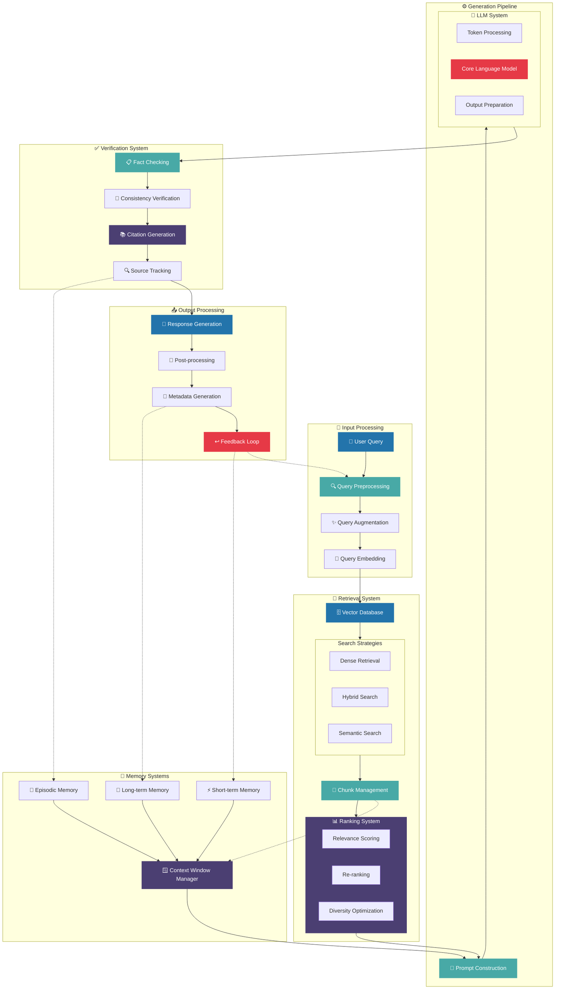

```mermaid
flowchart TB
    subgraph Input ["🔄 Input Processing"]
        Query["📝 User Query"]
        QueryPrep["🔍 Query Preprocessing"]
        QueryAug["✨ Query Augmentation"]
        QueryEmbed["🔢 Query Embedding"]
    end

    subgraph Memory ["💭 Memory Systems"]
        ShortMem["⚡ Short-term Memory"]
        LongMem["💾 Long-term Memory"]
        EpisodicMem["📖 Episodic Memory"]
        ContextWindow["🪟 Context Window Manager"]
    end

    subgraph Retrieval ["🔎 Retrieval System"]
        VectorDB["🗄️ Vector Database"]
        subgraph RetStrat ["Search Strategies"]
            Dense["Dense Retrieval"]
            Hybrid["Hybrid Search"]
            Semantic["Semantic Search"]
        end
        ChunkMgmt["📑 Chunk Management"]
        subgraph Ranking ["📊 Ranking System"]
            RelScore["Relevance Scoring"]
            ReRank["Re-ranking"]
            DiversityOpt["Diversity Optimization"]
        end
    end

    subgraph Generation ["⚙️ Generation Pipeline"]
        PromptConst["🎯 Prompt Construction"]
        subgraph LLMSys ["🧠 LLM System"]
            TokenProc["Token Processing"]
            CoreLLM["Core Language Model"]
            OutPrep["Output Preparation"]
        end
    end

    subgraph Verification ["✅ Verification System"]
        FactCheck["📋 Fact Checking"]
        ConsistCheck["🔄 Consistency Verification"]
        CitationGen["📚 Citation Generation"]
        SourceTrack["🔍 Source Tracking"]
    end

    subgraph Output ["📤 Output Processing"]
        ResponseGen["💬 Response Generation"]
        PostProc["🔧 Post-processing"]
        MetadataGen["📎 Metadata Generation"]
        FeedbackLoop["↩️ Feedback Loop"]
    end

    %% Main Flow Connections
    Query --> QueryPrep --> QueryAug --> QueryEmbed
    QueryEmbed --> VectorDB --> RetStrat --> ChunkMgmt --> Ranking
    
    %% Memory Integration
    ShortMem & LongMem & EpisodicMem --> ContextWindow
    ContextWindow --> PromptConst
    
    %% Generation Flow
    Ranking --> PromptConst --> LLMSys
    
    %% Verification Flow
    LLMSys --> FactCheck --> ConsistCheck --> CitationGen --> SourceTrack
    
    %% Output Flow
    SourceTrack --> ResponseGen --> PostProc --> MetadataGen --> FeedbackLoop
    
    %% Feedback Loops
    FeedbackLoop -.-> QueryPrep
    FeedbackLoop -.-> ShortMem
    MetadataGen -.-> LongMem
    
    %% Cross-System Connections
    ChunkMgmt -.-> ContextWindow
    SourceTrack -.-> EpisodicMem

    classDef primary fill:#2374ab,stroke:#2374ab,stroke-width:2px,color:#fff
    classDef secondary fill:#48a9a6,stroke:#48a9a6,stroke-width:2px,color:#fff
    classDef tertiary fill:#4b3f72,stroke:#4b3f72,stroke-width:2px,color:#fff
    classDef highlight fill:#e63946,stroke:#e63946,stroke-width:3px,color:#fff
    
    class Query,VectorDB,CoreLLM,ResponseGen primary
    class QueryPrep,ChunkMgmt,PromptConst,FactCheck secondary
    class ContextWindow,Ranking,CitationGen,FeedbackLoop tertiary
    class FeedbackLoop,CoreLLM highlight
```
