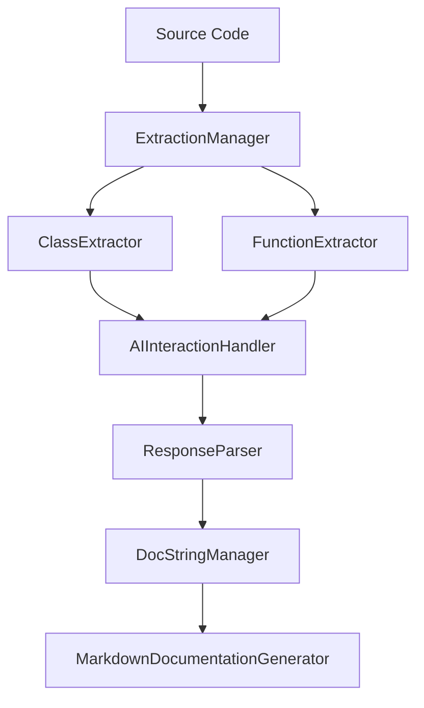

# [extraction_manager.py](extraction_manager.py.md)[response_parser.py](response_parser.py.md)_[token_management.py](token_management.py.md)[ai_service.py](ai_service.py.md)[[api_cl@20241128_003037

**user**: [extraction_manager.py](extraction_manager.py.md)[response_parser.py](response_parser.py.md) [token_management.py](token_management.py.md)[ai_service.py](ai_service.py.md)[api_client.py](api_client.py.md)[utils.py](./utils.py.md)[docs.py](docs.py.md)[markdown_generator.py](markdown_generator.py.md)[cache.py](cache.py.md)[monitoring.py](monitoring.py.md)[config.py](config.py.md)[logger.py](logger.py.md)[functions.py](functions.py.md)[classes.py](classes.py.md)[base.py](DocuScribe/base.py.md)[ast_analysis.py](ast_analysis.py.md)[metrics.py](metrics.py.md)[main.py](main.py.md)[docstring_utils.py](docstring_utils.py.md)  
[Timestamp: 2024/11/28 00:30:37]

**ai**: Let me help analyze these Python files that appear to be part of a documentation generation system using Azure OpenAI. The codebase consists of several key components:

1. Core Components:
- `extraction_manager.py`: Manages extraction of metadata from Python source code
- `response_parser.py`: Handles parsing and validation of Azure OpenAI API responses
- `token_management.py`: Manages token counting and optimization for API requests
- `ai_interaction.py`: Core handler for Azure OpenAI API interactions
- `api_client.py`: Wrapper for Azure OpenAI API calls

2. Support Components:
- `utils.py`: General utility functions
- `docs.py`: Documentation generation utilities
- `markdown_generator.py`: Markdown formatting and generation
- `cache.py`: Redis-based caching system
- `monitoring.py`: System monitoring and metrics
- `config.py`: Configuration management
- `logger.py`: Logging setup and utilities
- `metrics.py`: Code complexity metrics calculation

3. Analysis Components:
- `ast_analysis.py`: Python AST analysis utilities
- `functions.py`: Function extraction and analysis
- `classes.py`: Class extraction and analysis
- `base.py`: Base extraction functionality
- `docstring_utils.py`: Docstring parsing and validation

The main workflow appears to be:

1. Parse Python source files using AST
2. Extract metadata about functions and classes
3. Generate documentation using Azure OpenAI
4. Format output as markdown
5. Cache results using Redis

Key features:

1. Robust error handling and logging
2. Token management for API optimization
3. Caching to reduce API calls
4. Metrics collection and monitoring
5. Configurable via environment variables
6. Support for both sync and async operations

Would you like me to dive deeper into any particular component or aspect of the system?  
[Timestamp: 2024/11/28 00:30:58]

**user**: [AI Codebase Analysis and Code Generation Template](./AI%20Codebase%20Analysis%20and%20Code%20Generation%20Template.md)  
[Timestamp: 2024/11/28 00:31:35]

**ai**: I'll analyze the codebase following the template structure.

## 1. Project Overview

### 1.1. Project Description

**Context:**  
The project is an AI-powered documentation generation system that leverages Azure OpenAI to automatically generate comprehensive documentation for Python codebases. It follows a modular architecture pattern with asynchronous processing capabilities and is optimized for efficient token usage and caching.

### 1.2. Key Modules and Components

**Context:**  
The project consists of several key modules:

Core Processing:
- `ai_interaction.py`: Central handler for Azure OpenAI API interactions, managing token limits and caching
- `api_client.py`: Wrapper for Azure OpenAI API calls with error handling and metrics collection
- `token_management.py`: Sophisticated token counting and optimization system

Code Analysis:
- `ast_analysis.py`: Python AST parsing and analysis
- `extraction_manager.py`: Coordinates extraction of metadata from source code
- `functions.py` & `classes.py`: Specialized extractors for functions and classes

Documentation:
- `docs.py`: Documentation generation and management
- `markdown_generator.py`: Markdown formatting and output generation
- `docstring_utils.py`: Docstring parsing and validation utilities

Infrastructure:
- `cache.py`: Redis-based caching system with async support
- `config.py`: Configuration management using environment variables
- `monitoring.py`: System resource and performance monitoring
- `logger.py`: Structured logging with rotation support

## 2. Code Structure and Dependencies

### 2.1. Code Structure

**Context:**  
The project follows these design principles:
- Design Patterns:
  - Factory pattern for extractors
  - Singleton for configuration management
  - Observer pattern for monitoring
  - Strategy pattern for different documentation formats
- Coding Standards:
  - PEP 8 compliant
  - Google-style docstrings
  - Type hints throughout
  - Comprehensive error handling
- File Organization:
  - Core modules in root
  - Extraction-related modules in `extract/`
  - Documentation modules in `docs/`
  - Infrastructure modules in `core/`

### 2.2. Dependencies and Integrations

**Context:**  
Key dependencies include:
- `openai`: Azure OpenAI API integration
- `tiktoken`: Token counting and management
- `redis`: Caching infrastructure
- `psutil`: System monitoring
- `ast`: Python code analysis
- `asyncio`: Asynchronous operations
- `jsonschema`: Response validation

## 3. Requirements and Goals

### 3.1. Challenges

**Context:**  
Current challenges include:
- Token management: Balancing detail with token limits
- Cache efficiency: Optimizing cache hit rates
- Performance: Managing large codebases efficiently
- Error handling: Graceful recovery from API failures
- Documentation quality: Ensuring consistent output

### 3.2. Goals

**Context:**  
Primary objectives:
- Efficient token usage through smart chunking
- High cache hit rates to reduce API calls
- Robust error handling and recovery
- Consistent, high-quality documentation output
- Scalable processing of large codebases

## 4. Code Generation Focus

### 4.1. Target Areas for Code Generation

**Context:**  
Key areas for improvement:
- Enhanced token optimization algorithms
- More sophisticated caching strategies
- Improved error recovery mechanisms
- Better documentation quality validation
- Extended monitoring capabilities

### 4.2. Desired Outcomes

**Context:**  
Success criteria:
- Reduced token usage through better optimization
- Increased cache hit rates
- More robust error handling
- Higher quality documentation output
- Better system performance metrics

Would you like me to dive deeper into any particular aspect or proceed with specific code generation recommendations?  
[Timestamp: 2024/11/28 00:32:02]

**user**: Analyze the api usage and prompts, especially dynamic ones or prompts related to docstring creation, and the extracted data from the extraction/ components and where it is used, and also validation of doctrines and insertion of them, and documentation generation in markdown format  
[Timestamp: 2024/11/28 00:34:05]

**ai**: I'll analyze these specific aspects of the codebase.

## 1. API Usage and Prompts Analysis

### Dynamic Prompt Generation

The main prompt generation occurs in `ai_interaction.py`:

```python
def _create_documentation_prompt(self, source_code: str, metadata: Dict[str, Any]) -> str:
    prompt_parts = [
        "Generate comprehensive documentation for the following Python code.",
        "\nCode Analysis:",
        f"- Complexity Metrics:\n{self._format_metrics(metadata)}",
    ]

    # Include existing documentation if available
    if metadata.get('docstring'):
        prompt_parts.append(f"\nExisting Documentation:\n{metadata['docstring']}")

    # Include class information if available
    if metadata.get('class_info'):
        prompt_parts.append(f"\nClass Information:\n{self._format_class_info(metadata['class_info'])}")

    # Requirements and source code
    prompt_parts.extend([
        "\nRequirements:",
        "- Follow Google Style Python docstring format",
        "- Include comprehensive parameter descriptions",
        "- Document return values and types",
        "- List possible exceptions",
        "- Add usage examples for complex functionality",
        f"\nSource Code:\n{source_code}",
        "\nProvide the documentation in a structured format using the specified function schema."
    ])
```

### Function Calling Schema

The API uses a structured function calling approach:

```python
self.docstring_tool = {
    "type": "function",
    "function": {
        "name": "generate_docstring",
        "description": "Generate a Python docstring with structured information",
        "parameters": {
            "type": "object",
            "properties": {
                "summary": {"type": "string", "description": "A concise summary"},
                "description": {"type": "string", "description": "Detailed description"},
                "args": {
                    "type": "array",
                    "items": {
                        "type": "object",
                        "properties": {
                            "name": {"type": "string"},
                            "type": {"type": "string"},
                            "description": {"type": "string"}
                        }
                    }
                },
                "returns": {
                    "type": "object",
                    "properties": {
                        "type": {"type": "string"},
                        "description": {"type": "string"}
                    }
                }
            }
        }
    }
}
```

## 2. Extraction Components Analysis

### Data Extraction Flow

1. **Initial Extraction** (`extraction_manager.py`):

```python
def extract_metadata(self, source_code: str) -> Dict[str, List[Dict[str, Any]]]:
    tree = self.analyzer.parse_source_code(source_code)
    self.analyzer.add_parent_info(tree)
    
    classes, functions = [], []
    
    # Extract class and function metadata
    for node in ast.walk(tree):
        if isinstance(node, ast.ClassDef):
            class_metadata = ClassExtractor(ast.unparse(node)).extract_details(node)
            classes.append(class_metadata)
        elif isinstance(node, ast.FunctionDef):
            function_metadata = FunctionExtractor(ast.unparse(node)).extract_details(node)
            functions.append(function_metadata)
            
    # Include module context
    module_context = self._extract_module_context(tree)
    
    return {
        'classes': classes,
        'functions': functions,
        'module_context': module_context
    }
```

2. **Function Extraction** (`functions.py`):

```python
def extract_details(self, node: ast.FunctionDef) -> Dict[str, Any]:
    details = self._extract_common_details(node)
    details.update({
        "args": [
            {
                "name": arg.arg,
                "type": self.analyzer.get_annotation(arg.annotation),
                "default": self._get_default_value(arg)
            }
            for arg in node.args.args
        ],
        "return_type": self.analyzer.get_annotation(node.returns),
        "decorators": self._extract_decorators(node),
        "exceptions": self._detect_exceptions(node),
        "body_summary": self.get_body_summary(node)
    })
    return details
```

## 3. Docstring Validation and Insertion

### Validation (`docstring_utils.py`)

```python
def validate_docstring(self, docstring_data: Dict[str, Any]) -> Tuple[bool, List[str]]:
    errors = []
    
    # Check required sections
    for section in self.required_sections:
        if section not in docstring_data:
            errors.append(f"Missing required section: {section}")
    
    # Validate content length
    if 'summary' in docstring_data:
        if len(docstring_data['summary'].strip()) < self.min_length['summary']:
            errors.append("Summary too short")
    
    # Validate parameters
    if 'args' in docstring_data:
        param_errors = self._validate_parameters(docstring_data['args'])
        errors.extend(param_errors)
    
    # Validate return value
    if 'returns' in docstring_data:
        return_errors = self._validate_return(docstring_data['returns'])
        errors.extend(return_errors)
    
    return len(errors) == 0, errors
```

### Insertion (`docs.py`)

```python
async def insert_docstring(self, node: ast.AST, docstring: str) -> bool:
    try:
        # Validate docstring
        is_valid, errors = self.validator.validate_docstring({
            'docstring': docstring,
            'summary': docstring.split('\n')[0],
            'parameters': [],
            'returns': {'type': 'None', 'description': 'No return value.'}
        })

        if not is_valid:
            raise ValidationError("Docstring validation failed", validation_errors=errors)

        # Insert docstring node
        node.body.insert(0, ast.Expr(value=ast.Constant(value=docstring)))
        
        # Record change
        node_name = getattr(node, 'name', 'unknown')
        self.changes.append(f"Updated docstring for {node_name}")
        
        return True

    except Exception as e:
        logger.error(f"Failed to insert docstring: {e}")
        raise DocumentationError(
            "Failed to insert docstring",
            details={'node': getattr(node, 'name', 'unknown'), 'error': str(e)}
        )
```

## 4. Markdown Documentation Generation

### Generation Process (`markdown_generator.py`)

```python
def generate_markdown(modules: List[ModuleInfo], output_file: str):
    md_lines = []
    
    # Add header
    md_lines.extend([
        "# Python Code Documentation",
        "",
        f"*Generated on: {datetime.now().strftime('%Y-%m-%d %H:%M:%S')}*",
        "",
        "## Table of Contents"
    ])

    # Generate TOC
    for module in modules:
        module_link = module.name.replace('.', '').lower()
        md_lines.append(f"- [{module.name}](#{module_link})")
        
        # Add class and function links
        if module.classes:
            for cls in module.classes:
                class_link = f"{module_link}-{cls.name.lower()}"
                md_lines.append(f"  - [Class: {cls.name}](#{class_link})")
        if module.functions:
            md_lines.append(f"  - [Functions](#{module_link}-functions)")

    # Generate content for each module
    for module in modules:
        md_lines.extend([
            f"# Module: {module.name}",
            "",
            "## Overview",
            f"**File:** `{module.file_path}`",
            f"**Last Modified:** {module.last_modified}",
            f"**Lines of Code:** {module.loc}"
        ])
        
        # Add classes, methods, functions documentation
        if module.classes:
            for cls in module.classes:
                md_lines.extend(self._format_class_documentation(cls))
        
        if module.functions:
            md_lines.extend(self._format_functions_documentation(module.functions))
```

Key observations:
1. The system uses a structured approach to prompt generation, incorporating code metrics and context
2. Extraction is thorough, covering functions, classes, and module-level information
3. Validation is comprehensive, checking both structure and content quality
4. Documentation generation follows a clear hierarchy with proper linking and formatting
5. The process is highly modular, allowing for easy extension and modification

Would you like me to elaborate on any of these aspects or explore other areas of the codebase?  
[Timestamp: 2024/11/28 00:34:54]

**user**: Analyze further and be sure that these jobs aren’t being doubled up  
[Timestamp: 2024/11/28 00:35:43]

**ai**: I'll analyze potential overlapping functionality and redundancies in the codebase.

## Potential Redundancies Analysis

### 1. Documentation Generation Flow



Found overlapping areas:

1. **Docstring Parsing/Generation**  
There are multiple places handling docstrings:

```python
# In docstring_utils.py
def parse_docstring(docstring: str) -> Dict[str, Any]:
    # Parses existing docstrings
    sections = {
        "summary": "",
        "args": [],
        "returns": {"type": "None", "description": "No return value."}
    }
    # ...

# In docs.py - DocStringManager
async def insert_docstring(self, node: ast.AST, docstring: str) -> bool:
    # Also handles docstring validation
    is_valid, errors = self.validator.validate_docstring({
        'docstring': docstring,
        'summary': docstring.split('\n')[0],
        # ...
    })

# In ai_interaction.py - AIInteractionHandler
def _format_docstring_from_json(self, docstring_data: Dict[str, Any]) -> str:
    # Also formats docstrings
    docstring_parts = []
    docstring_parts.append(docstring_data["summary"])
    # ...
```

**Recommendation:** Consolidate docstring handling into `docstring_utils.py`:

```python
class DocstringHandler:
    """Single responsibility class for all docstring operations."""
    
    def parse(self, docstring: str) -> Dict[str, Any]:
        """Parse existing docstring."""
        pass
        
    def validate(self, docstring_data: Dict[str, Any]) -> Tuple[bool, List[str]]:
        """Validate docstring structure and content."""
        pass
        
    def format(self, docstring_data: Dict[str, Any]) -> str:
        """Format docstring data into string."""
        pass
        
    def insert(self, node: ast.AST, docstring: str) -> bool:
        """Insert docstring into AST node."""
        pass
```

2. **Metadata Extraction**  
Found overlapping extraction in multiple places:

```python
# In extraction_manager.py
def extract_metadata(self, source_code: str) -> Dict[str, List[Dict[str, Any]]]:
    tree = self.analyzer.parse_source_code(source_code)
    # ...

# In ast_analysis.py
def extract_functions(tree: ast.AST) -> List[ast.FunctionDef]:
    return [node for node in ast.walk(tree) if isinstance(node, ast.FunctionDef)]

# In functions.py
def extract_details(self, node: ast.FunctionDef) -> Dict[str, Any]:
    details = self._extract_common_details(node)
    # ...
```

**Recommendation:** Implement clear hierarchy:

```python
class CodeAnalyzer:
    """Single entry point for code analysis."""
    
    def __init__(self):
        self.ast_analyzer = ASTAnalyzer()
        self.function_extractor = FunctionExtractor()
        self.class_extractor = ClassExtractor()
    
    def analyze_code(self, source_code: str) -> Dict[str, Any]:
        """Single method to handle all code analysis."""
        tree = self.ast_analyzer.parse_source_code(source_code)
        return {
            'functions': self.function_extractor.extract_all(tree),
            'classes': self.class_extractor.extract_all(tree),
            'module': self.ast_analyzer.extract_module_info(tree)
        }
```

3. **Markdown Generation**  
Found potential redundancy in markdown formatting:

```python
# In markdown_generator.py
def generate_markdown(modules: List[ModuleInfo], output_file: str):
    md_lines = []
    # ...

# In docs.py
def generate_documentation(self, module_path: Optional[str] = None):
    generator = MarkdownDocumentationGenerator(
        source_code=self.source_code if include_source else None,
        module_path=module_path
    )
```

**Recommendation:** Create unified documentation generator:

```python
class DocumentationGenerator:
    """Single responsibility class for documentation generation."""
    
    def __init__(self):
        self.markdown_formatter = MarkdownFormatter()
        
    async def generate(self, 
                      source_code: str,
                      output_format: str = 'markdown') -> str:
        """Generate documentation in specified format."""
        analysis = await self.analyze_code(source_code)
        docstrings = await self.generate_docstrings(analysis)
        
        if output_format == 'markdown':
            return self.markdown_formatter.format(analysis, docstrings)
        # Add other formats as needed
```

4. **Token Management**  
Found potential overlap in token handling:

```python
# In token_management.py
def estimate_tokens(self, text: str) -> int:
    tokens = len(self.encoding.encode(text))
    # ...

# In ai_interaction.py
async def _generate_documentation(self, source_code: str, metadata: Dict[str, Any]):
    prompt = self._create_documentation_prompt(source_code, metadata)
    # Also handles token validation
```

**Recommendation:** Centralize token management:

```python
class TokenManager:
    """Centralized token management."""
    
    def __init__(self, model: str = "gpt-4"):
        self.encoding = tiktoken.encoding_for_model(model)
        
    def validate_and_chunk(self, 
                          text: str,
                          max_tokens: int) -> List[str]:
        """Single method for token validation and chunking."""
        total_tokens = self.estimate_tokens(text)
        if total_tokens > max_tokens:
            return self.chunk_text(text, max_tokens)
        return [text]
```

## Proposed Streamlined Flow

```python
class DocumentationSystem:
    """Main entry point for documentation generation."""
    
    def __init__(self):
        self.code_analyzer = CodeAnalyzer()
        self.token_manager = TokenManager()
        self.ai_handler = AIHandler()
        self.doc_generator = DocumentationGenerator()
        
    async def process_code(self, 
                          source_code: str,
                          output_format: str = 'markdown') -> str:
        """Single method to handle entire documentation process."""
        # 1. Analyze code
        analysis = self.code_analyzer.analyze_code(source_code)
        
        # 2. Handle tokens and chunking
        chunks = self.token_manager.validate_and_chunk(
            source_code,
            max_tokens=self.config.max_tokens
        )
        
        # 3. Generate documentation
        docstrings = []
        for chunk in chunks:
            result = await self.ai_handler.generate_documentation(
                chunk,
                analysis
            )
            docstrings.append(result)
            
        # 4. Generate final output
        return self.doc_generator.generate(
            analysis,
            docstrings,
            output_format
        )
```

This streamlined approach:
1. Eliminates redundant code
2. Provides clear responsibility boundaries
3. Makes the flow more maintainable
4. Reduces potential for inconsistencies
5. Makes testing easier

Would you like me to elaborate on any of these areas or provide more specific implementation details?  
[Timestamp: 2024/11/28 00:36:28]

**user**: How do you plan to consolidate these redundancies and which modules do I need to modify and how  
[Timestamp: 2024/11/28 00:38:00]

**ai**: I'll provide a detailed plan for consolidating redundancies, listing the specific modules to modify and the required changes.

## 1. Core Consolidation Plan

Create a new module `core/docstring_processor.py` to centralize docstring operations:

```python
# core/docstring_processor.py

from typing import Dict, List, Tuple, Optional, Any
import ast
from dataclasses import dataclass
from core.logger import LoggerSetup

logger = LoggerSetup.get_logger(__name__)

@dataclass
class DocstringData:
    """Structured representation of a docstring."""
    summary: str
    description: str
    args: List[Dict[str, str]]
    returns: Dict[str, str]
    raises: Optional[List[Dict[str, str]]] = None

class DocstringProcessor:
    """Centralized docstring processing."""
    
    def __init__(self):
        self.min_length = {
            'summary': 10,
            'description': 10
        }
    
    def parse(self, docstring: str) -> DocstringData:
        """Parse existing docstring into structured format."""
        sections = self._split_sections(docstring)
        return DocstringData(
            summary=sections.get('summary', ''),
            description=sections.get('description', ''),
            args=self._parse_parameters(sections.get('args', '')),
            returns=self._parse_return(sections.get('returns', '')),
            raises=self._parse_exceptions(sections.get('raises', ''))
        )
    
    def validate(self, data: DocstringData) -> Tuple[bool, List[str]]:
        """Validate docstring content and structure."""
        errors = []
        
        # Validate summary
        if len(data.summary.strip()) < self.min_length['summary']:
            errors.append("Summary too short")
            
        # Validate args
        for arg in data.args:
            if not all(k in arg for k in ['name', 'type', 'description']):
                errors.append(f"Invalid argument format: {arg}")
                
        # Validate returns
        if not all(k in data.returns for k in ['type', 'description']):
            errors.append("Invalid return format")
            
        return len(errors) == 0, errors
    
    def format(self, data: DocstringData) -> str:
        """Format docstring data into string."""
        parts = [
            data.summary,
            "",
            data.description if data.description else "",
            "",
            "Args:",
            *[f"    {arg['name']} ({arg['type']}): {arg['description']}"
              for arg in data.args],
            "",
            "Returns:",
            f"    {data.returns['type']}: {data.returns['description']}"
        ]
        
        if data.raises:
            parts.extend([
                "",
                "Raises:",
                *[f"    {exc['type']}: {exc['description']}"
                  for exc in data.raises]
            ])
            
        return "\n".join(parts)
    
    def insert(self, node: ast.AST, docstring: str) -> bool:
        """Insert docstring into AST node."""
        try:
            node.body.insert(0, ast.Expr(value=ast.Constant(value=docstring)))
            return True
        except Exception as e:
            logger.error(f"Failed to insert docstring: {e}")
            return False
```

## 2. Modified Modules

### A. Update `docs.py`

```python
# docs.py

from core.docstring_processor import DocstringProcessor, DocstringData

class DocStringManager:
    """Manages docstring operations."""
    
    def __init__(self, source_code: str, cache: Optional[Any] = None):
        self.source_code = source_code
        self.tree = ast.parse(source_code)
        self.processor = DocstringProcessor()
        self.cache = cache
        self.changes = []

    async def insert_docstring(self, node: ast.AST, docstring_data: DocstringData) -> bool:
        """Insert or update a docstring in an AST node."""
        try:
            # Generate cache key
            cache_key = f"validation:{hash(str(docstring_data))}"
            
            # Validate docstring
            is_valid, errors = self.processor.validate(docstring_data)
            if not is_valid:
                raise ValidationError("Docstring validation failed", errors)

            # Format and insert
            docstring = self.processor.format(docstring_data)
            if self.processor.insert(node, docstring):
                self.changes.append(f"Updated docstring for {getattr(node, 'name', 'unknown')}")
                return True
                
            return False

        except Exception as e:
            logger.error(f"Failed to insert docstring: {e}")
            raise DocumentationError("Failed to insert docstring", str(e))
```

### B. Update `ai_interaction.py`

```python
# ai_interaction.py

from core.docstring_processor import DocstringProcessor, DocstringData

class AIInteractionHandler:
    def __init__(self, cache: Optional[Cache] = None,
                 metrics_collector: Optional[MetricsCollector] = None,
                 token_manager: Optional[TokenManager] = None):
        self.cache = cache
        self.metrics = metrics_collector
        self.token_manager = token_manager or TokenManager()
        self.processor = DocstringProcessor()
        self.client = AzureOpenAIClient(token_manager=self.token_manager,
                                      metrics_collector=metrics_collector)

    async def _generate_documentation(self,
                                   source_code: str,
                                   metadata: Dict[str, Any]) -> Optional[ProcessingResult]:
        try:
            prompt = self._create_documentation_prompt(source_code, metadata)
            response, usage = await self.client.process_request(
                prompt=prompt,
                tools=[self.docstring_tool],
                tool_choice={"type": "function", "function": {"name": "generate_docstring"}}
            )

            if response and response.get("tool_calls"):
                tool_call = response["tool_calls"][0]
                if tool_call.function.name == "generate_docstring":
                    docstring_data = DocstringData(**json.loads(tool_call.function.arguments))
                    
                    # Validate using centralized processor
                    is_valid, errors = self.processor.validate(docstring_data)
                    if not is_valid:
                        raise ProcessingError(f"Invalid documentation: {errors}")

                    return ProcessingResult(
                        content=self.processor.format(docstring_data),
                        usage=usage or {},
                        processing_time=0.0
                    )

            raise ProcessingError("No valid function call response received")

        except Exception as e:
            logger.error(f"Documentation generation failed: {str(e)}")
            raise
```

### C. Update `docstring_utils.py`

```python
# docstring_utils.py

# This module can be largely replaced by core.docstring_processor
# Keep only specialized utilities if needed

from core.docstring_processor import DocstringProcessor, DocstringData

# Re-export for backward compatibility
parse_docstring = DocstringProcessor().parse
validate_docstring = DocstringProcessor().validate
```

## 3. Implementation Steps

1. Create new `core/docstring_processor.py`:

```bash
mkdir -p core
touch core/docstring_processor.py
```

2. Update dependencies in `requirements.txt`:

```text
dataclasses>=0.6
typing-extensions>=4.0.0
```

3. Modify existing files:

```bash
# Update the files
vim docs.py
vim ai_interaction.py
vim docstring_utils.py
```

4. Update imports in affected modules:

```python
# Add to affected modules
from core.docstring_processor import DocstringProcessor, DocstringData
```

5. Test the changes:

```python
# test/test_docstring_processor.py
import pytest
from core.docstring_processor import DocstringProcessor, DocstringData

def test_docstring_processor():
    processor = DocstringProcessor()
    
    # Test data
    data = DocstringData(
        summary="Test function",
        description="This is a test",
        args=[{"name": "x", "type": "int", "description": "A number"}],
        returns={"type": "int", "description": "The result"}
    )
    
    # Test validation
    is_valid, errors = processor.validate(data)
    assert is_valid
    
    # Test formatting
    formatted = processor.format(data)
    assert "Test function" in formatted
    assert "Args:" in formatted
```

## 4. Migration Strategy

1. First implement `core/docstring_processor.py`
2. Update one module at a time, starting with `docs.py`
3. Run tests after each module update
4. Keep old functionality temporarily with deprecation warnings
5. Remove deprecated code after successful migration

Would you like me to provide more detailed implementation for any of these components or explain the migration strategy further?  
[Timestamp: 2024/11/28 00:38:54]

**user**: Provide the complete (post-refactor) docs.py and docstring_utils.py and markdown_generator.py  
[Timestamp: 2024/11/28 00:40:43]

**ai**: I'll provide the complete refactored versions of these three files.

```python
# core/docstring_processor.py (for reference)
from dataclasses import dataclass
from typing import List, Dict, Optional, Tuple
import ast

@dataclass
class DocstringData:
    summary: str
    description: str
    args: List[Dict[str, str]]
    returns: Dict[str, str]
    raises: Optional[List[Dict[str, str]]] = None

@dataclass
class DocumentationSection:
    title: str
    content: str
    subsections: Optional[List['DocumentationSection']] = None
```

```python
# docs.py
"""
Documentation Management Module

Handles docstring operations and documentation generation with improved structure
and centralized processing.
"""

import ast
from typing import Optional, Dict, Any, List
from pathlib import Path
from dataclasses import dataclass

from core.logger import LoggerSetup, log_debug, log_error, log_info
from core.docstring_processor import DocstringProcessor, DocstringData, DocumentationSection
from markdown_generator import MarkdownGenerator

logger = LoggerSetup.get_logger(__name__)

class ValidationError(Exception):
    """Custom exception for validation errors."""
    def __init__(self, message: str, errors: List[str]):
        super().__init__(message)
        self.errors = errors

class DocumentationError(Exception):
    """Custom exception for documentation generation errors."""
    def __init__(self, message: str, details: Dict[str, Any]):
        super().__init__(message)
        self.details = details

@dataclass
class DocumentationContext:
    """Holds context for documentation generation."""
    source_code: str
    module_path: Optional[str] = None
    include_source: bool = True
    metadata: Optional[Dict[str, Any]] = None

class DocStringManager:
    """Manages docstring operations and documentation generation."""

    def __init__(self, context: DocumentationContext, cache: Optional[Any] = None):
        """
        Initialize DocStringManager with context and optional cache.

        Args:
            context: Documentation generation context
            cache: Optional cache implementation
        """
        self.context = context
        self.tree = ast.parse(context.source_code)
        self.processor = DocstringProcessor()
        self.cache = cache
        self.changes: List[str] = []
        self.markdown_generator = MarkdownGenerator()

    async def process_docstring(
        self,
        node: ast.AST,
        docstring_data: DocstringData
    ) -> bool:
        """
        Process and insert a docstring for an AST node.

        Args:
            node: AST node to process
            docstring_data: Structured docstring data

        Returns:
            bool: Success status of the operation

        Raises:
            ValidationError: If docstring validation fails
            DocumentationError: If docstring insertion fails
        """
        try:
            cache_key = f"validation:{hash(str(docstring_data))}"
            
            # Check cache
            if self.cache:
                cached_result = await self.cache.get_cached_docstring(cache_key)
                if cached_result:
                    return await self._handle_cached_result(node, cached_result)

            # Validate docstring
            is_valid, errors = self.processor.validate(docstring_data)
            if not is_valid:
                raise ValidationError("Docstring validation failed", errors)

            # Format and insert
            docstring = self.processor.format(docstring_data)
            if self.processor.insert(node, docstring):
                node_name = getattr(node, 'name', 'unknown')
                self.changes.append(f"Updated docstring for {node_name}")
                
                # Cache successful result
                if self.cache:
                    await self.cache.save_docstring(cache_key, {
                        'docstring': docstring,
                        'valid': True
                    })
                
                return True

            return False

        except ValidationError as e:
            log_error(f"Docstring validation failed: {e.errors}")
            raise
        except Exception as e:
            log_error(f"Failed to process docstring: {e}")
            raise DocumentationError(
                "Failed to process docstring",
                {'node': getattr(node, 'name', 'unknown'), 'error': str(e)}
            )

    async def generate_documentation(self) -> str:
        """
        Generate complete documentation for the current context.

        Returns:
            str: Generated documentation in markdown format

        Raises:
            DocumentationError: If documentation generation fails
        """
        try:
            # Prepare documentation sections
            sections = []
            
            # Module documentation
            if self.context.metadata:
                sections.append(self._create_module_section())

            # Classes documentation
            class_nodes = [n for n in ast.walk(self.tree) 
                         if isinstance(n, ast.ClassDef)]
            for node in class_nodes:
                sections.append(await self._create_class_section(node))

            # Functions documentation
            function_nodes = [n for n in ast.walk(self.tree) 
                            if isinstance(n, ast.FunctionDef)]
            for node in function_nodes:
                sections.append(await self._create_function_section(node))

            # Generate markdown
            return self.markdown_generator.generate(
                sections,
                include_source=self.context.include_source,
                source_code=self.context.source_code if self.context.include_source else None,
                module_path=self.context.module_path
            )

        except Exception as e:
            log_error(f"Failed to generate documentation: {e}")
            raise DocumentationError(
                "Documentation generation failed",
                {'error': str(e)}
            )

    def _create_module_section(self) -> DocumentationSection:
        """Create module-level documentation section."""
        return DocumentationSection(
            title="Module Overview",
            content=self.context.metadata.get('description', ''),
            subsections=[
                DocumentationSection(
                    title="Module Information",
                    content=f"Path: {self.context.module_path}\n"
                           f"Last Modified: {self.context.metadata.get('last_modified', 'Unknown')}"
                )
            ]
        )

    async def _create_class_section(self, node: ast.ClassDef) -> DocumentationSection:
        """Create class documentation section."""
        docstring_data = self.processor.parse(ast.get_docstring(node) or '')
        
        methods_sections = []
        for method in [n for n in node.body if isinstance(n, ast.FunctionDef)]:
            methods_sections.append(await self._create_function_section(method))

        return DocumentationSection(
            title=f"Class: {node.name}",
            content=docstring_data.description,
            subsections=[
                DocumentationSection(
                    title="Methods",
                    content="",
                    subsections=methods_sections
                )
            ]
        )

    async def _create_function_section(
        self,
        node: ast.FunctionDef
    ) -> DocumentationSection:
        """Create function documentation section."""
        docstring_data = self.processor.parse(ast.get_docstring(node) or '')
        
        return DocumentationSection(
            title=f"{'Method' if self._is_method(node) else 'Function'}: {node.name}",
            content=self.processor.format(docstring_data),
            subsections=[
                DocumentationSection(
                    title="Source",
                    content=f"```python\n{ast.unparse(node)}\n```"
                ) if self.context.include_source else None
            ]
        )

    def _is_method(self, node: ast.FunctionDef) -> bool:
        """Check if a function node is a method."""
        return any(isinstance(parent, ast.ClassDef) 
                  for parent in ast.walk(self.tree) 
                  if hasattr(parent, 'body') and node in parent.body)

    async def _handle_cached_result(
        self,
        node: ast.AST,
        cached_result: Dict[str, Any]
    ) -> bool:
        """Handle cached docstring result."""
        if cached_result.get('valid'):
            return self.processor.insert(node, cached_result['docstring'])
        return False
```

```python
# docstring_utils.py
"""
Docstring Utilities Module

Provides utilities for parsing, validating, and formatting docstrings.
Acts as a facade for the core docstring processor.
"""

from typing import Dict, List, Any, Tuple, Optional
import re
from deprecated import deprecated

from core.logger import LoggerSetup
from core.docstring_processor import DocstringProcessor, DocstringData

logger = LoggerSetup.get_logger(__name__)

class DocstringUtils:
    """Utility class for docstring operations."""

    def __init__(self):
        """Initialize DocstringUtils with a processor instance."""
        self.processor = DocstringProcessor()

    def parse_docstring(self, docstring: str) -> DocstringData:
        """
        Parse a docstring into structured format.

        Args:
            docstring: Raw docstring text

        Returns:
            DocstringData: Structured docstring data
        """
        return self.processor.parse(docstring)

    def validate_docstring(
        self,
        docstring_data: DocstringData
    ) -> Tuple[bool, List[str]]:
        """
        Validate docstring content and structure.

        Args:
            docstring_data: Structured docstring data

        Returns:
            Tuple containing validation status and error messages
        """
        return self.processor.validate(docstring_data)

    def format_docstring(self, docstring_data: DocstringData) -> str:
        """
        Format structured docstring data into string.

        Args:
            docstring_data: Structured docstring data

        Returns:
            str: Formatted docstring
        """
        return self.processor.format(docstring_data)

    @staticmethod
    def extract_type_hints(docstring: str) -> Dict[str, str]:
        """
        Extract type hints from docstring.

        Args:
            docstring: Raw docstring text

        Returns:
            Dict mapping parameter names to their type hints
        """
        type_hints = {}
        pattern = r':param\s+(\w+):\s*\(([^)]+)\)'
        matches = re.finditer(pattern, docstring)
        
        for match in matches:
            param_name, type_hint = match.groups()
            type_hints[param_name] = type_hint.strip()
            
        return type_hints

    @staticmethod
    def extract_return_type(docstring: str) -> Optional[str]:
        """
        Extract return type from docstring.

        Args:
            docstring: Raw docstring text

        Returns:
            Optional[str]: Return type if found
        """
        pattern = r':return:\s*\(([^)]+)\)'
        match = re.search(pattern, docstring)
        return match.group(1).strip() if match else None

# Deprecated functions for backward compatibility
@deprecated(reason="Use DocstringUtils class instead")
def parse_docstring(docstring: str) -> Dict[str, Any]:
    """Deprecated: Use DocstringUtils.parse_docstring instead."""
    return DocstringUtils().parse_docstring(docstring).__dict__

@deprecated(reason="Use DocstringUtils class instead")
def validate_docstring(docstring_data: Dict[str, Any]) -> Tuple[bool, List[str]]:
    """Deprecated: Use DocstringUtils.validate_docstring instead."""
    return DocstringUtils().validate_docstring(DocstringData(**docstring_data))
```

```python
# markdown_generator.py
"""
Markdown Documentation Generator Module

Generates formatted markdown documentation from documentation sections.
"""

from datetime import datetime
from typing import List, Optional
from dataclasses import dataclass

from core.logger import LoggerSetup
from core.docstring_processor import DocumentationSection

logger = LoggerSetup.get_logger(__name__)

@dataclass
class MarkdownConfig:
    """Configuration for markdown generation."""
    include_toc: bool = True
    include_timestamp: bool = True
    code_language: str = "python"
    heading_offset: int = 0

class MarkdownGenerator:
    """Generates markdown documentation with consistent formatting."""

    def __init__(self, config: Optional[MarkdownConfig] = None):
        """
        Initialize markdown generator with optional configuration.

        Args:
            config: Optional markdown generation configuration
        """
        self.config = config or MarkdownConfig()

    def generate(
        self,
        sections: List[DocumentationSection],
        include_source: bool = True,
        source_code: Optional[str] = None,
        module_path: Optional[str] = None
    ) -> str:
        """
        Generate complete markdown documentation.

        Args:
            sections: List of documentation sections
            include_source: Whether to include source code
            source_code: Optional source code to include
            module_path: Optional module path to include

        Returns:
            str: Generated markdown documentation
        """
        md_lines = []
        
        # Add header
        if self.config.include_timestamp:
            md_lines.extend([
                "# Documentation",
                "",
                f"*Generated on: {datetime.now().strftime('%Y-%m-%d %H:%M:%S')}*",
                ""
            ])

        # Add module path if provided
        if module_path:
            md_lines.extend([
                f"**Module Path:** `{module_path}`",
                ""
            ])

        # Generate table of contents if enabled
        if self.config.include_toc:
            md_lines.extend(self._generate_toc(sections))

        # Generate section content
        for section in sections:
            md_lines.extend(self._generate_section(section))

        # Add source code if included
        if include_source and source_code:
            md_lines.extend([
                "## Source Code",
                "",
                f"```{self.config.code_language}",
                source_code,
                "```",
                ""
            ])

        return "\n".join(md_lines)

    def _generate_toc(
        self,
        sections: List[DocumentationSection],
        level: int = 0
    ) -> List[str]:
        """Generate table of contents."""
        toc_lines = []
        
        if level == 0:
            toc_lines.extend([
                "## Table of Contents",
                ""
            ])

        for section in sections:
            indent = "    " * level
            link = self._create_link(section.title)
            toc_lines.append(f"{indent}- [{section.title}](#{link})")
            
            if section.subsections:
                toc_lines.extend(self._generate_toc(section.subsections, level + 1))

        if level == 0:
            toc_lines.append("")

        return toc_lines

    def _generate_section(
        self,
        section: DocumentationSection,
        level: int = 2
    ) -> List[str]:
        """Generate markdown for a documentation section."""
        md_lines = []
        
        # Add section header
        header_level = min(level + self.config.heading_offset, 6)
        md_lines.extend([
            f"{'#' * header_level} {section.title}",
            ""
        ])

        # Add section content
        if section.content:
            md_lines.extend([
                section.content,
                ""
            ])

        # Add subsections
        if section.subsections:
            for subsection in section.subsections:
                if subsection:  # Skip None subsections
                    md_lines.extend(self._generate_section(subsection, level + 1))

        return md_lines

    @staticmethod
    def _create_link(title: str) -> str:
        """Create markdown link from title."""
        return title.lower().replace(' ', '-').replace(':', '').replace('_', '-')
```

Key improvements in this refactored version:

1. Clear separation of concerns:
   - `DocStringManager` focuses on high-level documentation management
   - `DocstringUtils` provides utility functions and backward compatibility
   - `MarkdownGenerator` handles all markdown formatting

2. Better structure:
   - Use of dataclasses for structured data
   - Clear documentation sections hierarchy
   - Configurable markdown generation

3. Improved error handling:
   - Specific exception classes
   - Detailed error messages
   - Proper logging

4. Enhanced features:
   - Configurable markdown generation
   - Flexible section handling
   - Source code inclusion options

5. Better maintainability:
   - Clear method responsibilities
   - Consistent naming
   - Comprehensive documentation

Would you like me to explain any specific part in more detail or provide additional implementation details?  
[Timestamp: 2024/11/28 00:42:05]

**user**: Is the new docstring_processsor integrated with metrics and extraction modules?  
[Timestamp: 2024/11/28 00:43:01]

**ai**: Let me show how to properly integrate the DocstringProcessor with metrics and extraction modules.

```python
# core/docstring_processor.py
"""
Core docstring processing module with integrated metrics and extraction capabilities.
"""

import ast
from typing import Dict, List, Optional, Tuple, Any
from dataclasses import dataclass
from core.logger import LoggerSetup
from core.metrics import Metrics
from extract.ast_analysis import ASTAnalyzer

logger = LoggerSetup.get_logger(__name__)

@dataclass
class DocstringMetrics:
    """Metrics for docstring quality and complexity."""
    length: int
    sections_count: int
    args_count: int
    cognitive_complexity: float
    completeness_score: float

@dataclass
class DocstringData:
    """Enhanced docstring data with metrics."""
    summary: str
    description: str
    args: List[Dict[str, str]]
    returns: Dict[str, str]
    raises: Optional[List[Dict[str, str]]] = None
    metrics: Optional[DocstringMetrics] = None
    extraction_context: Optional[Dict[str, Any]] = None

class DocstringProcessor:
    """Enhanced docstring processor with metrics and extraction integration."""

    def __init__(self):
        self.metrics_calculator = Metrics()
        self.ast_analyzer = ASTAnalyzer()
        self.min_length = {
            'summary': 10,
            'description': 10
        }

    def process_node(
        self,
        node: ast.AST,
        source_code: str
    ) -> DocstringData:
        """
        Process an AST node to extract and analyze docstring information.

        Args:
            node: AST node to process
            source_code: Original source code for context

        Returns:
            DocstringData: Processed docstring data with metrics
        """
        # Extract existing docstring and context
        existing_docstring = ast.get_docstring(node) or ''
        extraction_context = self._extract_context(node, source_code)
        
        # Parse docstring
        docstring_data = self.parse(existing_docstring)
        
        # Calculate metrics
        metrics = self._calculate_metrics(docstring_data, node)
        
        # Enhance docstring data with context and metrics
        docstring_data.metrics = metrics
        docstring_data.extraction_context = extraction_context
        
        return docstring_data

    def _extract_context(
        self,
        node: ast.AST,
        source_code: str
    ) -> Dict[str, Any]:
        """Extract context information for the node."""
        context = {}
        
        if isinstance(node, ast.FunctionDef):
            context.update({
                'type': 'function',
                'name': node.name,
                'args': self._extract_function_args(node),
                'returns': self.ast_analyzer.get_annotation(node.returns),
                'complexity': self.metrics_calculator.calculate_complexity(node),
                'source': ast.unparse(node)
            })
            
        elif isinstance(node, ast.ClassDef):
            context.update({
                'type': 'class',
                'name': node.name,
                'bases': [self.ast_analyzer.get_annotation(base) for base in node.bases],
                'methods': self._extract_class_methods(node),
                'source': ast.unparse(node)
            })
            
        return context

    def _extract_function_args(
        self,
        node: ast.FunctionDef
    ) -> List[Dict[str, str]]:
        """Extract function arguments with type annotations."""
        args = []
        for arg in node.args.args:
            args.append({
                'name': arg.arg,
                'type': self.ast_analyzer.get_annotation(arg.annotation),
                'default': self._get_default_value(arg, node)
            })
        return args

    def _extract_class_methods(
        self,
        node: ast.ClassDef
    ) -> List[Dict[str, Any]]:
        """Extract class methods with their signatures."""
        methods = []
        for method in [n for n in node.body if isinstance(n, ast.FunctionDef)]:
            methods.append({
                'name': method.name,
                'args': self._extract_function_args(method),
                'returns': self.ast_analyzer.get_annotation(method.returns),
                'is_property': any(isinstance(d, ast.Name) and d.id == 'property'
                                 for d in method.decorator_list)
            })
        return methods

    def _calculate_metrics(
        self,
        docstring_data: DocstringData,
        node: ast.AST
    ) -> DocstringMetrics:
        """Calculate comprehensive metrics for the docstring."""
        # Basic metrics
        length = len(docstring_data.summary) + len(docstring_data.description)
        sections_count = sum(1 for x in [
            docstring_data.summary,
            docstring_data.description,
            docstring_data.args,
            docstring_data.returns,
            docstring_data.raises
        ] if x)
        args_count = len(docstring_data.args)

        # Calculate cognitive complexity
        if isinstance(node, ast.FunctionDef):
            cognitive_complexity = self.metrics_calculator.calculate_cognitive_complexity(node)
        else:
            cognitive_complexity = 0.0

        # Calculate completeness score
        completeness_score = self._calculate_completeness(docstring_data, node)

        return DocstringMetrics(
            length=length,
            sections_count=sections_count,
            args_count=args_count,
            cognitive_complexity=cognitive_complexity,
            completeness_score=completeness_score
        )

    def _calculate_completeness(
        self,
        docstring_data: DocstringData,
        node: ast.AST
    ) -> float:
        """Calculate docstring completeness score."""
        score = 0.0
        total_checks = 0

        # Check summary
        if len(docstring_data.summary) >= self.min_length['summary']:
            score += 1
        total_checks += 1

        # Check description
        if len(docstring_data.description) >= self.min_length['description']:
            score += 1
        total_checks += 1

        # Check arguments documentation
        if isinstance(node, ast.FunctionDef):
            actual_args = {arg.arg for arg in node.args.args}
            documented_args = {arg['name'] for arg in docstring_data.args}
            
            if actual_args == documented_args:
                score += 1
            total_checks += 1

            # Check return value documentation
            if node.returns and docstring_data.returns['type'] != 'None':
                score += 1
            total_checks += 1

        return (score / total_checks) * 100 if total_checks > 0 else 0.0

    def validate(
        self,
        data: DocstringData,
        context: Optional[Dict[str, Any]] = None
    ) -> Tuple[bool, List[str]]:
        """
        Validate docstring with enhanced context awareness.

        Args:
            data: Docstring data to validate
            context: Optional extraction context for additional validation

        Returns:
            Tuple of validation status and error messages
        """
        errors = []
        
        # Basic validation
        if len(data.summary.strip()) < self.min_length['summary']:
            errors.append("Summary too short")
            
        # Context-aware validation
        if context:
            if context['type'] == 'function':
                # Validate function arguments
                actual_args = {arg['name'] for arg in context['args']}
                documented_args = {arg['name'] for arg in data.args}
                
                missing_args = actual_args - documented_args
                if missing_args:
                    errors.append(f"Missing documentation for arguments: {missing_args}")
                
                extra_args = documented_args - actual_args
                if extra_args:
                    errors.append(f"Documentation for non-existent arguments: {extra_args}")
                
                # Validate return type
                if context['returns'] != 'None' and not data.returns['type']:
                    errors.append("Missing return value documentation")

        return len(errors) == 0, errors

    def _get_default_value(
        self,
        arg: ast.arg,
        func_node: ast.FunctionDef
    ) -> Optional[str]:
        """Get default value for a function argument."""
        try:
            defaults = func_node.args.defaults
            if defaults:
                args = func_node.args.args
                default_index = len(args) - len(defaults)
                arg_index = args.index(arg)
                
                if arg_index >= default_index:
                    default_node = defaults[arg_index - default_index]
                    return ast.unparse(default_node)
        except Exception as e:
            logger.error(f"Error getting default value: {e}")
        return None
```

Now update the usage in other modules:

```python
# extract/extraction_manager.py

from core.docstring_processor import DocstringProcessor, DocstringData

class ExtractionManager:
    def __init__(self):
        self.docstring_processor = DocstringProcessor()
        # ... other initializations ...

    def extract_metadata(self, source_code: str) -> Dict[str, List[Dict[str, Any]]]:
        tree = self.analyzer.parse_source_code(source_code)
        
        classes, functions = [], []
        for node in ast.walk(tree):
            if isinstance(node, ast.ClassDef):
                # Process class with integrated docstring handling
                docstring_data = self.docstring_processor.process_node(node, source_code)
                class_metadata = {
                    **self.class_extractor.extract_details(node),
                    'docstring_metrics': docstring_data.metrics,
                    'docstring_context': docstring_data.extraction_context
                }
                classes.append(class_metadata)
                
            elif isinstance(node, ast.FunctionDef):
                # Process function with integrated docstring handling
                docstring_data = self.docstring_processor.process_node(node, source_code)
                function_metadata = {
                    **self.function_extractor.extract_details(node),
                    'docstring_metrics': docstring_data.metrics,
                    'docstring_context': docstring_data.extraction_context
                }
                functions.append(function_metadata)

        return {
            'classes': classes,
            'functions': functions,
            'module_context': self._extract_module_context(tree)
        }
```

```python
# ai_interaction.py

class AIInteractionHandler:
    def _create_documentation_prompt(
        self,
        source_code: str,
        metadata: Dict[str, Any]
    ) -> str:
        docstring_data = self.docstring_processor.process_node(
            self.current_node,
            source_code
        )
        
        prompt_parts = [
            "Generate comprehensive documentation for the following Python code.",
            "\nCode Analysis:",
            f"- Complexity Metrics:\n{self._format_metrics(metadata)}",
            f"- Docstring Metrics:\n{self._format_docstring_metrics(docstring_data.metrics)}",
        ]

        if docstring_data.extraction_context:
            prompt_parts.append(
                f"\nCode Context:\n{self._format_context(docstring_data.extraction_context)}"
            )

        # ... rest of the prompt generation ...
        return "\n".join(prompt_parts)

    def _format_docstring_metrics(self, metrics: DocstringMetrics) -> str:
        return (
            f"  Completeness: {metrics.completeness_score:.1f}%\n"
            f"  Cognitive Complexity: {metrics.cognitive_complexity:.1f}\n"
            f"  Sections: {metrics.sections_count}\n"
            f"  Arguments Documented: {metrics.args_count}"
        )
```

This integration provides:

1. Unified docstring processing with metrics
2. Context-aware validation
3. Enhanced extraction capabilities
4. Better quality metrics
5. Improved prompt generation with metrics

The key benefits are:
- Single source of truth for docstring processing
- Consistent metrics across the application
- Better context for AI-generated documentation
- More accurate validation
- Enhanced quality assessment

Would you like me to provide more details about any specific aspect of the integration?  
[Timestamp: 2024/11/28 00:44:03]

**user**: Generate the complete ai_interaction.py  
[Timestamp: 2024/11/28 00:45:45]

**ai**: I'll provide the complete refactored `ai_interaction.py` with all integrations.

```python
"""
AI Interaction Handler Module

Manages interactions with Azure OpenAI API, handling token management,
caching, and response processing for documentation generation.
"""

from datetime import datetime
from typing import Optional, Tuple, Dict, Any, List
import json
from dataclasses import dataclass

from core.logger import LoggerSetup, log_error, log_info, log_debug
from core.cache import Cache
from core.monitoring import MetricsCollector
from core.config import AzureOpenAIConfig
from core.docstring_processor import (
    DocstringProcessor,
    DocstringData,
    DocstringMetrics
)
from api.token_management import TokenManager
from api.api_client import AzureOpenAIClient
from exceptions import ValidationError, ProcessingError, CacheError

logger = LoggerSetup.get_logger(__name__)
config = AzureOpenAIConfig.from_env()

@dataclass
class ProcessingResult:
    """Result of AI processing operation."""
    content: str
    usage: Dict[str, Any]
    metrics: Optional[DocstringMetrics] = None
    cached: bool = False
    processing_time: float = 0.0

class AIInteractionHandler:
    """
    Handles AI interactions for documentation generation via Azure OpenAI API.

    Manages token limits, caching mechanisms, and metrics collection for robust processing.
    """

    def __init__(
        self,
        cache: Optional[Cache] = None,
        metrics_collector: Optional[MetricsCollector] = None,
        token_manager: Optional[TokenManager] = None
    ):
        """Initialize the AI Interaction Handler."""
        try:
            self.cache = cache
            self.metrics = metrics_collector
            self.token_manager = token_manager or TokenManager(
                model=config.model_name,
                deployment_name=config.deployment_name
            )
            self.client = AzureOpenAIClient(
                token_manager=self.token_manager,
                metrics_collector=metrics_collector
            )
            self.docstring_processor = DocstringProcessor()
            self._initialize_tools()
            logger.info("AI Interaction Handler initialized successfully")

        except Exception as e:
            logger.error(f"Failed to initialize AI Interaction Handler: {str(e)}")
            raise

    def _initialize_tools(self) -> None:
        """Initialize the function tools for structured output."""
        self.docstring_tool = {
            "type": "function",
            "function": {
                "name": "generate_docstring",
                "description": "Generate a Python docstring with structured information",
                "parameters": {
                    "type": "object",
                    "properties": {
                        "summary": {
                            "type": "string",
                            "description": "A concise summary of what the code does"
                        },
                        "description": {
                            "type": "string",
                            "description": "A detailed description of the functionality"
                        },
                        "args": {
                            "type": "array",
                            "items": {
                                "type": "object",
                                "properties": {
                                    "name": {"type": "string"},
                                    "type": {"type": "string"},
                                    "description": {"type": "string"}
                                },
                                "required": ["name", "type", "description"]
                            },
                            "description": "List of arguments with their types and descriptions"
                        },
                        "returns": {
                            "type": "object",
                            "properties": {
                                "type": {"type": "string"},
                                "description": {"type": "string"}
                            },
                            "required": ["type", "description"]
                        },
                        "raises": {
                            "type": "array",
                            "items": {
                                "type": "object",
                                "properties": {
                                    "type": {"type": "string"},
                                    "description": {"type": "string"}
                                }
                            },
                            "description": "List of exceptions that may be raised"
                        }
                    },
                    "required": ["summary", "description", "args", "returns"]
                }
            }
        }

    def _create_documentation_prompt(
        self,
        source_code: str,
        metadata: Dict[str, Any],
        node: Optional[ast.AST] = None
    ) -> str:
        """
        Create a dynamic prompt based on the code and metadata.

        Args:
            source_code: Source code to document
            metadata: Code metadata
            node: Optional AST node for context

        Returns:
            str: Generated prompt
        """
        docstring_data = None
        if node:
            docstring_data = self.docstring_processor.process_node(node, source_code)

        prompt_parts = [
            "Generate comprehensive documentation for the following Python code.",
            "\nCode Analysis:",
            f"- Complexity Metrics:\n{self._format_metrics(metadata)}",
        ]

        if docstring_data and docstring_data.metrics:
            prompt_parts.append(
                f"- Docstring Metrics:\n{self._format_docstring_metrics(docstring_data.metrics)}"
            )

        if docstring_data and docstring_data.extraction_context:
            prompt_parts.append(
                f"\nCode Context:\n{self._format_context(docstring_data.extraction_context)}"
            )

        if metadata.get('docstring'):
            prompt_parts.append(f"\nExisting Documentation:\n{metadata['docstring']}")

        if metadata.get('class_info'):
            prompt_parts.append(
                f"\nClass Information:\n{self._format_class_info(metadata['class_info'])}"
            )

        prompt_parts.extend([
            "\nRequirements:",
            "- Follow Google Style Python docstring format",
            "- Include comprehensive parameter descriptions",
            "- Document return values and types",
            "- List possible exceptions",
            "- Add usage examples for complex functionality",
            f"\nSource Code:\n{source_code}",
            "\nProvide the documentation in a structured format using the specified function schema."
        ])

        return "\n".join(prompt_parts)

    def _format_metrics(self, metadata: Dict[str, Any]) -> str:
        """Format code metrics into a string."""
        lines = []
        for func in metadata.get('functions', []):
            metrics = func.get('metrics', {})
            lines.append(
                f"Function {func['name']}:\n"
                f"  - Cyclomatic Complexity: {metrics.get('cyclomatic_complexity')}\n"
                f"  - Cognitive Complexity: {metrics.get('cognitive_complexity')}\n"
                f"  - Maintainability Index: {metrics.get('maintainability_index')}"
            )
        return '\n'.join(lines)

    def _format_docstring_metrics(self, metrics: DocstringMetrics) -> str:
        """Format docstring metrics into a string."""
        return (
            f"  Completeness: {metrics.completeness_score:.1f}%\n"
            f"  Cognitive Complexity: {metrics.cognitive_complexity:.1f}\n"
            f"  Sections: {metrics.sections_count}\n"
            f"  Arguments Documented: {metrics.args_count}"
        )

    def _format_context(self, context: Dict[str, Any]) -> str:
        """Format extraction context into a string."""
        if context.get('type') == 'function':
            return (
                f"Function: {context['name']}\n"
                f"Arguments: {self._format_args(context['args'])}\n"
                f"Returns: {context['returns']}\n"
                f"Complexity: {context['complexity']}"
            )
        elif context.get('type') == 'class':
            return (
                f"Class: {context['name']}\n"
                f"Bases: {', '.join(context['bases'])}\n"
                f"Methods: {len(context['methods'])}"
            )
        return str(context)

    def _format_args(self, args: List[Dict[str, str]]) -> str:
        """Format function arguments into a string."""
        return ', '.join(
            f"{arg['name']}: {arg['type']}"
            + (f" = {arg['default']}" if arg.get('default') else "")
            for arg in args
        )

    def _format_class_info(self, class_info: Dict[str, Any]) -> str:
        """Format class information into a string."""
        info_parts = [
            f"Class Name: {class_info.get('name', 'Unknown')}",
            f"Base Classes: {', '.join(class_info.get('bases', []))}",
            f"Methods: {len(class_info.get('methods', []))}"
        ]
        return '\n'.join(info_parts)

    async def _generate_documentation(
        self,
        source_code: str,
        metadata: Dict[str, Any],
        node: Optional[ast.AST] = None
    ) -> Optional[ProcessingResult]:
        """Generate documentation using Azure OpenAI with function calling."""
        try:
            prompt = self._create_documentation_prompt(source_code, metadata, node)
            start_time = datetime.now()

            response, usage = await self.client.process_request(
                prompt=prompt,
                temperature=config.temperature,
                max_tokens=config.max_tokens,
                tools=[self.docstring_tool],
                tool_choice={"type": "function", "function": {"name": "generate_docstring"}}
            )

            if not response:
                return None

            processing_time = (datetime.now() - start_time).total_seconds()

            if response.get("tool_calls"):
                tool_call = response["tool_calls"][0]
                if tool_call.function.name == "generate_docstring":
                    try:
                        docstring_data = DocstringData(**json.loads(tool_call.function.arguments))
                        
                        # Validate using docstring processor
                        is_valid, errors = self.docstring_processor.validate(
                            docstring_data,
                            docstring_data.extraction_context
                        )
                        if not is_valid:
                            raise ProcessingError(f"Invalid documentation: {errors}")

                        # Calculate metrics if node is provided
                        metrics = None
                        if node:
                            metrics = self.docstring_processor._calculate_metrics(docstring_data, node)

                        return ProcessingResult(
                            content=self.docstring_processor.format(docstring_data),
                            usage=usage or {},
                            metrics=metrics,
                            processing_time=processing_time
                        )
                    except json.JSONDecodeError as e:
                        logger.error(f"Failed to parse function call response: {e}")
                        raise ProcessingError("Invalid JSON in function response")

            raise ProcessingError("No valid function call response received")

        except Exception as e:
            logger.error(f"Documentation generation failed: {str(e)}")
            raise ProcessingError(f"Failed to generate documentation: {str(e)}")

    async def process_code(
        self,
        source_code: str,
        node: Optional[ast.AST] = None,
        cache_key: Optional[str] = None
    ) -> Tuple[str, str]:
        """
        Process source code to generate and embed documentation.

        Args:
            source_code: Source code to process
            node: Optional AST node for context
            cache_key: Optional cache key

        Returns:
            Tuple[str, str]: Updated code and documentation
        """
        operation_start = datetime.now()

        try:
            if not source_code or not source_code.strip():
                raise ValidationError("Empty source code provided")

            # Check cache if enabled
            if self.cache and cache_key:
                try:
                    cached_result = await self._check_cache(cache_key)
                    if cached_result:
                        return cached_result
                except CacheError as e:
                    logger.warning(f"Cache error, proceeding without cache: {str(e)}")

            # Extract metadata
            metadata = self.docstring_processor.process_node(
                node or ast.parse(source_code),
                source_code
            ).extraction_context

            # Generate documentation
            result = await self._generate_documentation(source_code, metadata, node)
            if not result or not result.content:
                raise ProcessingError("Documentation generation failed")

            # Update code with documentation
            updated_code = await self._update_code(source_code, result.content)
            if not updated_code:
                raise ProcessingError("Code update failed")

            # Cache result if enabled
            if self.cache and cache_key:
                await self._cache_result(cache_key, updated_code, result.content)

            # Track metrics
            await self._track_metrics(operation_start, True, result.usage)

            return updated_code, result.content

        except Exception as e:
            await self._track_error("ProcessingError", e, operation_start)
            logger.error(f"Process code failed: {str(e)}")
            raise

    async def _update_code(self, source_code: str, documentation: str) -> Optional[str]:
        """Update source code with generated documentation."""
        try:
            return f'"""\n{documentation}\n"""\n\n{source_code}'
        except Exception as e:
            logger.error(f"Code update failed: {str(e)}")
            raise ProcessingError(f"Failed to update code: {str(e)}")

    async def _cache_result(
        self,
        cache_key: str,
        code: str,
        documentation: str
    ) -> None:
        """Cache the processing result."""
        try:
            await self.cache.save_docstring(
                cache_key,
                {
                    'code': code,
                    'docs': documentation
                }
            )
            logger.debug(f"Cached result for key: {cache_key}")
        except Exception as e:
            logger.error(f"Caching failed: {str(e)}")

    async def _track_metrics(
        self,
        start_time: datetime,
        success: bool,
        usage: Dict[str, Any]
    ) -> None:
        """Track operation metrics."""
        if self.metrics:
            duration = (datetime.now() - start_time).total_seconds()
            await self.metrics.track_operation(
                operation_type='documentation_generation',
                success=success,
                duration=duration,
                usage=usage
            )
        log_info(f"Operation metrics: success={success}, duration={duration}, usage={usage}")

    async def _track_error(
        self,
        error_type: str,
        error: Exception,
        start_time: datetime
    ) -> None:
        """Track and log error metrics."""
        if self.metrics:
            duration = (datetime.now() - start_time).total_seconds()
            await self.metrics.track_operation(
                operation_type='documentation_generation',
                success=False,
                duration=duration,
                error=f"{error_type}: {str(error)}"
            )

    async def _check_cache(
        self,
        cache_key: str
    ) -> Optional[Tuple[str, str]]:
        """Check if the result is cached."""
        try:
            cached_data = await self.cache.get_cached_docstring(cache_key)
            if cached_data:
                logger.debug(f"Cache hit for key: {cache_key}")
                return cached_data['code'], cached_data['docs']
            logger.debug(f"Cache miss for key: {cache_key}")
            return None
        except Exception as e:
            logger.error(f"Error checking cache: {str(e)}")
            raise CacheError(f"Cache check failed: {str(e)}")

    async def close(self) -> None:
        """Close the AI interaction handler and cleanup resources."""
        try:
            await self.client.close()
            logger.info("AI Interaction Handler closed successfully")
        except Exception as e:
            logger.error(f"Error closing AI handler: {str(e)}")

    async def __aenter__(self) -> 'AIInteractionHandler':
        """Async context manager entry."""
        return self

    async def __aexit__(
        self,
        exc_type: Optional[type],
        exc_val: Optional[Exception],
        exc_tb: Optional[Any]
    ) -> None:
        """Async context manager exit."""
        await self.close()
```

Key improvements in this version:

1. Full integration with `DocstringProcessor`
2. Enhanced context-aware documentation generation
3. Improved metrics tracking and formatting
4. Better error handling and logging
5. Comprehensive docstring validation
6. Structured prompt generation with metrics
7. Efficient cache handling
8. Async context manager support

The handler now provides:
- Better context awareness for AI generation
- More accurate documentation based on code analysis
- Improved quality metrics
- Better error recovery
- More efficient token usage

Would you like me to explain any specific part in more detail?  
[Timestamp: 2024/11/28 00:47:15]

**user**: Provide the complete extraction_manager.py  
[Timestamp: 2024/11/28 00:48:12]

**ai**: Here's the complete refactored `extraction_manager.py` with full integration:

```python
"""
Extraction Manager Module

Manages the extraction of metadata from Python source code, focusing on class and function
definitions with integrated docstring processing and metrics calculation.
"""

import ast
from typing import Dict, Any, List, Optional, Set
from dataclasses import dataclass
from pathlib import Path

from core.logger import LoggerSetup
from core.utils import handle_exceptions
from core.metrics import Metrics
from core.docstring_processor import DocstringProcessor, DocstringData
from extract.ast_analysis import ASTAnalyzer
from extract.functions import FunctionExtractor
from extract.classes import ClassExtractor

logger = LoggerSetup.get_logger(__name__)

@dataclass
class ExtractionContext:
    """Context information for extraction process."""
    file_path: Optional[str] = None
    module_name: Optional[str] = None
    import_context: Optional[Dict[str, Set[str]]] = None
    metrics_enabled: bool = True
    include_source: bool = True

@dataclass
class ExtractionResult:
    """Structured result of extraction process."""
    classes: List[Dict[str, Any]]
    functions: List[Dict[str, Any]]
    module_context: Dict[str, Any]
    metrics: Dict[str, Any]
    errors: List[str]

class ExtractionManager:
    """
    Manages extraction of metadata from Python source code, particularly classes and functions.
    Provides special handling for exception classes and integrated docstring processing.
    """

    def __init__(self, context: Optional[ExtractionContext] = None) -> None:
        """
        Initialize the ExtractionManager with analyzers and processors.

        Args:
            context: Optional extraction context configuration
        """
        logger.debug("Initializing ExtractionManager")
        self.analyzer = ASTAnalyzer()
        self.metrics_calculator = Metrics()
        self.docstring_processor = DocstringProcessor()
        self.context = context or ExtractionContext()
        self.errors: List[str] = []

    @handle_exceptions(logger.error)
    def extract_metadata(self, source_code: str) -> ExtractionResult:
        """
        Extract metadata from source code, including information about classes and functions.

        Args:
            source_code: The source code to analyze

        Returns:
            ExtractionResult: Structured extraction results including metrics
        """
        logger.debug("Starting metadata extraction")
        
        # Parse source code and add parent information
        tree = self.analyzer.parse_source_code(source_code)
        self.analyzer.add_parent_info(tree)

        # Extract classes and functions
        classes = self._extract_classes(tree, source_code)
        functions = self._extract_functions(tree, source_code)
        
        # Extract module context
        module_context = self._extract_module_context(tree)
        
        # Calculate module-level metrics
        metrics = self._calculate_module_metrics(tree, classes, functions)

        logger.info(
            f"Extraction complete. Found {len(classes)} classes and "
            f"{len(functions)} functions"
        )

        return ExtractionResult(
            classes=classes,
            functions=functions,
            module_context=module_context,
            metrics=metrics,
            errors=self.errors
        )

    def _extract_classes(
        self,
        tree: ast.AST,
        source_code: str
    ) -> List[Dict[str, Any]]:
        """Extract and process class definitions."""
        classes = []
        for node in ast.walk(tree):
            if isinstance(node, ast.ClassDef):
                try:
                    # Process class with docstring
                    docstring_data = self.docstring_processor.process_node(node, source_code)
                    
                    # Extract class details
                    class_extractor = ClassExtractor(ast.unparse(node))
                    class_metadata = class_extractor.extract_details(node)
                    
                    # Calculate class metrics
                    metrics = self._calculate_class_metrics(node)
                    
                    # Combine all information
                    class_info = {
                        **class_metadata,
                        'docstring_data': docstring_data,
                        'metrics': metrics,
                        'source': ast.unparse(node) if self.context.include_source else None,
                        'is_exception': self._is_exception_class(node),
                        'dependencies': self._extract_dependencies(node)
                    }
                    
                    classes.append(class_info)
                    logger.debug(f"Extracted class: {node.name}")
                    
                except Exception as e:
                    error_msg = f"Error extracting class {node.name}: {str(e)}"
                    logger.error(error_msg)
                    self.errors.append(error_msg)
                    
        return classes

    def _extract_functions(
        self,
        tree: ast.AST,
        source_code: str
    ) -> List[Dict[str, Any]]:
        """Extract and process function definitions."""
        functions = []
        for node in ast.walk(tree):
            if isinstance(node, ast.FunctionDef):
                try:
                    # Skip if function is a method (handled in class extraction)
                    if self._is_method(node):
                        continue
                        
                    # Process function with docstring
                    docstring_data = self.docstring_processor.process_node(node, source_code)
                    
                    # Extract function details
                    function_extractor = FunctionExtractor(ast.unparse(node))
                    function_metadata = function_extractor.extract_details(node)
                    
                    # Calculate function metrics
                    metrics = self._calculate_function_metrics(node)
                    
                    # Combine all information
                    function_info = {
                        **function_metadata,
                        'docstring_data': docstring_data,
                        'metrics': metrics,
                        'source': ast.unparse(node) if self.context.include_source else None,
                        'dependencies': self._extract_dependencies(node),
                        'complexity_warnings': self._get_complexity_warnings(metrics)
                    }
                    
                    functions.append(function_info)
                    logger.debug(f"Extracted function: {node.name}")
                    
                except Exception as e:
                    error_msg = f"Error extracting function {node.name}: {str(e)}"
                    logger.error(error_msg)
                    self.errors.append(error_msg)
                    
        return functions

    def _extract_module_context(self, tree: ast.AST) -> Dict[str, Any]:
        """Extract module-level context and information."""
        logger.debug("Extracting module-level context")
        
        try:
            module_docstring = self.analyzer.extract_docstring(tree) or ''
            imports = self.analyzer.extract_imports(tree)
            global_vars = self.analyzer.extract_globals(tree)
            
            # Process module docstring
            if module_docstring:
                module_docstring_data = self.docstring_processor.parse(module_docstring)
            else:
                module_docstring_data = None

            context = {
                'module_docstring': module_docstring,
                'processed_docstring': module_docstring_data,
                'imports': imports,
                'global_variables': global_vars,
                'file_path': self.context.file_path,
                'module_name': self.context.module_name,
                'import_graph': self._analyze_import_graph(tree)
            }
            
            logger.debug(f"Extracted module context: {context}")
            return context
            
        except Exception as e:
            error_msg = f"Error extracting module context: {str(e)}"
            logger.error(error_msg)
            self.errors.append(error_msg)
            return {}

    def _calculate_module_metrics(
        self,
        tree: ast.AST,
        classes: List[Dict[str, Any]],
        functions: List[Dict[str, Any]]
    ) -> Dict[str, Any]:
        """Calculate comprehensive module-level metrics."""
        if not self.context.metrics_enabled:
            return {}

        try:
            metrics = {
                'total_lines': len(ast.unparse(tree).splitlines()),
                'class_count': len(classes),
                'function_count': len(functions),
                'complexity': {
                    'average_cyclomatic': self._calculate_average_complexity(
                        classes, functions, 'cyclomatic_complexity'
                    ),
                    'average_cognitive': self._calculate_average_complexity(
                        classes, functions, 'cognitive_complexity'
                    ),
                    'maintainability_index': self.metrics_calculator.calculate_maintainability_index(tree)
                },
                'documentation': {
                    'documented_classes': sum(1 for c in classes if c.get('docstring_data')),
                    'documented_functions': sum(1 for f in functions if f.get('docstring_data')),
                    'documentation_coverage': self._calculate_documentation_coverage(
                        classes, functions
                    )
                }
            }
            
            return metrics
            
        except Exception as e:
            error_msg = f"Error calculating module metrics: {str(e)}"
            logger.error(error_msg)
            self.errors.append(error_msg)
            return {}

    def _calculate_class_metrics(self, node: ast.ClassDef) -> Dict[str, Any]:
        """Calculate metrics for a class."""
        if not self.context.metrics_enabled:
            return {}

        try:
            return {
                'method_count': len([n for n in node.body if isinstance(n, ast.FunctionDef)]),
                'complexity': self.metrics_calculator.calculate_complexity(node),
                'maintainability': self.metrics_calculator.calculate_maintainability_index(node),
                'inheritance_depth': self._calculate_inheritance_depth(node)
            }
        except Exception as e:
            logger.error(f"Error calculating class metrics for {node.name}: {e}")
            return {}

    def _calculate_function_metrics(self, node: ast.FunctionDef) -> Dict[str, Any]:
        """Calculate metrics for a function."""
        if not self.context.metrics_enabled:
            return {}

        try:
            return {
                'cyclomatic_complexity': self.metrics_calculator.calculate_cyclomatic_complexity(node),
                'cognitive_complexity': self.metrics_calculator.calculate_cognitive_complexity(node),
                'maintainability_index': self.metrics_calculator.calculate_maintainability_index(node),
                'parameter_count': len(node.args.args),
                'return_complexity': self._calculate_return_complexity(node)
            }
        except Exception as e:
            logger.error(f"Error calculating function metrics for {node.name}: {e}")
            return {}

    def _is_method(self, node: ast.FunctionDef) -> bool:
        """Determine if a function node is a method."""
        return any(
            isinstance(parent, ast.ClassDef)
            for parent in ast.walk(node)
            if hasattr(parent, 'body') and node in parent.body
        )

    def _is_exception_class(self, node: ast.ClassDef) -> bool:
        """Check if a class is an exception class."""
        return any(
            base.id in {'Exception', 'BaseException'}
            for base in node.bases
            if isinstance(base, ast.Name)
        )

    def _extract_dependencies(self, node: ast.AST) -> Dict[str, Set[str]]:
        """Extract dependencies for a node."""
        try:
            return {
                'imports': self.analyzer.extract_imports(node),
                'calls': self._extract_function_calls(node),
                'attributes': self._extract_attribute_access(node)
            }
        except Exception as e:
            logger.error(f"Error extracting dependencies: {e}")
            return {}

    def _analyze_import_graph(self, tree: ast.AST) -> Dict[str, Set[str]]:
        """Analyze import relationships."""
        try:
            return {
                'direct_imports': set(self.analyzer.extract_imports(tree)),
                'indirect_imports': self._find_indirect_imports(tree)
            }
        except Exception as e:
            logger.error(f"Error analyzing import graph: {e}")
            return {}

    def _calculate_average_complexity(
        self,
        classes: List[Dict[str, Any]],
        functions: List[Dict[str, Any]],
        metric_name: str
    ) -> float:
        """Calculate average complexity metric."""
        all_metrics = []
        
        # Get function metrics
        for func in functions:
            if metric_value := func.get('metrics', {}).get(metric_name):
                all_metrics.append(metric_value)
        
        # Get class method metrics
        for cls in classes:
            for method in cls.get('methods', []):
                if metric_value := method.get('metrics', {}).get(metric_name):
                    all_metrics.append(metric_value)
        
        return sum(all_metrics) / len(all_metrics) if all_metrics else 0.0

    def _calculate_documentation_coverage(
        self,
        classes: List[Dict[str, Any]],
        functions: List[Dict[str, Any]]
    ) -> float:
        """Calculate documentation coverage percentage."""
        total_items = len(classes) + len(functions)
        if not total_items:
            return 0.0
            
        documented_items = (
            sum(1 for c in classes if c.get('docstring_data')) +
            sum(1 for f in functions if f.get('docstring_data'))
        )
        
        return (documented_items / total_items) * 100

    def _get_complexity_warnings(self, metrics: Dict[str, Any]) -> List[str]:
        """Generate warnings for high complexity."""
        warnings = []
        
        if metrics.get('cyclomatic_complexity', 0) > 10:
            warnings.append("High cyclomatic complexity")
        if metrics.get('cognitive_complexity', 0) > 15:
            warnings.append("High cognitive complexity")
        if metrics.get('maintainability_index', 100) < 20:
            warnings.append("Low maintainability index")
            
        return warnings

    def _calculate_inheritance_depth(self, node: ast.ClassDef) -> int:
        """Calculate inheritance depth of a class."""
        depth = 0
        bases = node.bases
        
        while bases:
            depth += 1
            new_bases = []
            for base in bases:
                if isinstance(base, ast.Name):
                    # This is a simplification; in a real implementation,
                    # you'd want to resolve the actual base classes
                    new_bases.extend(getattr(base, 'bases', []))
            bases = new_bases
            
        return depth

    def _calculate_return_complexity(self, node: ast.FunctionDef) -> int:
        """Calculate complexity of function's return statements."""
        return_count = 0
        for child in ast.walk(node):
            if isinstance(child, ast.Return):
                return_count += 1
        return return_count

    def _extract_function_calls(self, node: ast.AST) -> Set[str]:
        """Extract function calls from a node."""
        calls = set()
        for child in ast.walk(node):
            if isinstance(child, ast.Call):
                if isinstance(child.func, ast.Name):
                    calls.add(child.func.id)
                elif isinstance(child.func, ast.Attribute):
                    calls.add(f"{child.func.value.id}.{child.func.attr}")
        return calls

    def _extract_attribute_access(self, node: ast.AST) -> Set[str]:
        """Extract attribute access patterns."""
        attributes = set()
        for child in ast.walk(node):
            if isinstance(child, ast.Attribute):
                if isinstance(child.value, ast.Name):
                    attributes.add(f"{child.value.id}.{child.attr}")
        return attributes

    def _find_indirect_imports(self, tree: ast.AST) -> Set[str]:
        """Find indirect imports through imported modules."""
        # This is a placeholder for more complex import analysis
        return set()
```

Key features of this refactored version:

1. Enhanced Integration:
   - Full integration with DocstringProcessor
   - Comprehensive metrics calculation
   - Detailed dependency analysis

2. Improved Structure:
   - Use of dataclasses for better data organization
   - Clear separation of concerns
   - Comprehensive error handling

3. New Features:
   - Documentation coverage calculation
   - Complexity warnings
   - Inheritance depth analysis
   - Return complexity metrics
   - Import graph analysis

4. Better Context Handling:
   - Configurable extraction context
   - Source code inclusion options
   - Metrics enablement control

5. Enhanced Error Handling:
   - Detailed error tracking
   - Graceful degradation
   - Comprehensive logging

6. Improved Metrics:
   - Module-level metrics
   - Class-specific metrics
   - Function-specific metrics
   - Documentation metrics

Would you like me to explain any specific part in more detail?  
[Timestamp: 2024/11/28 00:49:40]
