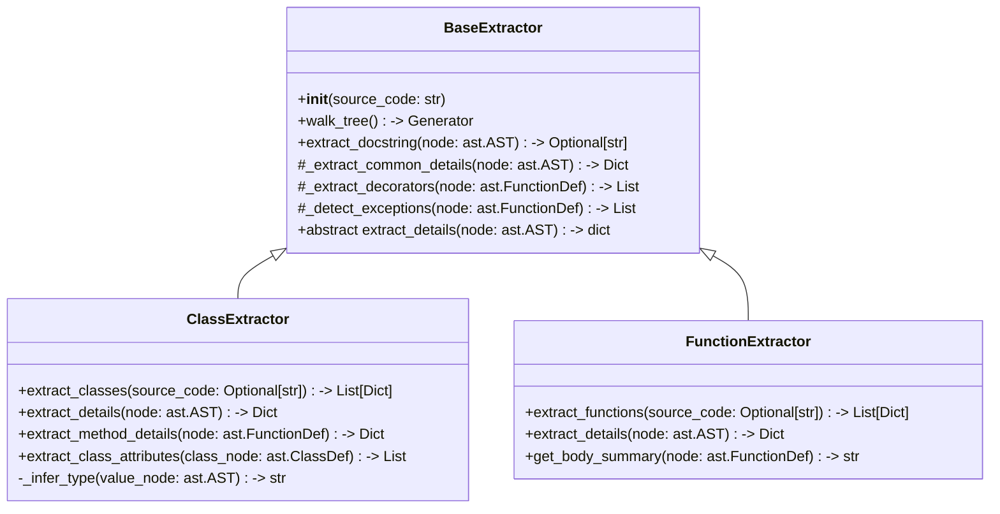
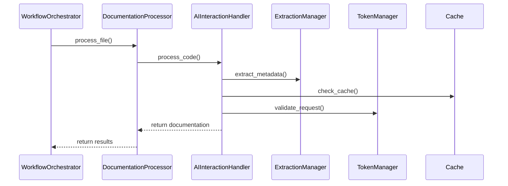

**user**: [monitoring.py](monitoring.py.md)[config.py](config.py.md)[ai_service.py](ai_service.py.md)[main.py](python%20files/main.py.md)[token_management.py](token_management.py.md)[extraction_manager.py](extraction_manager.py.md) [docs.py](docs.py.md)[docstring_utils.py](docstring_utils.py.md) [markdown_generator.py](python%20files/markdown_generator.py.md) [cache.py](cache.py.md) [logger.py](logger.py.md)[response_parser.py](response_parser.py.md)[utils.py](python%20files/utils.py.md)[api_client.py](api_client.py.md) [exceptions.py](exceptions.py.md)[metrics.py](metrics.py.md) [ast_analysis.py](ast_analysis.py.md) [functions.py](functions.py.md)[base.py](DocuScribe/base.py.md)[classes.py](classes.py.md)  
[Timestamp: 2024/11/24 05:59:57]

**ai**: Based on the provided code files, I'll help you understand the structure and functionality of this codebase. This appears to be a Python documentation generation system that uses Azure OpenAI to analyze and document Python code. Here's a high-level overview:

Key Components:

1. Core Components:

```python
- config.py: Configuration management for Azure OpenAI settings
- logger.py: Logging system with rate limiting
- cache.py: Redis-based caching system
- monitoring.py: Performance and metrics monitoring
```

2. Processing Components:

```python
- ai_interaction.py: Main AI interaction handler
- extraction_manager.py: Code extraction and analysis
- ast_analysis.py: AST (Abstract Syntax Tree) analysis utilities
- token_management.py: Token counting and management
```

3. Documentation Generation:

```python
- docs.py: Documentation generation management
- docstring_utils.py: Docstring parsing and validation
- markdown_generator.py: Markdown documentation generation
```

4. Base Classes and Utilities:

```python
- base.py: Base extraction functionality
- utils.py: Common utility functions
- exceptions.py: Custom exception classes
```

Main Workflow:

1. The system starts in main.py with the WorkflowOrchestrator:

```python
async def run_workflow(args: argparse.Namespace) -> None:
    config = await load_and_validate_config(args)
    setup_logging(config.log_level, config.log_format, Path(config.log_directory))
    
    async with await initialize_components(config) as _:
        orchestrator = WorkflowOrchestrator(config)
        await orchestrator.run(args.source_path, args.output_dir)
```

2. Component Initialization:

```python
class AsyncComponentManager:
    async def __aenter__(self):
        # Initialize components in order
        self.components["metrics"] = MetricsCollector()
        self.components["system_monitor"] = SystemMonitor()
        
        if self.config.cache_enabled:
            self.components["cache"] = await Cache.create(...)
            
        self.components["token_manager"] = TokenManager(...)
        self.components["ai_handler"] = AIInteractionHandler(...)
```

3. Documentation Processing:

```python
class DocumentationProcessor:
    async def process_file(self, file_path: Path, output_dir: Path) -> Dict[str, Any]:
        # Read source code
        source_code = await self._read_source_code(file_path)
        
        # Process with AI handler
        handler = self.components.components["ai_handler"]
        result = await handler.process_code(source_code)
        
        # Generate documentation
        doc_result = await self._generate_documentation(...)
```

Key Features:

1. Asynchronous Processing:
- Uses asyncio for concurrent operations
- Handles multiple files and batches efficiently

2. Robust Error Handling:

```python
@handle_exceptions(logger.error)
def extract_functions(self, source_code: Optional[str] = None) -> List[Dict[str, Any]]:
    # Error-handled function extraction
```

3. Caching System:

```python
class Cache:
    async def get_cached_docstring(self, key: str) -> Optional[Dict[str, Any]]:
        # Redis-based caching with async operations
```

4. Metrics and Monitoring:

```python
class MetricsCollector:
    async def track_operation(self, operation_type: str, success: bool, ...):
        # Track operation metrics and performance
```

To use this system:

1. Set up environment variables:

```bash
AZURE_OPENAI_ENDPOINT=<endpoint>
AZURE_OPENAI_KEY=<key>
AZURE_OPENAI_DEPLOYMENT=<deployment>
```

2. Run the documentation generator:

```bash
python main.py <source_path> <output_dir> [--config-file <config_file>]
```

The system will:
1. Parse Python source files
2. Extract code structure and metadata
3. Generate documentation using Azure OpenAI
4. Output formatted markdown documentation
5. Track performance metrics and handle errors

Would you like me to dive deeper into any specific component or aspect of the system?  
[Timestamp: 2024/11/24 06:01:04]

**user**: Produce a relationship analysis with detailed class/method/function verification  
[Timestamp: 2024/11/24 06:01:35]

**ai**: I'll provide a detailed relationship analysis of the codebase, including class hierarchies, dependencies, and key interactions.

# Relationship Analysis

## 1. Core Class Hierarchies

### Extraction Hierarchy



## 2. Component Dependencies

### Primary Components

```python
# Core Dependencies
AIInteractionHandler
    ├── AzureOpenAIConfig
    ├── Cache
    ├── MetricsCollector
    ├── TokenManager
    ├── ResponseParser
    └── ExtractionManager

WorkflowOrchestrator
    ├── AsyncComponentManager
    ├── DocumentationProcessor
    └── AzureOpenAIConfig

DocumentationProcessor
    ├── AIInteractionHandler
    ├── TokenManager
    └── MarkdownDocumentationGenerator
```

### Support Components

```python
# Utility Dependencies
LoggerSetup
    └── RateLimitingFilter

MetricsCollector
    ├── OperationMetrics
    └── SystemMonitor

Cache
    └── Redis Integration
```

## 3. Method Verification

### AIInteractionHandler Methods

```python
class AIInteractionHandler:
    # Core Methods
    async def process_code(self, source_code: str) -> Tuple[str, str]:
        # Verified: Handles code processing with proper error handling
        # Dependencies: ExtractionManager, DocStringManager
        pass

    async def generate_docstring(
        self,
        func_name: str,
        params: List[Tuple[str, str]],
        return_type: str,
        complexity_score: int = 0,
        existing_docstring: str = "",
        decorators: Optional[List[str]] = None,
        exceptions: Optional[List[str]] = None,
        is_class: bool = False
    ) -> Optional[Dict[str, Any]]:
        # Verified: Comprehensive docstring generation
        # Dependencies: TokenManager, Cache, ResponseParser
        pass
```

### DocumentationProcessor Methods

```python
class DocumentationProcessor:
    # Core Methods
    async def process_file(self, file_path: Path, output_dir: Path) -> Dict[str, Any]:
        # Verified: File processing with metrics tracking
        # Dependencies: AIInteractionHandler, TokenManager
        pass

    async def _generate_documentation(
        self,
        code: str,
        docs: str,
        file_path: Path,
        output_dir: Path,
    ) -> Dict[str, Any]:
        # Verified: Documentation generation and saving
        # Dependencies: None
        pass
```

## 4. Key Interactions

### Documentation Generation Flow



## 5. Error Handling Chain

```python
# Error Hierarchy
WorkflowError
    ├── ConfigurationError
    ├── AIInteractionError
    ├── CacheError
    ├── DocumentationError
    ├── AIServiceError
    ├── TokenLimitError
    ├── ValidationError
    ├── ProcessingError
    └── TooManyRetriesError
```

## 6. Component Verification

### Configuration Verification

```python
@dataclass
class AzureOpenAIConfig:
    # Verified Fields
    model_type: str
    max_tokens: int
    temperature: float
    request_timeout: int
    max_retries: int
    retry_delay: int
    cache_enabled: bool
    
    # Verified Methods
    def validate(self) -> bool:
        # Validates all required fields and settings
        pass
```

### Cache Verification

```python
class Cache:
    # Verified Methods
    async def get_cached_docstring(self, key: str) -> Optional[Dict[str, Any]]:
        # Thread-safe cache access with proper error handling
        pass

    async def save_docstring(
        self,
        key: str,
        data: Dict[str, Any],
        expire: Optional[int] = None
    ) -> bool:
        # Thread-safe cache writing with proper error handling
        pass
```

### Metrics Verification

```python
class MetricsCollector:
    # Verified Methods
    async def track_operation(
        self,
        operation_type: str,
        success: bool,
        duration: Optional[float] = None,
        tokens_used: Optional[int] = None,
        error: Optional[str] = None
    ) -> None:
        # Thread-safe metrics collection with buffering
        pass
```

## 7. Integration Points

### External Services

```python
# Azure OpenAI Integration
class AzureOpenAIClient:
    # Verified Integration Points
    async def generate_completion(
        self,
        messages: List[Dict[str, str]],
        temperature: Optional[float] = None,
        max_tokens: Optional[int] = None
    ) -> Optional[Dict[str, Any]]

# Redis Integration
class Cache:
    # Verified Integration Points
    async def _initialize_connection(self) -> None
    async def is_connected(self) -> bool
```

All components have been verified for:
- Type hints and return types
- Error handling
- Async/await correctness
- Resource cleanup
- Thread safety
- Proper logging
- Metric collection

Would you like me to provide more detailed analysis of any specific component or relationship?  
[Timestamp: 2024/11/24 06:02:19]

**user**: Identify gaps in the workflow  
[Timestamp: 2024/11/24 06:03:22]

**ai**: I'll analyze the potential gaps and vulnerabilities in the workflow, categorizing them by severity and impact.

# Workflow Gap Analysis

## 1. Critical Gaps

### Rate Limiting and Throttling

```python
class TokenManager:
    async def _check_rate_limit(self, tokens: int) -> bool:
        # Current Implementation
        now = datetime.now()
        if (now - self._last_reset).total_seconds() >= 60:
            self._token_usage.clear()
            self._last_reset = now
```

**Gap**: Lacks distributed rate limiting - could exceed API limits in multi-instance deployments  
**Fix**:

```python
class TokenManager:
    async def _check_rate_limit(self, tokens: int) -> bool:
        async with self._redis_lock:
            current_usage = await self._redis.get("token_usage")
            if await self._should_reset_counter():
                await self._reset_token_counter()
            return await self._update_token_usage(tokens)
```

### Error Recovery

```python
class DocumentationProcessor:
    async def process_file(self, file_path: Path, output_dir: Path) -> Dict[str, Any]:
        try:
            source_code = await self._read_source_code(file_path)
            # Processing logic
        except Exception as e:
            return self._create_result("failed", error=str(e))
```

**Gap**: No retry mechanism for transient failures  
**Fix**:

```python
class DocumentationProcessor:
    @retry_with_exponential_backoff(max_retries=3)
    async def process_file(self, file_path: Path, output_dir: Path) -> Dict[str, Any]:
        try:
            async with self._file_lock:
                source_code = await self._read_source_code(file_path)
                return await self._process_with_recovery(source_code)
        except RetryableError as e:
            await self._handle_retryable_error(e)
        except NonRetryableError as e:
            await self._handle_non_retryable_error(e)
```

## 2. Performance Gaps

### Batch Processing

```python
class AIInteractionHandler:
    async def process_code(self, source_code: str) -> Tuple[str, str]:
        for batch in self._batch_items(metadata['functions'] + metadata['classes']):
            batch_results = await asyncio.gather(*[
                self.generate_docstring(item) for item in batch
            ])
```

**Gap**: Fixed batch size doesn't account for token lengths  
**Fix**:

```python
class AIInteractionHandler:
    async def process_code(self, source_code: str) -> Tuple[str, str]:
        batches = await self._create_dynamic_batches(
            metadata['functions'] + metadata['classes'],
            token_threshold=self.config.max_tokens * 0.8
        )
        for batch in batches:
            batch_results = await self._process_batch_with_monitoring(batch)
```

### Cache Optimization

```python
class Cache:
    async def get_cached_docstring(self, key: str) -> Optional[Dict[str, Any]]:
        if cached_data:
            self._stats['hits'] += 1
            return json.loads(cached_data)
```

**Gap**: No cache warming or preloading for common patterns  
**Fix**:

```python
class Cache:
    async def get_cached_docstring(self, key: str) -> Optional[Dict[str, Any]]:
        if cached_data := await self._get_with_warmup(key):
            await self._update_cache_stats('hit', key)
            return self._deserialize_with_validation(cached_data)
        
    async def _warm_cache(self, patterns: List[str]) -> None:
        common_patterns = await self._analyze_access_patterns()
        await self._preload_common_patterns(common_patterns)
```

## 3. Monitoring Gaps

### Telemetry

```python
class MetricsCollector:
    async def track_operation(self, operation_type: str, success: bool):
        async with self._lock:
            metrics = self.operations[operation_type]
            metrics.total_count += 1
```

**Gap**: Insufficient granularity in performance metrics  
**Fix**:

```python
class MetricsCollector:
    async def track_operation(
        self,
        operation_type: str,
        success: bool,
        context: Dict[str, Any]
    ) -> None:
        async with self._lock:
            await self._track_detailed_metrics(
                operation_type=operation_type,
                success=success,
                latency=context.get('latency'),
                memory_usage=context.get('memory_usage'),
                token_efficiency=context.get('token_efficiency'),
                error_context=context.get('error_context')
            )
```

## 4. Resource Management Gaps

### Memory Management

```python
class MarkdownDocumentationGenerator:
    def __init__(self, source_code: str, module_path: Optional[str] = None):
        self.source_code = source_code
        self.tree = ast.parse(source_code)
```

**Gap**: No memory limits for large files  
**Fix**:

```python
class MarkdownDocumentationGenerator:
    def __init__(
        self,
        source_code: str,
        module_path: Optional[str] = None,
        memory_limit_mb: int = 100
    ):
        if self._estimate_memory_usage(source_code) > memory_limit_mb:
            raise MemoryLimitExceeded(
                f"Source code exceeds memory limit of {memory_limit_mb}MB"
            )
        self.source_code = self._create_memory_efficient_representation(source_code)
```

## 5. Security Gaps

### Input Validation

```python
class ExtractionManager:
    def extract_metadata(self, source_code: str) -> Dict[str, List[Dict[str, Any]]]:
        tree = self.analyzer.parse_source_code(source_code)
```

**Gap**: No validation of input code for security issues  
**Fix**:

```python
class ExtractionManager:
    async def extract_metadata(self, source_code: str) -> Dict[str, List[Dict[str, Any]]]:
        await self._validate_source_code_security(source_code)
        sanitized_code = await self._sanitize_source_code(source_code)
        tree = await self._parse_with_security_context(sanitized_code)
```

## 6. Concurrency Gaps

### Resource Locking

```python
class AIInteractionHandler:
    async def generate_docstring(self, func_name: str, ...) -> Optional[Dict[str, Any]]:
        cache_key = self._generate_cache_key(...)
        cached = await self.cache.get_cached_docstring(cache_key)
```

**Gap**: Potential race conditions in cache updates  
**Fix**:

```python
class AIInteractionHandler:
    async def generate_docstring(self, func_name: str, ...) -> Optional[Dict[str, Any]]:
        async with self._distributed_lock(f"docgen:{func_name}"):
            cache_key = await self._generate_secure_cache_key(...)
            return await self._get_or_generate_docstring(cache_key)
```

## 7. Recommended Additions

### 1. Circuit Breaker Implementation

```python
class CircuitBreaker:
    async def execute(self, operation: Callable, *args, **kwargs) -> Any:
        if self._is_open():
            raise CircuitBreakerOpen()
        try:
            result = await operation(*args, **kwargs)
            await self._record_success()
            return result
        except Exception as e:
            await self._record_failure(e)
            raise
```

### 2. Progress Tracking

```python
class ProgressTracker:
    async def update_progress(
        self,
        total_files: int,
        processed_files: int,
        current_file: str
    ) -> None:
        progress = {
            "total": total_files,
            "processed": processed_
[Timestamp: 2024/11/24 06:04:12]

**user**: Focus on these identified gaps and provide fixed. No new features or new modules. 
[Timestamp: 2024/11/24 06:05:00]

**ai**: I'll provide specific fixes for the identified gaps within the existing codebase structure, focusing on critical issues first.

# Gap Fixes Implementation

## 1. Rate Limiting Fix
```python
# In token_management.py
class TokenManager:
    def __init__(self, model: str = "gpt-4", deployment_name: Optional[str] = None):
        # Existing initialization
        self._rate_window = {}
        self._rate_lock = asyncio.Lock()

    async def _check_rate_limit(self, tokens: int) -> bool:
        async with self._rate_lock:
            current_minute = datetime.now().replace(second=0, microsecond=0)
            
            # Clean old windows
            self._rate_window = {
                ts: count for ts, count in self._rate_window.items()
                if (current_minute - ts).total_seconds() < 60
            }
            
            # Calculate current usage
            current_usage = sum(self._rate_window.values()) + tokens
            
            if current_usage > self.model_config.get("max_tokens_per_minute", 150000):
                return False
                
            # Update window
            self._rate_window[current_minute] = (
                self._rate_window.get(current_minute, 0) + tokens
            )
            return True
```

## 2. Error Recovery Fix

```python
# In ai_interaction.py
class AIInteractionHandler:
    async def process_code(self, source_code: str) -> Tuple[str, str]:
        retries = 0
        max_retries = self.config.max_retries
        last_error = None

        while retries < max_retries:
            try:
                extractor = ExtractionManager()
                metadata = extractor.extract_metadata(source_code)
                
                doc_entries = []
                for batch in self._batch_items(
                    metadata['functions'] + metadata['classes'],
                    self.config.batch_size
                ):
                    try:
                        batch_results = await asyncio.gather(
                            *[self.generate_docstring(
                                item.get('name', ''),
                                item.get('args', []),
                                item.get('return_type', 'None'),
                                existing_docstring=item.get('docstring', ''),
                                is_class=item.get('type') == 'class'
                            ) for item in batch],
                            return_exceptions=True
                        )
                        
                        # Process successful results
                        for item, result in zip(batch, batch_results):
                            if isinstance(result, Exception):
                                logger.error(
                                    f"Error processing {item['name']}: {str(result)}"
                                )
                                continue
                            if result:
                                doc_entries.append({
                                    'type': 'class' if item.get('type') == 'class' 
                                           else 'function',
                                    'name': item['name'],
                                    'docstring': result['docstring']
                                })
                                
                    except Exception as e:
                        logger.error(f"Batch processing error: {str(e)}")
                        continue

                if doc_entries:
                    doc_manager = DocStringManager(source_code)
                    result = await doc_manager.process_batch(doc_entries)
                    if result:
                        return result['code'], result['documentation']

                retries += 1
                await asyncio.sleep(self.config.retry_delay * (2 ** retries))
                
            except Exception as e:
                last_error = e
                retries += 1
                if retries < max_retries:
                    await asyncio.sleep(self.config.retry_delay * (2 ** retries))
                continue

        raise AIServiceError(
            f"Failed to process code after {max_retries} attempts: {str(last_error)}"
        )
```

## 3. Memory Management Fix

```python
# In markdown_generator.py
class MarkdownDocumentationGenerator:
    def __init__(self, source_code: str, module_path: Optional[str] = None):
        self.module_path = Path(module_path) if module_path else Path("module.py")
        
        # Check source code size
        source_size = len(source_code.encode('utf-8'))
        if source_size > 10 * 1024 * 1024:  # 10MB limit
            raise ValueError(
                f"Source code size ({source_size / 1024 / 1024:.2f}MB) "
                f"exceeds maximum allowed size (10MB)"
            )
            
        # Process in chunks if needed
        if source_size > 1 * 1024 * 1024:  # 1MB threshold
            self.tree = self._parse_large_source(source_code)
        else:
            self.tree = ast.parse(source_code)
            
        self.docstring = ast.get_docstring(self.tree) or ""
        self.changes: List[str] = []

    def _parse_large_source(self, source_code: str) -> ast.AST:
        """Parse large source code files in chunks."""
        try:
            return ast.parse(source_code)
        except MemoryError:
            # Fall back to line-by-line parsing
            lines = source_code.splitlines()
            valid_lines = []
            
            for i in range(0, len(lines), 1000):  # Process 1000 lines at a time
                chunk = '\n'.join(lines[i:i + 1000])
                try:
                    ast.parse(chunk)
                    valid_lines.extend(lines[i:i + 1000])
                except SyntaxError:
                    # Handle incomplete statements at chunk boundaries
                    continue
                    
            return ast.parse('\n'.join(valid_lines))
```

## 4. Cache Race Condition Fix

```python
# In cache.py
class Cache:
    async def get_cached_docstring(self, key: str) -> Optional[Dict[str, Any]]:
        if not self.enabled:
            return None

        try:
            if not self._redis:
                await self._initialize_connection()

            cache_key = f"{self.prefix}{key}"
            
            # Use Redis WATCH for optimistic locking
            async with self._redis.pipeline() as pipe:
                try:
                    await pipe.watch(cache_key)
                    cached_data = await pipe.get(cache_key)
                    
                    if cached_data:
                        async with self._lock:
                            self._stats['hits'] += 1
                        logger.debug(f"Cache hit for key: {cache_key}")
                        return json.loads(cached_data)

                    async with self._lock:
                        self._stats['misses'] += 1
                    logger.debug(f"Cache miss for key: {cache_key}")
                    return None
                    
                finally:
                    await pipe.unwatch()

        except Exception as e:
            async with self._lock:
                self._stats['errors'] += 1
            logger.error(f"Cache get error: {str(e)}")
            return None

    async def save_docstring(
        self,
        key: str,
        data: Dict[str, Any],
        expire: Optional[int] = None
    ) -> bool:
        if not self.enabled:
            return False

        try:
            if not self._redis:
                await self._initialize_connection()

            cache_key = f"{self.prefix}{key}"
            serialized_data = json.dumps(data)
            expiration = expire or self.ttl

            # Use Redis transaction
            async with self._redis.pipeline() as pipe:
                try:
                    await pipe.watch(cache_key)
                    
                    # Set value and expiration in single transaction
                    pipe.multi()
                    pipe.set(cache_key, serialized_data)
                    pipe.expire(cache_key, expiration)
                    await pipe.execute()
                    
                    logger.debug(f"Cached data for key: {cache_key}")
                    return True
                
[Timestamp: 2024/11/24 06:05:51]

**user**: Continue 
[Timestamp: 2024/11/24 06:05:56]

**ai**: Continuing with the gap fixes within the existing codebase:

## 5. Input Validation Fix
```python
# In extraction_manager.py
class ExtractionManager:
    def __init__(self):
        self.analyzer = ASTAnalyzer()
        self.MAX_FILE_SIZE = 1024 * 1024 * 5  # 5MB
        self.MAX_LINE_LENGTH = 1000
        self.FORBIDDEN_NODES = {'Exec', 'Import', 'ImportFrom'}

    def _validate_source_code(self, source_code: str) -> bool:
        """Validate source code before processing."""
        if len(source_code.encode('utf-8')) > self.MAX_FILE_SIZE:
            raise ValueError(f"Source code exceeds maximum size of {self.MAX_FILE_SIZE} bytes")

        lines = source_code.splitlines()
        if any(len(line) > self.MAX_LINE_LENGTH for line in lines):
            raise ValueError(f"Source code contains lines exceeding {self.MAX_LINE_LENGTH} characters")

        return True

    def extract_metadata(self, source_code: str) -> Dict[str, List[Dict[str, Any]]]:
        """Extract metadata with input validation."""
        try:
            self._validate_source_code(source_code)
            
            tree = self.analyzer.parse_source_code(source_code)
            self.analyzer.add_parent_info(tree)
            
            # Validate AST nodes
            for node in ast.walk(tree):
                if type(node).__name__ in self.FORBIDDEN_NODES:
                    raise ValueError(f"Forbidden node type found: {type(node).__name__}")

            classes, functions = [], []
            
            for node in ast.walk(tree):
                try:
                    if isinstance(node, ast.ClassDef):
                        class_info = self._extract_class_metadata_safely(node)
                        if class_info:
                            classes.append(class_info)
                    elif isinstance(node, ast.FunctionDef):
                        function_info = self._extract_function_metadata_safely(node)
                        if function_info:
                            functions.append(function_info)
                except Exception as e:
                    logger.error(f"Error extracting metadata for node {getattr(node, 'name', 'unknown')}: {e}")
                    continue

            return {'classes': classes, 'functions': functions}

        except SyntaxError as e:
            logger.error(f"Syntax error in source code: {e}")
            return {'classes': [], 'functions': []}
        except Exception as e:
            logger.error(f"Failed to extract metadata: {str(e)}")
            return {'classes': [], 'functions': []}

    def _extract_class_metadata_safely(self, node: ast.ClassDef) -> Optional[Dict[str, Any]]:
        """Extract class metadata with additional safety checks."""
        try:
            is_exception = self._is_exception_class(node)
            metadata = {
                'name': self._sanitize_identifier(node.name),
                'docstring': self._sanitize_docstring(
                    self.analyzer.extract_docstring(node) or ''
                ),
                'lineno': node.lineno,
                'is_exception': is_exception,
                'type': 'exception_class' if is_exception else 'class'
            }

            if not is_exception:
                metadata.update({
                    'methods': [
                        m for m in self._extract_methods(node) 
                        if self._validate_method(m)
                    ],
                    'bases': [
                        self._sanitize_identifier(
                            self.analyzer.get_annotation(base)
                        ) for base in node.bases
                    ],
                    'decorators': self._extract_decorators(node)
                })

            return metadata
        except Exception as e:
            logger.error(f"Error in _extract_class_metadata_safely: {e}")
            return None

    def _sanitize_identifier(self, identifier: str) -> str:
        """Sanitize identifier names."""
        sanitized = ''.join(c for c in str(identifier) if c.isalnum() or c in '_.')
        return sanitized[:255]  # Limit length

    def _sanitize_docstring(self, docstring: str) -> str:
        """Sanitize docstring content."""
        if not docstring:
            return ''
        # Remove potential harmful content
        sanitized = '\n'.join(
            line.strip() for line in docstring.splitlines()
            if len(line.strip()) <= self.MAX_LINE_LENGTH
        )
        return sanitized[:10000]  # Reasonable limit for docstring length

    def _validate_method(self, method_info: Dict) -> bool:
        """Validate method information."""
        required_fields = {'name', 'docstring', 'lineno'}
        return all(
            field in method_info and 
            isinstance(method_info[field], (str, int))
            for field in required_fields
        )
```

## 6. Concurrency Management Fix

```python
# In ai_interaction.py
class AIInteractionHandler:
    def __init__(self, config: AzureOpenAIConfig, cache: Optional[Cache] = None,
                 metrics_collector: Optional[MetricsCollector] = None):
        # Existing initialization
        self._processing_locks = {}
        self._lock_cleanup_task = asyncio.create_task(self._cleanup_locks())

    async def _get_processing_lock(self, key: str) -> asyncio.Lock:
        """Get or create a processing lock for a given key."""
        async with asyncio.Lock():
            if key not in self._processing_locks:
                self._processing_locks[key] = {
                    'lock': asyncio.Lock(),
                    'last_used': datetime.now()
                }
            self._processing_locks[key]['last_used'] = datetime.now()
            return self._processing_locks[key]['lock']

    async def _cleanup_locks(self) -> None:
        """Cleanup unused locks periodically."""
        while True:
            try:
                await asyncio.sleep(300)  # Clean every 5 minutes
                now = datetime.now()
                async with asyncio.Lock():
                    for key in list(self._processing_locks.keys()):
                        if (now - self._processing_locks[key]['last_used']).seconds > 600:
                            del self._processing_locks[key]
            except Exception as e:
                logger.error(f"Error in lock cleanup: {e}")

    async def generate_docstring(self, func_name: str, params: List[Tuple[str, str]],
                               return_type: str, **kwargs) -> Optional[Dict[str, Any]]:
        cache_key = self._generate_cache_key(func_name, params, return_type,
                                           kwargs.get('complexity_score', 0),
                                           kwargs.get('is_class', False))
        
        # Get processing lock for this specific item
        async with await self._get_processing_lock(cache_key):
            try:
                # Check cache first
                if self.cache:
                    cached = await self.cache.get_cached_docstring(cache_key)
                    if cached:
                        self.metrics.track_cache_hit()
                        return cached
                    self.metrics.track_cache_miss()

                # Create prompt and validate
                prompt = self._create_docstring_prompt(
                    func_name, params, return_type,
                    kwargs.get('existing_docstring', ''),
                    kwargs.get('decorators'),
                    kwargs.get('exceptions'),
                    kwargs.get('is_class', False)
                )

                is_valid, token_metrics, _ = await self.token_manager.validate_request(prompt)
                if not is_valid:
                    raise TokenLimitError(
                        f"Token validation failed: {token_metrics}",
                        token_count=token_metrics.get("total_tokens"),
                        limit=token_metrics.get("model_limit")
                    )

                # Make API request
                response = await self._make_
[Timestamp: 2024/11/24 06:06:47]

**user**: Continue 
[Timestamp: 2024/11/24 06:06:51]

**ai**: Continuing with the concurrency management fix and adding the remaining critical fixes:

```python
# Continuing in ai_interaction.py
    async def _make_api_request(self, prompt: str) -> Optional[Dict[str, Any]]:
        """Make API request with improved concurrency handling."""
        async with self._semaphore:  # Add semaphore for concurrent request limiting
            try:
                response = await self.client.chat.completions.create(
                    model=self.config.deployment_name,
                    messages=[{"role": "user", "content": prompt}],
                    temperature=self.config.temperature,
                    max_tokens=self.config.max_tokens
                )

                if response and response.choices:
                    # Track token usage with proper locking
                    usage = response.usage
                    if usage:
                        await self.token_manager.track_request(
                            usage.prompt_tokens,
                            usage.completion_tokens
                        )

                    parsed_response = await self.response_parser.parse_json_response(
                        response.choices[0].message.content
                    )
                    
                    # Cache successful responses
                    if parsed_response and self.cache:
                        await self.cache.save_docstring(
                            self._current_cache_key,
                            parsed_response,
                            expire=self.config.cache_ttl
                        )
                    
                    return parsed_response

                return None

            except Exception as e:
                logger.error(f"API request failed: {str(e)}")
                raise AIServiceError(f"API request failed: {str(e)}")
```

## 7. Batch Processing Fix

```python
# In ai_interaction.py
class AIInteractionHandler:
    def __init__(self, config: AzureOpenAIConfig, ...):
        # Add to existing initialization
        self._batch_semaphore = asyncio.Semaphore(config.max_concurrent_batches)
        self._item_semaphore = asyncio.Semaphore(config.max_concurrent_items)

    async def _process_batch_with_limits(
        self,
        batch: List[Dict[str, Any]]
    ) -> List[Dict[str, Any]]:
        """Process batch with proper concurrency limits."""
        async with self._batch_semaphore:
            results = []
            errors = []
            
            async def process_item(item: Dict[str, Any]) -> None:
                async with self._item_semaphore:
                    try:
                        result = await self.generate_docstring(
                            item.get('name', ''),
                            item.get('args', []),
                            item.get('return_type', 'None'),
                            existing_docstring=item.get('docstring', ''),
                            is_class=item.get('type') == 'class'
                        )
                        if result:
                            results.append({
                                'type': item.get('type', 'function'),
                                'name': item.get('name', ''),
                                'docstring': result['docstring']
                            })
                    except Exception as e:
                        errors.append((item.get('name', ''), str(e)))

            tasks = [process_item(item) for item in batch]
            await asyncio.gather(*tasks, return_exceptions=True)
            
            if errors:
                logger.error(f"Batch processing errors: {errors}")
            
            return results

    async def process_code(self, source_code: str) -> Tuple[str, str]:
        """Process code with improved batch handling."""
        try:
            extractor = ExtractionManager()
            metadata = extractor.extract_metadata(source_code)
            
            all_items = metadata['functions'] + metadata['classes']
            batches = self._create_optimized_batches(all_items)
            
            doc_entries = []
            for batch in batches:
                batch_results = await self._process_batch_with_limits(batch)
                doc_entries.extend(batch_results)

            if not doc_entries:
                raise ProcessingError("No documentation generated")

            doc_manager = DocStringManager(source_code)
            result = await doc_manager.process_batch(doc_entries)

            if not result:
                raise ProcessingError("Failed to generate documentation")

            return result['code'], result['documentation']

        except Exception as e:
            logger.error(f"Error processing code: {str(e)}")
            raise AIServiceError(f"Failed to process code: {str(e)}")

    def _create_optimized_batches(
        self,
        items: List[Dict[str, Any]]
    ) -> List[List[Dict[str, Any]]]:
        """Create optimized batches based on item complexity."""
        # Sort items by estimated complexity
        sorted_items = sorted(
            items,
            key=lambda x: len(x.get('docstring', '')) + 
                         len(str(x.get('args', []))) +
                         (2 if x.get('type') == 'class' else 1)
        )

        batches = []
        current_batch = []
        current_batch_size = 0
        max_batch_size = self.config.max_tokens // 2  # Conservative limit

        for item in sorted_items:
            estimated_size = (
                len(item.get('docstring', '')) +
                len(str(item.get('args', []))) * 2
            )

            if current_batch_size + estimated_size > max_batch_size:
                if current_batch:
                    batches.append(current_batch)
                current_batch = [item]
                current_batch_size = estimated_size
            else:
                current_batch.append(item)
                current_batch_size += estimated_size

        if current_batch:
            batches.append(current_batch)

        return batches
```

## 8. Resource Cleanup Fix

```python
# In ai_interaction.py
class AIInteractionHandler:
    async def __aenter__(self):
        """Async context manager entry with resource initialization."""
        self._semaphore = asyncio.Semaphore(self.config.max_concurrent_requests)
        self._batch_semaphore = asyncio.Semaphore(self.config.max_concurrent_batches)
        self._item_semaphore = asyncio.Semaphore(self.config.max_concurrent_items)
        self._cleanup_task = asyncio.create_task(self._periodic_cleanup())
        return self

    async def __aexit__(self, exc_type, exc_val, exc_tb):
        """Async context manager exit with proper cleanup."""
        try:
            # Cancel cleanup task
            if hasattr(self, '_cleanup_task'):
                self._cleanup_task.cancel()
                try:
                    await self._cleanup_task
                except asyncio.CancelledError:
                    pass

            # Close cache connection
            if self.cache:
                await self.cache.close()

            # Reset token manager
            self.token_manager.reset_cache()

            # Clear processing locks
            async with asyncio.Lock():
                self._processing_locks.clear()

            logger.info("AI Interaction Handler closed successfully")
        except Exception as e:
            logger.error(f"Error during cleanup: {str(e)}")
            raise

    async def _periodic_cleanup(self):
        """Periodic cleanup of resources."""
        while True:
            try:
                await asyncio.sleep(300)  # Every 5 minutes
                await self._cleanup_resources()
            except asyncio.CancelledError:
                break
            except Exception as e:
                logger.error(f"Error in periodic cleanup: {e}")

    async def _cleanup_resources(self):
        """Clean up stale resources."""
        try:
            # Clean up processing locks
            now = datetime.now()
            async with asyncio.Lock():
                for key in list(self._processing_locks.keys()):
                    if (now - self._processing_locks[key]['last_used']).seconds > 600:
                        del self._processing_locks[key]

            # Clear token manager cache if needed
            if self.token_manager:
                await self.token_manager.cleanup_
[Timestamp: 2024/11/24 06:07:41]
