The updated diagram is already quite comprehensive and clear. However, here are a few suggestions for further improvement:

1. **Add Legends**: Consider adding a legend to explain the different colors used for the components. This would make it easier for viewers to understand the significance of each color without having to refer to the class definitions at the bottom.

2. **Clarify Feedback Loop**: While you've added notes about the types of feedback, you might want to consider adding a brief explanation of how the feedback loop works. For example, you could add a note like "Feedback Loop: Uses user feedback and system metrics to refine query preprocessing and update short-term memory."

3. **Highlight Key Processes**: You've highlighted the Feedback Loop and Core LLM, which is good. Consider highlighting other key processes or components that are crucial to the system's functionality, such as the Vector Database or the Prompt Construction.

4. **Add More Detail to Memory Systems**: While you've included different types of memory, you might want to add a brief note on how these different memory systems interact or contribute to the overall process. For example, you could add a note like "Short-term Memory: Stores recent interactions; Long-term Memory: Stores historical data; Episodic Memory: Stores specific events or experiences."

5. **Consider Adding a User Interface Component**: If applicable, you might want to include a component representing the user interface or interaction layer. This could show how the user interacts with the system and how the output is presented.

6. **Simplify Some Labels**: Some of the labels are quite long. Consider shortening them where possible to improve readability. For example, "Relevance Scoring" could be shortened to "Rel. Scoring."

7. **Add Version Number**: Since this is an updated diagram, consider adding a version number or date to track changes over time.

Here's a revised version of the diagram incorporating these suggestions:

```mermaid
flowchart TB
    subgraph Input ["🔄 Input Processing"]
        Query["📝 User Query"]
        QueryPrep["🔍 Query Prep"]
        QueryAug["✨ Query Aug"]
        QueryEmbed["🔢 Query Embed"]
    end

    subgraph Memory ["💭 Memory Systems"]
        ShortMem["⚡ Short-term Mem"]
        LongMem["💾 Long-term Mem"]
        EpisodicMem["📖 Episodic Mem"]
        ContextWindow["🪟 Context Window"]
    end

    subgraph Retrieval ["🔎 Retrieval System"]
        VectorDB["🗄️ Vector DB"]
        subgraph RetStrat ["Search Strategies"]
            Dense["Dense"]
            Hybrid["Hybrid"]
            Semantic["Semantic"]
        end
        ChunkMgmt["📑 Chunk Mgmt"]
        subgraph Ranking ["📊 Ranking System"]
            RelScore["Rel. Scoring"]
            ReRank["Re-rank"]
            DiversityOpt["Diversity Opt"]
        end
    end

    subgraph Generation ["⚙️ Generation Pipeline"]
        PromptConst["🎯 Prompt Const"]
        subgraph LLMSys ["🧠 LLM System"]
            TokenProc["Token Proc"]
            CoreLLM["Core LLM"]
            OutPrep["Output Prep"]
        end
    end

    subgraph Verification ["✅ Verification System"]
        FactCheck["📋 Fact Check"]
        ConsistCheck["🔄 Consistency"]
        CitationGen["📚 Citation"]
        SourceTrack["🔍 Source Track"]
    end

    subgraph Output ["📤 Output Processing"]
        ResponseGen["💬 Response Gen"]
        PostProc["🔧 Post-proc"]
        MetadataGen["📎 Metadata"]
        FeedbackLoop["↩️ Feedback Loop"]
    end

    %% Main Flow Connections
    Query --> QueryPrep --> QueryAug --> QueryEmbed
    QueryEmbed --> VectorDB --> RetStrat --> ChunkMgmt --> Ranking
    
    %% Memory Integration
    ShortMem & LongMem & EpisodicMem --> ContextWindow
    ContextWindow --> PromptConst
    
    %% Generation Flow
    Ranking --> PromptConst --> LLMSys
    
    %% Verification Flow
    LLMSys --> FactCheck --> ConsistCheck --> CitationGen --> SourceTrack
    
    %% Output Flow
    SourceTrack --> ResponseGen --> PostProc --> MetadataGen --> FeedbackLoop
    
    %% Feedback Loops
    FeedbackLoop -.-> QueryPrep
    FeedbackLoop -.-> ShortMem
    MetadataGen -.-> LongMem
    
    %% Cross-System Connections
    ChunkMgmt -.-> ContextWindow
    SourceTrack -.-> EpisodicMem

    %% Additional Details
    QueryAug -->|Synonym Exp, Context Add| QueryAug
    ContextWindow -->|Selects Relevant Context| PromptConst
    RetStrat -->|Strategy Selection| ChunkMgmt
    RelScore -->|Initial Scoring| ReRank
    ReRank -->|Refined Scoring| DiversityOpt
    FeedbackLoop -->|User Feedback, System Metrics| QueryPrep
    FeedbackLoop -->|Updates| ShortMem
    ChunkMgmt -->|Relevant Chunks| ContextWindow
    SourceTrack -->|Tracks Sources| EpisodicMem

    %% New Additions
    subgraph UI ["💻 User Interface"]
        UserInput["User Input"]
        OutputDisplay["Output Display"]
    end

    UserInput --> Query
    ResponseGen --> OutputDisplay

    %% Legends
    subgraph Legend ["📋 Legend"]
        Primary["Primary Components"]
        Secondary["Secondary Components"]
        Tertiary["Tertiary Components"]
        Highlight["Key Processes"]
    end

    classDef primary fill:#2374ab,stroke:#2374ab,stroke-width:2px,color:#fff
    classDef secondary fill:#48a9a6,stroke:#48a9a6,stroke-width:2px,color:#fff
    classDef tertiary fill:#4b3f72,stroke:#4b3f72,stroke-width:2px,color:#fff
    classDef highlight fill:#e63946,stroke:#e63946,stroke-width:3px,color:#fff
    
    class Query,VectorDB,CoreLLM,ResponseGen primary
    class QueryPrep,ChunkMgmt,PromptConst,FactCheck secondary
    class ContextWindow,Ranking,CitationGen,FeedbackLoop tertiary
    class FeedbackLoop,CoreLLM,VectorDB,PromptConst highlight

    class Primary primary
    class Secondary secondary
    class Tertiary tertiary
    class Highlight highlight
```

These changes should make the diagram even more informative and easier to understand. Let me know if you have any questions or if you'd like to make any further adjustments!