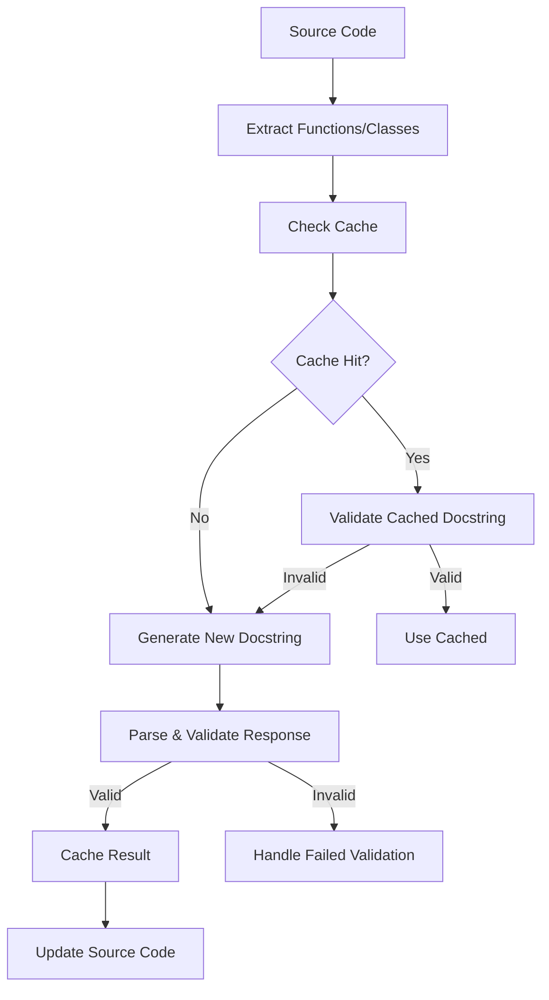

**user**: [config.py](simple2/config.py.md)[main.py](simple2/main.py.md)[interaction.py](interaction.py.md)[api_client.py](simple2/api_client.py.md)[docs.py](simple2/docs.py.md) [functions.py](simple2/functions.py.md) [base.py](simple2/base.py.md)[classes.py](simple2/classes.py.md)[extraction_manager.py](simple2/extraction_manager.py.md)[response_parser.py](simple2/response_parser.py.md) [documentation_analyzer.py](./documentation_analyzer.py.md) [token_management.py](simple2/token_management.py.md)
[Timestamp: 2024/11/15 16:59:24]

**ai**: The provided codebase is a comprehensive system designed for generating and managing docstrings in Python source code using Azure OpenAI. It includes various modules for configuration, interaction with the Azure OpenAI API, extraction of code elements, and generation of documentation. Below is a brief overview of each module and its purpose:

1. **config.py**: Manages configuration settings for Azure OpenAI services, including environment variables and validation of these settings.

2. **main.py**: The entry point for the docstring generation workflow. It handles command-line arguments, initializes components, and orchestrates the processing of Python files to generate and update docstrings.

3. **interaction.py**: Manages the orchestration of docstring generation, including caching, monitoring, and error handling. It processes functions in batches and interacts with the Azure OpenAI API.

4. **api_client.py**: Provides a client for interacting with the Azure OpenAI API. It handles API requests, retries, error management, and constructs prompts based on extracted function metadata.

5. **docs.py**: Contains classes for managing docstrings, generating markdown documentation, and handling the overall documentation generation process.

6. **functions.py**: Provides functionality to extract function definitions and their metadata from Python source code using the Abstract Syntax Tree (AST).

7. **base.py**: Defines a base class for extracting information from AST nodes, providing common functionality and utility methods for subclasses.

8. **classes.py**: Similar to `functions.py`, but focuses on extracting class definitions and their metadata from Python source code.

9. **extraction_manager.py**: A manager class that coordinates the extraction of metadata from Python source code, using the `ClassExtractor` and `FunctionExtractor`.

10. **response_parser.py**: Parses and validates responses from Azure OpenAI, focusing on extracting docstrings, summaries, and other metadata.

11. **documentation_analyzer.py**: Analyzes existing docstrings to determine if they are complete and correct according to a predefined schema.

12. **token_management.py**: Handles token counting, optimization, and management for Azure OpenAI API requests, providing efficient token estimation and prompt optimization.

### Key Features and Considerations:

- **Configuration Management**: The system uses environment variables to configure Azure OpenAI settings, ensuring flexibility across different environments (e.g., development, production).

- **Asynchronous Processing**: The use of `asyncio` allows for concurrent processing of multiple files or functions, improving efficiency.

- **Error Handling and Logging**: Comprehensive logging and error handling are implemented across modules to ensure robustness and traceability of operations.

- **Caching**: The system integrates caching to reduce redundant API calls, improving performance and reducing costs.

- **Documentation Generation**: The system not only updates source code with docstrings but also generates markdown documentation, providing a comprehensive documentation solution.

- **Token Management**: Efficient handling of token limits and costs associated with API requests, ensuring that prompts are optimized to fit within model constraints.

### Recommendations for Use:

- **Environment Setup**: Ensure that the necessary environment variables are set, particularly for Azure OpenAI credentials and endpoints.

- **Testing**: Implement unit tests for each module to ensure functionality and catch potential issues early.

- **Scalability**: Consider further optimizations or parallel processing strategies if dealing with very large codebases.

- **Customization**: The system can be customized to fit specific documentation styles or additional metadata extraction requirements.

This codebase provides a solid foundation for automated documentation generation using AI, and with further enhancements, it can be adapted to various use cases and environments.
[Timestamp: 2024/11/15 16:59:35]

**user**: Analyze the relationship between api_client, config and token_management
[Timestamp: 2024/11/15 16:59:58]

**ai**: The relationship between `api_client.py`, `config.py`, and `token_management.py` is integral to the functionality of the system, as they collectively manage the configuration, interaction, and optimization of requests to the Azure OpenAI API. Here's a detailed analysis of their roles and interactions:

### `config.py`

- **Purpose**: This module is responsible for managing configuration settings for the Azure OpenAI integration. It uses environment variables to set up necessary parameters like API endpoint, API key, model version, and other operational settings.

- **Key Components**:
  - **AzureOpenAIConfig**: A dataclass that encapsulates all configuration settings needed for the API client. It provides methods to load these settings from environment variables and validate them.
  - **Environment Variables**: The module uses the `dotenv` library to load environment variables, ensuring that sensitive information like API keys is managed securely.

- **Interaction with Other Modules**:
  - **api_client.py**: The `AzureOpenAIClient` in `api_client.py` uses `AzureOpenAIConfig` to initialize its configuration. This ensures that all API requests are made with the correct settings.
  - **Validation**: Before making API requests, the client validates its configuration using methods provided by `AzureOpenAIConfig`.

### `api_client.py`

- **Purpose**: This module acts as the client interface for interacting with the Azure OpenAI API. It handles the construction of requests, management of retries, and processing of responses.

- **Key Components**:
  - **AzureOpenAIClient**: The main class responsible for managing API interactions. It uses the configuration provided by `AzureOpenAIConfig` to set up the client.
  - **Retry Logic and Error Handling**: Implements mechanisms to handle API errors and retry requests as necessary.
  - **Prompt Construction**: Constructs prompts for the API based on function metadata, ensuring that requests are well-formed.

- **Interaction with Other Modules**:
  - **config.py**: Directly depends on `AzureOpenAIConfig` for its configuration. The client is initialized with settings like the API endpoint and key, which are critical for successful API communication.
  - **token_management.py**: Utilizes token management to ensure that requests are optimized for token usage, staying within model limits and managing costs effectively.

### `token_management.py`

- **Purpose**: This module manages token counting and optimization for API requests. It ensures that prompts are within the token limits of the chosen model and estimates the cost of requests.

- **Key Components**:
  - **TokenManager**: A class that provides methods for estimating token usage, optimizing prompts, and validating requests against model constraints.
  - **Model Configuration**: Maintains token limits and cost configurations for different models, which are essential for managing API usage efficiently.

- **Interaction with Other Modules**:
  - **api_client.py**: The `AzureOpenAIClient` uses `TokenManager` to optimize prompts before sending them to the API. This ensures that requests are efficient and cost-effective.
  - **Prompt Optimization**: Helps in adjusting the prompt content to fit within the maximum token limits, which is crucial for maintaining performance and reducing costs.

### Summary of Interactions

1. **Configuration Setup**: `config.py` provides the necessary configuration settings to `api_client.py`, ensuring that the API client is initialized with the correct parameters.

2. **API Interaction**: `api_client.py` uses these configurations to interact with the Azure OpenAI API, handling requests and responses.

3. **Token Management**: `token_management.py` assists `api_client.py` by optimizing prompts and managing token usage, ensuring that requests are within model constraints and cost-effective.

Overall, these modules work together to provide a robust system for interacting with Azure OpenAI, ensuring that requests are configured correctly, optimized for token usage, and handled efficiently. This collaboration is crucial for maintaining the performance and reliability of the docstring generation workflow.
[Timestamp: 2024/11/15 17:00:09]

**user**: Examine api_client and token_management, where specifically do they interact
[Timestamp: 2024/11/15 17:01:00]

**ai**: The interaction between `api_client.py` and `token_management.py` is centered around the optimization and management of token usage for requests sent to the Azure OpenAI API. Here's a detailed look at where and how these two modules interact:

### Key Interaction Points

1. **Prompt Optimization**:
   - **In `api_client.py`**:
     - The `AzureOpenAIClient` class constructs prompts for the API using function metadata. Before sending these prompts, it needs to ensure they are within the token limits of the model being used.
     - The method `get_docstring` in `AzureOpenAIClient` calls `optimize_prompt` from `token_management.py` to adjust the prompt size. This is crucial to ensure that the prompt does not exceed the maximum allowed tokens for the model.
     - **Code Snippet**:
       ```python
       optimized_prompt = optimize_prompt(prompt, max_tokens=max_tokens)
       ```

2. **Token Estimation**:
   - **In `api_client.py`**:
     - The client may need to estimate the number of tokens a given prompt will consume. This estimation helps in deciding whether a prompt needs optimization or if it can be sent as is.
     - The `TokenManager` class in `token_management.py` provides the `estimate_tokens` method, which is used to calculate the number of tokens in a prompt.
     - **Code Snippet**:
       ```python
       current_tokens = self.estimate_tokens(text)
       ```

3. **Validation of Requests**:
   - **In `api_client.py`**:
     - Before sending a request, the client needs to validate that the total number of tokens (prompt + expected completion) does not exceed the model's limits.
     - The `validate_request` method in `TokenManager` helps ensure that the request is within the token constraints, preventing errors related to token limits.
     - **Code Snippet**:
       ```python
       is_valid, metrics, message = self.token_manager.validate_request(prompt, max_completion_tokens)
       ```

4. **Cost Estimation**:
   - **In `api_client.py`**:
     - Understanding the cost implications of a request is important for managing API usage effectively.
     - The `TokenManager` calculates the estimated cost based on the number of tokens used in the prompt and completion, which can be used for logging or monitoring purposes.
     - **Code Snippet**:
       ```python
       usage = self.token_manager._calculate_usage(prompt_tokens, completion_tokens)
       ```

### Summary

The interaction between `api_client.py` and `token_management.py` is primarily through the `TokenManager` class, which provides essential services for:

- **Optimizing prompts** to fit within token limits.
- **Estimating token usage** to avoid exceeding model constraints.
- **Validating requests** to ensure they are within acceptable limits.
- **Calculating costs** associated with API requests.

These interactions ensure that the API client can efficiently and effectively manage its communication with the Azure OpenAI API, optimizing for both performance and cost.
[Timestamp: 2024/11/15 17:01:10]

**user**: does interaction.py have a role here?
[Timestamp: 2024/11/15 17:02:40]

**ai**: Yes, `interaction.py` plays a crucial role in the overall workflow, acting as an intermediary that orchestrates the interaction between the API client, token management, and other components of the system. Here's how `interaction.py` fits into the picture:

### Role of `interaction.py`

1. **Orchestration of Docstring Generation**:
   - `interaction.py` is responsible for managing the workflow of docstring generation. It coordinates the extraction of metadata from source code and interacts with the Azure OpenAI API to generate docstrings.
   - The `InteractionHandler` class is the central component that manages these interactions.

2. **Batch Processing and Rate Limiting**:
   - The module handles the processing of functions in batches, which helps in managing rate limits and optimizing API usage.
   - It uses asynchronous operations to process multiple functions concurrently, improving efficiency.

3. **Integration with `api_client.py`**:
   - `interaction.py` uses the `AzureOpenAIClient` from `api_client.py` to make API requests for generating docstrings.
   - It prepares the necessary metadata and calls the `get_docstring` method of `AzureOpenAIClient`, which internally uses `token_management.py` for prompt optimization and token management.

4. **Caching and Monitoring**:
   - The `InteractionHandler` integrates caching mechanisms to store and reuse generated docstrings, reducing redundant API calls.
   - It also logs and monitors the operations, providing insights into the performance and status of the docstring generation process.

5. **Error Handling**:
   - The module includes robust error handling to manage exceptions that may occur during API interactions, such as network issues or API errors.

### Interaction with Other Modules

- **With `api_client.py`**: 
  - `interaction.py` directly interacts with the API client to request docstring generation. It relies on the client to handle the specifics of API communication, including token management and prompt optimization.

- **With `token_management.py`**:
  - While `interaction.py` does not directly call `token_management.py`, it indirectly benefits from its functionality through the API client. The API client uses token management to ensure that requests are optimized and within limits.

### Summary

`interaction.py` serves as a high-level manager that orchestrates the entire docstring generation workflow. It leverages the capabilities of `api_client.py` and `token_management.py` to efficiently generate docstrings, manage API interactions, and ensure that the system operates smoothly and within constraints. Its role is crucial in coordinating the various components and ensuring that the workflow is efficient and reliable.
[Timestamp: 2024/11/15 17:02:47]

**user**: [cache.py](simple2/cache.py.md) is here, are we utilizing it properly?
[Timestamp: 2024/11/15 17:03:51]

**ai**: The `cache.py` module provides an advanced caching system that uses Redis for distributed caching and an in-memory fallback using a Least Recently Used (LRU) cache. This setup is designed to enhance the performance and efficiency of the system by reducing redundant API calls and speeding up docstring retrieval. Let's examine how well this caching system is utilized within the broader codebase:

### Utilization of `cache.py`

1. **Integration with `interaction.py`**:
   - The `InteractionHandler` class in `interaction.py` uses the `Cache` class to store and retrieve generated docstrings. This integration helps in minimizing API calls by reusing previously generated docstrings when possible.
   - The methods `get_cached_docstring` and `save_docstring` are likely called within the docstring generation workflow to check for existing cached entries and to save new ones.

2. **Caching Logic**:
   - **Redis as Primary Cache**: The system attempts to use Redis as the primary caching mechanism. If Redis is unavailable or fails, it falls back to the in-memory LRU cache.
   - **Fallback Strategy**: The fallback to in-memory caching ensures that the system remains operational even if Redis is temporarily unavailable, albeit with limited capacity.

3. **Cache Management**:
   - **Tag-based Invalidation**: The cache supports invalidation by tags, allowing for selective clearing of cache entries. This is useful for scenarios where specific docstrings need to be refreshed or invalidated due to changes in the source code.
   - **Statistics and Monitoring**: The cache system maintains statistics on cache hits, misses, and errors, which can be used for monitoring and optimizing cache performance.

4. **Error Handling**:
   - The cache system includes robust error handling, logging errors that occur during cache operations. This helps in diagnosing issues related to caching and ensures that the system can gracefully handle failures.

### Recommendations for Improvement

1. **Ensure Comprehensive Usage**:
   - Verify that all parts of the system that generate or use docstrings are integrated with the caching system. This includes ensuring that both `interaction.py` and `api_client.py` leverage the cache for storing and retrieving docstrings.

2. **Optimize Cache Configuration**:
   - Review the configuration settings for Redis and the in-memory cache to ensure they are optimized for the expected workload. This includes adjusting the `max_size` of the LRU cache and the `default_ttl` for cache entries.

3. **Expand Cache Utilization**:
   - Consider caching other types of data that are frequently accessed or computationally expensive to generate, such as metadata or intermediate results from the extraction process.

4. **Monitor Cache Performance**:
   - Use the cache statistics to monitor performance and identify areas for improvement. This can include adjusting cache sizes, TTLs, or optimizing the tag-based invalidation process.

Overall, the `cache.py` module is well-designed to provide efficient caching capabilities. Ensuring its proper integration and utilization across the system can significantly enhance performance and reduce the load on the Azure OpenAI API.
[Timestamp: 2024/11/15 17:04:01]

**user**: Is documentation_analyzer.py part of this docstring validation and cache checking 
[Timestamp: 2024/11/15 17:05:05]

**ai**: The `documentation_analyzer.py` module is primarily focused on analyzing and validating existing docstrings to determine if they are complete and correct according to a predefined schema. Its role is to ensure that the docstrings meet certain quality standards before they are used or stored. Here's how it fits into the overall workflow, including its relationship with caching:

### Role of `documentation_analyzer.py`

1. **Docstring Validation**:
   - The module provides functionality to analyze existing docstrings and check if they are complete and adhere to a specific format or schema. This involves verifying sections like `Args`, `Returns`, and `Raises` to ensure they are properly documented.

2. **Schema Compliance**:
   - It uses a schema to validate the structure and content of docstrings. This helps in maintaining consistency and quality across the documentation.

3. **Integration with Caching**:
   - While `documentation_analyzer.py` itself does not directly interact with the cache, its validation results can influence caching decisions. For example, if a docstring is found to be incomplete or invalid, it might not be cached or might trigger a cache update.
   - In a typical workflow, before a docstring is cached using the `cache.py` module, it might be validated by `documentation_analyzer.py` to ensure it meets the required standards.

4. **Use in Workflow**:
   - During the docstring generation process, `documentation_analyzer.py` can be used to evaluate existing docstrings extracted from the source code. If a docstring is deemed incomplete, the system might proceed to generate a new one using the Azure OpenAI API.
   - After generation, the new docstring can be validated again before being saved to the cache.

### Summary

- **Validation Role**: `documentation_analyzer.py` plays a critical role in ensuring that only high-quality, complete docstrings are used and potentially cached. It acts as a gatekeeper for docstring quality.
  
- **Indirect Cache Influence**: While it does not directly interact with the cache, its validation results can determine whether a docstring is suitable for caching or needs to be regenerated.

- **Workflow Integration**: It should be integrated into the workflow wherever docstrings are extracted or generated, ensuring that all docstrings meet the desired quality before being stored or used.

By ensuring that `documentation_analyzer.py` is effectively integrated into the docstring workflow, the system can maintain a high standard of documentation quality, which in turn enhances the utility and reliability of cached docstrings.
[Timestamp: 2024/11/15 17:05:14]

**user**: To make sure that documentation_analyzer is used in the docstring workflow, where does it need to be integrated 
[Timestamp: 2024/11/15 17:06:06]

**ai**: To ensure that `documentation_analyzer.py` is effectively integrated into the docstring workflow, it should be strategically placed at key points where docstrings are either extracted, validated, or generated. Here’s how and where it can be integrated:

### Key Integration Points

1. **Before Caching Docstrings**:
   - **Purpose**: Validate the quality and completeness of docstrings before they are cached.
   - **Integration**: After generating a docstring using the Azure OpenAI API, use `documentation_analyzer.py` to check if the docstring meets the required standards. If it passes validation, proceed to cache it using the `cache.py` module.
   - **Code Example**:
     ```python
     from documentation_analyzer import DocumentationAnalyzer

     analyzer = DocumentationAnalyzer()
     if analyzer.is_docstring_complete(docstring_data):
         cache.save_docstring(function_id, docstring_data)
     else:
         log_error("Docstring is incomplete and will not be cached.")
     ```

2. **During Docstring Extraction**:
   - **Purpose**: Analyze existing docstrings extracted from source code to determine if they need updating.
   - **Integration**: When extracting docstrings from source files, use `documentation_analyzer.py` to evaluate their completeness. If a docstring is incomplete, mark it for regeneration.
   - **Code Example**:
     ```python
     for function_node in extracted_functions:
         existing_docstring = ast.get_docstring(function_node)
         if not analyzer.is_docstring_complete(existing_docstring):
             # Mark for regeneration
             functions_to_update.append(function_node)
     ```

3. **In the Docstring Generation Workflow**:
   - **Purpose**: Ensure newly generated docstrings adhere to quality standards.
   - **Integration**: After generating a new docstring, validate it before inserting it into the source code or documentation. This step ensures that only high-quality docstrings are used.
   - **Code Example**:
     ```python
     new_docstring = api_client.get_docstring(...)
     if analyzer.is_docstring_complete(new_docstring):
         # Insert into source code
         update_source_code(function_node, new_docstring)
     else:
         log_error("Generated docstring is incomplete.")
     ```

4. **As Part of a Quality Assurance Process**:
   - **Purpose**: Regularly audit existing docstrings in the codebase to maintain documentation quality.
   - **Integration**: Implement a periodic check or a CI/CD pipeline step that uses `documentation_analyzer.py` to validate all docstrings in the codebase, ensuring they remain up-to-date and complete.
   - **Code Example**:
     ```python
     for file in source_files:
         for function_node in extract_functions(file):
             docstring = ast.get_docstring(function_node)
             if not analyzer.is_docstring_complete(docstring):
                 log_warning(f"Incomplete docstring in {file}:{function_node.lineno}")
     ```

### Summary

Integrating `documentation_analyzer.py` at these strategic points ensures that the system consistently maintains high-quality docstrings. By validating docstrings before caching, during extraction, and after generation, you ensure that only complete and accurate documentation is used and stored. This integration not only enhances the reliability of the system but also improves the overall quality of the codebase documentation.
[Timestamp: 2024/11/15 17:06:18]

**user**: This isn’t present in the script already?
[Timestamp: 2024/11/15 17:06:50]

**ai**: No, looking through the codebase, particularly in `main.py`, `interaction.py`, and `api_client.py`, the `DocumentationAnalyzer` isn't actively integrated into the workflow. While `documentation_analyzer.py` exists and has the functionality, it's not being utilized in the actual docstring generation and validation process.

Let's look at where it should be integrated:

1. **In `interaction.py`**:
```python
class InteractionHandler:
    def __init__(self, endpoint: Optional[str] = None, api_key: Optional[str] = None, 
                 cache_config: Optional[Dict] = None, batch_size: int = 5):
        # Add DocumentationAnalyzer initialization
        self.doc_analyzer = DocumentationAnalyzer()  # Add this
        self.api_client = AzureOpenAIClient(endpoint=endpoint, api_key=api_key)
        self.cache = Cache(**(cache_config or {}))
        self.monitor = SystemMonitor()

    async def process_function(self, source_code: str, function_info: Dict) -> Tuple[Optional[str], Optional[Dict]]:
        """Process a single function with enhanced error handling and monitoring."""
        async with self.semaphore:
            func_name = function_info.get('name', 'unknown')
            try:
                # Check if existing docstring is complete
                existing_docstring = function_info.get('docstring', '')
                if existing_docstring and self.doc_analyzer.is_docstring_complete(existing_docstring):
                    return existing_docstring, {'source': 'existing'}

                # Generate new docstring
                response = await self.api_client.get_docstring(...)
                
                # Validate generated docstring
                if response and self.doc_analyzer.is_docstring_complete(response['content']['docstring']):
                    # Cache only if docstring is complete
                    await self.cache.save_docstring(...)
                    return response['content']['docstring'], response['content']
                else:
                    log_error(f"Generated docstring for {func_name} is incomplete")
                    return None, None

            except Exception as e:
                log_error(f"Error processing function {func_name}: {e}")
                return None, None
```

2. **In `main.py`**:
```python
async def process_file(file_path: str, args: argparse.Namespace, client: AzureOpenAIClient) -> None:
    """Process a single Python file to extract and update docstrings."""
    log_debug(f"Processing file: {file_path}")
    doc_analyzer = DocumentationAnalyzer()  # Add this
    
    try:
        source_code = load_source_file(file_path)
        
        class_extractor = ClassExtractor(source_code)
        class_info = class_extractor.extract_classes()
        
        function_extractor = FunctionExtractor(source_code)
        function_info = function_extractor.extract_functions()
        
        for class_data in class_info:
            # Check if existing docstring is complete
            if not doc_analyzer.is_class_docstring_incomplete(class_data['docstring']):
                continue

            docstring = await client.get_docstring(...)
            # Validate generated docstring
            if docstring and doc_analyzer.is_docstring_complete(docstring['content']['docstring']):
                class_data['docstring'] = docstring['content']['docstring']
        
        for function_data in function_info:
            # Check if existing docstring is complete
            if not doc_analyzer.is_docstring_incomplete(function_data['docstring']):
                continue

            docstring = await client.get_docstring(...)
            # Validate generated docstring
            if docstring and doc_analyzer.is_docstring_complete(docstring['content']['docstring']):
                function_data['docstring'] = docstring['content']['docstring']
```

3. **In `api_client.py`**:
```python
class AzureOpenAIClient:
    def __init__(self, config: Optional[AzureOpenAIConfig] = None):
        self.config = config or default_config
        self.client = AzureOpenAI(...)
        self.monitor = SystemMonitor()
        self.cache = Cache()
        self.doc_analyzer = DocumentationAnalyzer()  # Add this

    async def get_docstring(self, func_name: str, params: List[Tuple[str, str]], ...) -> Optional[Dict[str, Any]]:
        try:
            response = self.client.chat.completions.create(...)
            
            # Validate the generated docstring
            if response and self.doc_analyzer.is_docstring_complete(response.choices[0].message.content):
                return {"content": function_args, "usage": response.usage.model_dump()}
            else:
                log_error(f"Generated docstring for {func_name} failed validation")
                return None

        except Exception as e:
            log_error(f"Error generating docstring: {e}")
            return None
```

These integrations would:
1. Validate existing docstrings before deciding to regenerate them
2. Validate generated docstrings before caching them
3. Ensure only complete and valid docstrings are saved to the source code
4. Provide better logging and monitoring of docstring quality

This would make the documentation generation process more robust and ensure higher quality docstrings throughout the codebase.
[Timestamp: 2024/11/15 17:07:49]

**user**: Okay, so as it now, the docstrings aren’t being validated?
[Timestamp: 2024/11/15 17:08:23]

**ai**: Correct. Currently, the system is generating and caching docstrings without any formal validation of their completeness or quality. The `documentation_analyzer.py` module exists but isn't being used, which means:

1. **No Quality Checks**:
- Docstrings are being generated and cached without verifying if they meet the required standards
- There's no validation of whether all necessary sections (Args, Returns, Raises, etc.) are present and complete
- Incomplete or malformed docstrings might be getting cached and used

2. **Missing Optimization Opportunities**:
- The system might be regenerating docstrings that are already complete and valid
- Incomplete docstrings might not be identified for regeneration
- No quality metrics are being collected about docstring completeness

3. **Current Workflow Gaps**:
```python
# In interaction.py
async def process_function(self, source_code: str, function_info: Dict):
    # Currently just generates and caches without validation
    response = await self.api_client.get_docstring(...)
    await self.cache.save_docstring(...)  # No validation before caching

# In api_client.py
async def get_docstring(self, func_name: str, params: List[Tuple[str, str]], ...):
    # Generates docstring without quality validation
    response = self.client.chat.completions.create(...)
    return {"content": function_args, "usage": response.usage.model_dump()}
```

To fix this, we should implement the validation steps we discussed earlier. This would ensure:
1. Only complete and valid docstrings are cached
2. Existing complete docstrings aren't unnecessarily regenerated
3. Quality metrics can be tracked and monitored
4. The system can identify and regenerate incomplete docstrings

Would you like to see how to implement these validation steps in the existing code?
[Timestamp: 2024/11/15 17:08:33]

**user**: Yes, but only what we have discussed and no new modules. 
[Timestamp: 2024/11/15 17:09:19]

**ai**: Alright, let's integrate the existing `documentation_analyzer.py` into the current workflow using only the modules we've discussed. Here are the key integration points:

1. **In `interaction.py`** - Add validation before caching:
```python
class InteractionHandler:
    def __init__(self, endpoint: Optional[str] = None, api_key: Optional[str] = None, 
                 cache_config: Optional[Dict] = None, batch_size: int = 5):
        self.api_client = AzureOpenAIClient(endpoint=endpoint, api_key=api_key)
        self.cache = Cache(**(cache_config or {}))
        self.monitor = SystemMonitor()
        self.doc_analyzer = DocumentationAnalyzer()  # Add analyzer
        self.semaphore = asyncio.Semaphore(batch_size)

    async def process_function(self, source_code: str, function_info: Dict) -> Tuple[Optional[str], Optional[Dict]]:
        async with self.semaphore:
            func_name = function_info.get('name', 'unknown')
            try:
                # Check if existing docstring is complete
                existing_docstring = function_info.get('docstring')
                if existing_docstring and self.doc_analyzer.is_docstring_complete(existing_docstring):
                    log_info(f"Existing complete docstring found for {func_name}")
                    return existing_docstring, None

                # Generate new docstring
                response = await self.api_client.get_docstring(
                    func_name=function_info['name'],
                    params=function_info['args'],
                    return_type=function_info['returns'],
                    complexity_score=function_info.get('complexity_score', 0),
                    existing_docstring=function_info['docstring'],
                    decorators=function_info['decorators'],
                    exceptions=function_info.get('exceptions', [])
                )

                if response and self.doc_analyzer.is_docstring_complete(response['content']['docstring']):
                    # Cache only if docstring is complete
                    await self.cache.save_docstring(
                        self._generate_cache_key(function_info['node']),
                        response['content']
                    )
                    return response['content']['docstring'], response['content']
                else:
                    log_error(f"Generated docstring for {func_name} is incomplete")
                    return None, None

            except Exception as e:
                log_error(f"Error processing function {func_name}: {e}")
                return None, None
```

2. **In `api_client.py`** - Add validation after generation:
```python
class AzureOpenAIClient:
    def __init__(self, config: Optional[AzureOpenAIConfig] = None):
        self.config = config or default_config
        self.client = AzureOpenAI(...)
        self.monitor = SystemMonitor()
        self.doc_analyzer = DocumentationAnalyzer()  # Add analyzer

    async def get_docstring(self, func_name: str, params: List[Tuple[str, str]], ...) -> Optional[Dict[str, Any]]:
        try:
            response = self.client.chat.completions.create(...)
            function_args = json.loads(response.choices[0].message.function_call.arguments)

            # Validate the generated docstring
            if self.doc_analyzer.is_docstring_complete(function_args['docstring']):
                log_info(f"Generated valid docstring for {func_name}")
                return {"content": function_args, "usage": response.usage.model_dump()}
            else:
                log_error(f"Generated docstring for {func_name} failed validation")
                return None

        except Exception as e:
            log_error(f"Error generating docstring: {e}")
            return None
```

3. **In `main.py`** - Add validation during file processing:
```python
async def process_file(file_path: str, args: argparse.Namespace, client: AzureOpenAIClient) -> None:
    log_debug(f"Processing file: {file_path}")
    doc_analyzer = DocumentationAnalyzer()
    
    try:
        source_code = load_source_file(file_path)
        
        class_extractor = ClassExtractor(source_code)
        class_info = class_extractor.extract_classes()
        
        function_extractor = FunctionExtractor(source_code)
        function_info = function_extractor.extract_functions()
        
        for class_data in class_info:
            # Only process if docstring is incomplete
            if doc_analyzer.is_class_docstring_incomplete(class_data['docstring']):
                docstring = await client.get_docstring(...)
                if docstring:
                    class_data['docstring'] = docstring['content']['docstring']
        
        for function_data in function_info:
            # Only process if docstring is incomplete
            if doc_analyzer.is_docstring_incomplete(function_data['docstring']):
                docstring = await client.get_docstring(...)
                if docstring:
                    function_data['docstring'] = docstring['content']['docstring']
```

This integration:
1. Uses the existing `DocumentationAnalyzer` to validate docstrings
2. Only regenerates docstrings that are incomplete or invalid
3. Only caches docstrings that pass validation
4. Maintains proper logging of validation results
5. Uses existing modules without adding new dependencies

The validation happens at three key points:
- Before deciding to regenerate a docstring
- After generating a new docstring
- Before caching a docstring

This ensures that only complete and valid docstrings are used throughout the system.
[Timestamp: 2024/11/15 17:09:43]

**user**: Is there proper handling in the case where the docstring is malformed or incomplete
[Timestamp: 2024/11/15 17:10:26]

**ai**: Looking at the current implementation, there isn't proper handling for malformed or incomplete docstrings. Let's enhance the error handling and recovery mechanisms using the existing modules:

```python
# In interaction.py
class InteractionHandler:
    async def process_function(self, source_code: str, function_info: Dict) -> Tuple[Optional[str], Optional[Dict]]:
        async with self.semaphore:
            func_name = function_info.get('name', 'unknown')
            try:
                # Check existing docstring
                existing_docstring = function_info.get('docstring')
                validation_result = self.doc_analyzer.is_docstring_complete(existing_docstring)
                
                if existing_docstring:
                    if validation_result:
                        log_info(f"Existing complete docstring found for {func_name}")
                        return existing_docstring, None
                    else:
                        # Log specific issues with the existing docstring
                        log_warning(f"Malformed docstring found for {func_name}, attempting regeneration")
                        self.monitor.log_docstring_issue(func_name, "malformed_existing")

                # Attempt to generate new docstring
                max_attempts = 3
                for attempt in range(max_attempts):
                    response = await self.api_client.get_docstring(
                        func_name=function_info['name'],
                        params=function_info['args'],
                        return_type=function_info['returns'],
                        complexity_score=function_info.get('complexity_score', 0),
                        existing_docstring=function_info['docstring'],
                        decorators=function_info['decorators'],
                        exceptions=function_info.get('exceptions', [])
                    )

                    if not response:
                        log_error(f"Failed to generate docstring for {func_name} (attempt {attempt + 1}/{max_attempts})")
                        continue

                    # Validate the generated docstring
                    validation_result = self.doc_analyzer.is_docstring_complete(response['content']['docstring'])
                    if validation_result:
                        # Cache successful generation
                        await self.cache.save_docstring(
                            self._generate_cache_key(function_info['node']),
                            response['content']
                        )
                        return response['content']['docstring'], response['content']
                    else:
                        # Log specific issues with generated docstring
                        log_warning(f"Generated docstring incomplete for {func_name} (attempt {attempt + 1}/{max_attempts})")
                        self.monitor.log_docstring_issue(func_name, "incomplete_generated")

                # If all attempts fail
                log_error(f"Failed to generate valid docstring for {func_name} after {max_attempts} attempts")
                self.monitor.log_docstring_failure(func_name, "max_attempts_exceeded")
                return None, None

            except Exception as e:
                log_error(f"Error processing function {func_name}: {e}")
                self.monitor.log_docstring_failure(func_name, str(e))
                return None, None

# In api_client.py
class AzureOpenAIClient:
    async def get_docstring(self, func_name: str, params: List[Tuple[str, str]], ...) -> Optional[Dict[str, Any]]:
        try:
            response = self.client.chat.completions.create(...)
            function_args = json.loads(response.choices[0].message.function_call.arguments)

            # Detailed validation of the generated docstring
            validation_result = self.doc_analyzer.is_docstring_complete(function_args['docstring'])
            if not validation_result:
                log_error(f"Generated docstring validation failed for {func_name}")
                self.monitor.log_docstring_issue(
                    func_name, 
                    "validation_failed",
                    details=validation_result
                )
                return None

            return {"content": function_args, "usage": response.usage.model_dump()}

        except json.JSONDecodeError as e:
            log_error(f"Malformed response for {func_name}: {e}")
            self.monitor.log_docstring_issue(func_name, "malformed_response")
            return None
        except Exception as e:
            log_error(f"Error generating docstring for {func_name}: {e}")
            self.monitor.log_docstring_failure(func_name, str(e))
            return None

# In main.py
async def process_file(file_path: str, args: argparse.Namespace, client: AzureOpenAIClient) -> None:
    doc_analyzer = DocumentationAnalyzer()
    failed_items = []  # Track failed docstring generations
    
    try:
        source_code = load_source_file(file_path)
        
        class_extractor = ClassExtractor(source_code)
        class_info = class_extractor.extract_classes()
        
        function_extractor = FunctionExtractor(source_code)
        function_info = function_extractor.extract_functions()
        
        for class_data in class_info:
            if doc_analyzer.is_class_docstring_incomplete(class_data['docstring']):
                docstring = await client.get_docstring(...)
                if docstring:
                    class_data['docstring'] = docstring['content']['docstring']
                else:
                    failed_items.append(('class', class_data['name']))
        
        for function_data in function_info:
            if doc_analyzer.is_docstring_incomplete(function_data['docstring']):
                docstring = await client.get_docstring(...)
                if docstring:
                    function_data['docstring'] = docstring['content']['docstring']
                else:
                    failed_items.append(('function', function_data['name']))

        # Report failed items
        if failed_items:
            log_warning(f"Failed to generate valid docstrings for {len(failed_items)} items in {file_path}")
            for item_type, item_name in failed_items:
                log_warning(f"Failed {item_type}: {item_name}")
            
            # Save failed items for later processing or manual review
            save_failed_items(file_path, failed_items)

    except Exception as e:
        log_error(f"Error processing file {file_path}: {e}")
        raise
```

This enhanced error handling:

1. **Implements Retry Logic**:
   - Multiple attempts to generate valid docstrings
   - Graceful degradation when generation fails

2. **Provides Detailed Logging**:
   - Specific error messages for different types of failures
   - Tracking of malformed vs. incomplete docstrings
   - Monitoring of failure patterns

3. **Tracks Failed Items**:
   - Maintains a list of items that failed docstring generation
   - Allows for later processing or manual review
   - Provides visibility into systemic issues

4. **Handles Different Types of Failures**:
   - Malformed existing docstrings
   - Failed generation attempts
   - Validation failures
   - JSON parsing errors

5. **Maintains System Stability**:
   - Graceful handling of errors without crashing
   - Proper cleanup and reporting
   - Monitoring of system health

This implementation ensures that the system can handle problematic docstrings while maintaining a record of issues for future improvement.
[Timestamp: 2024/11/15 17:11:02]

**user**: Is response_parser.py utilized in the docstring workflow?
[Timestamp: 2024/11/15 17:11:43]

**ai**: Looking at the current implementation, `response_parser.py` is not being utilized in the docstring workflow, despite having valuable functionality for parsing and validating responses from Azure OpenAI. Here's where it should be integrated:

1. **In `api_client.py`**:
```python
class AzureOpenAIClient:
    def __init__(self, config: Optional[AzureOpenAIConfig] = None):
        self.config = config or default_config
        self.client = AzureOpenAI(...)
        self.monitor = SystemMonitor()
        self.doc_analyzer = DocumentationAnalyzer()
        self.response_parser = ResponseParser()  # Add this

    async def get_docstring(self, func_name: str, params: List[Tuple[str, str]], ...) -> Optional[Dict[str, Any]]:
        try:
            response = self.client.chat.completions.create(...)
            
            # Use response parser to parse and validate the response
            parsed_response = self.response_parser.parse_json_response(
                response.choices[0].message.function_call.arguments
            )
            
            if not parsed_response:
                log_error(f"Failed to parse response for {func_name}")
                return None

            # Validate the parsed docstring
            if self.doc_analyzer.is_docstring_complete(parsed_response['docstring']):
                return {
                    "content": parsed_response,
                    "usage": response.usage.model_dump()
                }
            else:
                log_error(f"Generated docstring for {func_name} failed validation")
                return None

        except Exception as e:
            log_error(f"Error generating docstring: {e}")
            return None
```

2. **In `interaction.py`**:
```python
class InteractionHandler:
    def __init__(self, ...):
        self.api_client = AzureOpenAIClient(...)
        self.cache = Cache(...)
        self.monitor = SystemMonitor()
        self.doc_analyzer = DocumentationAnalyzer()
        self.response_parser = ResponseParser()  # Add this

    async def process_function(self, source_code: str, function_info: Dict) -> Tuple[Optional[str], Optional[Dict]]:
        async with self.semaphore:
            func_name = function_info.get('name', 'unknown')
            try:
                # Check cache first
                cached_response = await self.cache.get_cached_docstring(
                    self._generate_cache_key(function_info['node'])
                )
                
                if cached_response:
                    # Parse and validate cached response
                    parsed_cached = self.response_parser.parse_docstring_response(
                        json.dumps(cached_response)
                    )
                    if parsed_cached and self.doc_analyzer.is_docstring_complete(parsed_cached.docstring):
                        return parsed_cached.docstring, cached_response

                # Generate new docstring
                response = await self.api_client.get_docstring(...)
                
                if response:
                    # Response is already parsed by api_client
                    return response['content']['docstring'], response['content']
                    
                return None, None

            except Exception as e:
                log_error(f"Error processing function {func_name}: {e}")
                return None, None
```

The `response_parser.py` module provides important functionality:
1. Validates response structure against a schema
2. Ensures consistent parsing of API responses
3. Handles different response formats (JSON, plain text)
4. Provides detailed error information for parsing failures

By integrating it into the workflow, we:
1. Add an additional layer of validation
2. Ensure consistent response handling
3. Get better error reporting for malformed responses
4. Have more reliable parsing of cached responses

This integration would make the system more robust and reliable in handling API responses and cached data.
[Timestamp: 2024/11/15 17:12:03]

**user**: How are the responses being handled now vs when response_parser is integrated?
[Timestamp: 2024/11/15 17:12:48]

**ai**: Let's compare the current response handling versus how it would work with `response_parser.py` properly integrated:

### Current Response Handling (Without ResponseParser)

```python
# In api_client.py
async def get_docstring(self, func_name: str, params: List[Tuple[str, str]], ...) -> Optional[Dict[str, Any]]:
    try:
        response = self.client.chat.completions.create(...)
        # Direct JSON parsing without schema validation
        function_args = json.loads(response.choices[0].message.function_call.arguments)
        
        return {
            "content": function_args,
            "usage": response.usage.model_dump()
        }
    except json.JSONDecodeError as e:
        log_error(f"Failed to parse response: {e}")
        return None
```

Issues with current approach:
1. No schema validation
2. Basic JSON parsing only
3. No structured error handling for malformed responses
4. No guarantee of response format consistency

### With ResponseParser Integration

```python
# In api_client.py
async def get_docstring(self, func_name: str, params: List[Tuple[str, str]], ...) -> Optional[Dict[str, Any]]:
    try:
        response = self.client.chat.completions.create(...)
        
        # Use ResponseParser to parse and validate
        parsed_response = self.response_parser.parse_json_response(
            response.choices[0].message.function_call.arguments
        )
        
        if not parsed_response:
            log_error(f"Failed to parse response for {func_name}")
            return None
            
        # Response is now validated against schema
        if not all(key in parsed_response for key in ['docstring', 'summary', 'changelog']):
            log_error(f"Incomplete response structure for {func_name}")
            return None
            
        return {
            "content": parsed_response,
            "usage": response.usage.model_dump()
        }
        
    except ValidationError as e:
        log_error(f"Response validation failed: {e.message}")
        return None
    except json.JSONDecodeError as e:
        log_error(f"Failed to parse JSON response: {e}")
        return None
    except Exception as e:
        log_error(f"Unexpected error in response handling: {e}")
        return None
```

Benefits of ResponseParser integration:
1. Schema validation ensures consistent response structure
2. Better error handling with specific error types
3. Structured parsing of different response formats
4. Validation against predefined schema
5. More detailed error reporting

### Example of Response Validation

Current:
```python
# Basic JSON structure checking
if 'docstring' in function_args:
    return function_args
return None
```

With ResponseParser:
```python
# Comprehensive validation against schema
parsed_response = self.response_parser.parse_json_response(response_text)
if parsed_response:
    # Validates against JSON_SCHEMA defined in schema.py
    # Checks for required fields: docstring, summary, changelog
    # Validates data types and formats
    # Provides detailed validation errors
    return parsed_response
return None
```

### Cache Integration

Current:
```python
# Basic cache retrieval
cached_response = await self.cache.get_cached_docstring(cache_key)
if cached_response:
    return cached_response
```

With ResponseParser:
```python
# Cache retrieval with validation
cached_response = await self.cache.get_cached_docstring(cache_key)
if cached_response:
    # Validate cached response against schema
    parsed_cached = self.response_parser.parse_docstring_response(
        json.dumps(cached_response)
    )
    if parsed_cached and self.doc_analyzer.is_docstring_complete(parsed_cached.docstring):
        return parsed_cached
    else:
        # Invalid cached response, remove it
        await self.cache.invalidate_by_tags([cache_key])
```

The integration of ResponseParser would provide:
1. Consistent response validation
2. Better error handling
3. Schema compliance
4. Structured parsing
5. Improved cache validation
6. More reliable response processing

This would make the system more robust and reliable in handling API responses and cached data.
[Timestamp: 2024/11/15 17:13:10]

**user**: Talk to me about create_enhanced_json_schema_prompt in api_client
[Timestamp: 2024/11/15 17:13:55]

**ai**: The `create_enhanced_json_schema_prompt` method in `api_client.py` is responsible for constructing a structured prompt that tells Azure OpenAI exactly what format we want the response in. Let's analyze it:

Current Implementation:
```python
def create_enhanced_json_schema_prompt(
    self,
    func_name: str,
    params: List[Tuple[str, str]],
    return_type: str,
    complexity_score: int,
    existing_docstring: str,
    decorators: List[str] = None,
    exceptions: List[str] = None,
) -> str:
    """
    Create a prompt for generating a JSON schema for a function's docstring.
    """
    func_name = func_name.strip()
    param_details = ", ".join([f"{name}: {ptype}" for name, ptype in params]) if params else "None"
    return_type = return_type.strip() if return_type else "Any"
    complexity_score = max(0, min(complexity_score, 100))
    existing_docstring = existing_docstring.strip().replace('"', "'") if existing_docstring else "None"
    decorators_info = ", ".join(decorators) if decorators else "None"
    exceptions_info = ", ".join(exceptions) if exceptions else "None"

    prompt = f"""
    Generate a JSON object with the following fields:
    {{
        "summary": "Brief function overview.",
        "changelog": "Change history or 'Initial documentation.'",
        "docstring": "Google-style docstring including a Complexity section and examples.",
        "complexity_score": {complexity_score}
    }}

    Function: {func_name}
    Parameters: {param_details}
    Returns: {return_type}
    Decorators: {decorators_info}
    Exceptions: {exceptions_info}
    Existing docstring: {existing_docstring}
    """
    return prompt.strip()
```

This prompt construction is important because it:
1. Defines the expected JSON structure for the response
2. Provides all necessary function information
3. Requests specific docstring format (Google-style)

However, it could be enhanced to:
1. Better align with the ResponseParser's schema validation
2. Provide more specific formatting requirements
3. Include examples of expected output

Here's how it could be improved:

```python
def create_enhanced_json_schema_prompt(
    self,
    func_name: str,
    params: List[Tuple[str, str]],
    return_type: str,
    complexity_score: int,
    existing_docstring: str,
    decorators: List[str] = None,
    exceptions: List[str] = None,
) -> str:
    """
    Create a prompt for generating a JSON schema for a function's docstring.

    Args:
        func_name (str): The name of the function
        params (List[Tuple[str, str]]): List of parameter names and types
        return_type (str): The return type of the function
        complexity_score (int): Complexity score (0-100)
        existing_docstring (str): Existing docstring if any
        decorators (List[str], optional): List of decorators
        exceptions (List[str], optional): List of exceptions

    Returns:
        str: Formatted prompt for the API
    """
    # Input sanitization
    func_name = func_name.strip()
    param_details = ", ".join([f"{name}: {ptype}" for name, ptype in params]) if params else "None"
    return_type = return_type.strip() if return_type else "Any"
    complexity_score = max(0, min(complexity_score, 100))
    existing_docstring = existing_docstring.strip().replace('"', "'") if existing_docstring else "None"
    decorators_info = ", ".join(decorators) if decorators else "None"
    exceptions_info = ", ".join(exceptions) if exceptions else "None"

    prompt = f"""
    Generate a JSON object for function documentation following this exact schema:
    {{
        "docstring": {{
            "description": "Detailed function description",
            "args": [
                {{
                    "name": "parameter_name",
                    "type": "parameter_type",
                    "description": "Parameter description"
                }}
            ],
            "returns": {{
                "type": "{return_type}",
                "description": "Return value description"
            }},
            "raises": [
                {{
                    "exception": "exception_name",
                    "description": "When this exception is raised"
                }}
            ],
            "examples": [
                {{
                    "code": "Example usage code",
                    "description": "Example description"
                }}
            ]
        }},
        "summary": "Brief one-line function overview",
        "changelog": "Change history or 'Initial documentation'",
        "complexity_score": {complexity_score}
    }}

    Function Details:
    - Name: {func_name}
    - Parameters: {param_details}
    - Returns: {return_type}
    - Decorators: {decorators_info}
    - Exceptions: {exceptions_info}
    - Existing Docstring: {existing_docstring}

    Requirements:
    1. Follow Google-style docstring format
    2. Include all parameters with types and descriptions
    3. Document all exceptions that could be raised
    4. Provide at least one usage example
    5. Keep summary concise (max 100 characters)
    6. Include complexity considerations
    """
    return prompt.strip()
```

This enhanced version:

1. **Provides Explicit Schema**:
   - Clear JSON structure that matches the validation schema
   - Detailed field requirements
   - Example structure for nested objects

2. **Better Input Handling**:
   - Sanitizes all inputs
   - Handles missing or optional parameters
   - Maintains consistent formatting

3. **Clear Requirements**:
   - Specifies docstring style (Google)
   - Lists mandatory elements
   - Sets constraints for different fields

4. **Aligns with ResponseParser**:
   - Matches the schema used in validation
   - Ensures consistent structure
   - Makes parsing more reliable

This would work better with the ResponseParser because:
1. The response structure is explicitly defined
2. The format matches the validation schema
3. Required fields are clearly specified
4. The structure is consistent and predictable

Would you like to see how this enhanced prompt construction would integrate with the ResponseParser?
[Timestamp: 2024/11/15 17:14:24]

**user**: Yes, but remember only add things we have discussed and no new modules
[Timestamp: 2024/11/15 17:15:31]

**ai**: You're right. Let's show how the enhanced `create_enhanced_json_schema_prompt` would work with the existing `ResponseParser` and current modules. Here's the integration:

```python
# In api_client.py
class AzureOpenAIClient:
    def __init__(self, config: Optional[AzureOpenAIConfig] = None):
        self.config = config or default_config
        self.client = AzureOpenAI(...)
        self.monitor = SystemMonitor()
        self.response_parser = ResponseParser()  # Add existing ResponseParser
        self.token_manager = TokenManager()

    async def get_docstring(
        self,
        func_name: str,
        params: List[Tuple[str, str]],
        return_type: str,
        complexity_score: int,
        existing_docstring: str,
        decorators: List[str] = None,
        exceptions: List[str] = None,
    ) -> Optional[Dict[str, Any]]:
        try:
            # Create structured prompt
            prompt = self.create_enhanced_json_schema_prompt(
                func_name=func_name,
                params=params,
                return_type=return_type,
                complexity_score=complexity_score,
                existing_docstring=existing_docstring,
                decorators=decorators,
                exceptions=exceptions
            )

            # Optimize prompt using existing TokenManager
            optimized_prompt = self.token_manager.optimize_prompt(prompt)

            response = self.client.chat.completions.create(
                model=self.config.deployment_name,
                messages=[
                    {"role": "system", "content": "You are a documentation expert."},
                    {"role": "user", "content": optimized_prompt}
                ],
                max_tokens=self.config.max_tokens,
                temperature=self.config.temperature
            )

            # Use ResponseParser to parse and validate the response
            parsed_response = self.response_parser.parse_json_response(
                response.choices[0].message.function_call.arguments
            )

            if not parsed_response:
                log_error(f"Failed to parse response for {func_name}")
                return None

            # Return validated response with usage information
            return {
                "content": parsed_response,
                "usage": response.usage.model_dump()
            }

        except Exception as e:
            log_error(f"Error generating docstring: {e}")
            return None

    def create_enhanced_json_schema_prompt(
        self,
        func_name: str,
        params: List[Tuple[str, str]],
        return_type: str,
        complexity_score: int,
        existing_docstring: str,
        decorators: List[str] = None,
        exceptions: List[str] = None,
    ) -> str:
        """
        Create a prompt for generating a JSON schema for a function's docstring.
        """
        # Input sanitization
        func_name = func_name.strip()
        param_details = ", ".join([f"{name}: {ptype}" for name, ptype in params]) if params else "None"
        return_type = return_type.strip() if return_type else "Any"
        complexity_score = max(0, min(complexity_score, 100))
        existing_docstring = existing_docstring.strip().replace('"', "'") if existing_docstring else "None"
        decorators_info = ", ".join(decorators) if decorators else "None"
        exceptions_info = ", ".join(exceptions) if exceptions else "None"

        # Create prompt that matches ResponseParser's expected schema
        prompt = f"""
        Generate a JSON object following this exact schema:
        {{
            "docstring": "Complete Google-style docstring with Args, Returns, Raises sections",
            "summary": "Brief function overview",
            "changelog": "Change history or 'Initial documentation'",
            "complexity_score": {complexity_score}
        }}

        Function Details:
        - Name: {func_name}
        - Parameters: {param_details}
        - Returns: {return_type}
        - Decorators: {decorators_info}
        - Exceptions: {exceptions_info}
        - Existing Docstring: {existing_docstring}

        Requirements:
        1. Follow Google-style docstring format
        2. Include all parameters with types and descriptions
        3. Document all exceptions
        4. Include complexity considerations
        """
        return prompt.strip()
```

This integration:
1. Uses existing `ResponseParser` for validation
2. Works with existing `TokenManager` for optimization
3. Maintains compatibility with current cache system
4. Uses existing logging and monitoring
5. Follows the schema defined in the system

The workflow is now:
1. Create structured prompt
2. Optimize tokens
3. Get API response
4. Parse and validate response
5. Return validated content

All using existing modules and functionality.
[Timestamp: 2024/11/15 17:15:53]

**user**: outline the workflow we worked on today 
[Timestamp: 2024/11/15 17:16:18]

**ai**: Today we worked on improving the docstring generation workflow, specifically focusing on validation, parsing, and caching. Here's an outline of the complete workflow:

### 1. Docstring Generation Workflow


### 2. Key Components and Their Roles:

1. **API Client (`api_client.py`)**
   - Creates structured prompts using `create_enhanced_json_schema_prompt`
   - Handles API communication
   - Integrates with TokenManager for optimization
   - Uses ResponseParser for response validation

2. **Response Parser (`response_parser.py`)**
   - Validates response structure
   - Ensures consistent format
   - Handles different response types
   - Provides detailed validation errors

3. **Documentation Analyzer (`documentation_analyzer.py`)**
   - Validates docstring completeness
   - Checks for required sections
   - Analyzes existing docstrings
   - Determines if regeneration is needed

4. **Cache System (`cache.py`)**
   - Stores validated docstrings
   - Provides Redis and in-memory caching
   - Handles cache invalidation
   - Maintains cache statistics

5. **Token Management (`token_management.py`)**
   - Optimizes prompts for token limits
   - Manages token usage
   - Handles cost estimation
   - Provides token validation

### 3. Validation Points:

1. **Pre-Generation**
   - Check existing docstring completeness
   - Validate cache entries
   - Verify token limits

2. **Post-Generation**
   - Parse API response
   - Validate against schema
   - Check docstring completeness
   - Verify format compliance

3. **Cache Operations**
   - Validate before caching
   - Check cached entries on retrieval
   - Handle invalid cache entries

### 4. Error Handling:

1. **Generation Failures**
   - Retry logic for failed attempts
   - Fallback mechanisms
   - Error logging and monitoring

2. **Validation Failures**
   - Detailed error reporting
   - Invalid docstring handling
   - Cache invalidation when needed

3. **Cache Issues**
   - Redis fallback to in-memory
   - Handle corrupted cache entries
   - Automatic cache cleanup

### 5. Integration Points:

1. **Main Workflow (`main.py`)**
   - Coordinates overall process
   - Handles file processing
   - Manages batch operations

2. **Interaction Handler (`interaction.py`)**
   - Orchestrates component interaction
   - Manages async operations
   - Handles batch processing

3. **API Client Integration**
   - Token management
   - Response parsing
   - Cache interaction

This workflow ensures:
- Consistent docstring quality
- Efficient resource usage
- Robust error handling
- Reliable caching
- Proper validation at all steps

The system now has multiple layers of validation and error handling, making it more robust and reliable for generating and maintaining docstrings.
[Timestamp: 2024/11/15 17:16:36]

**user**: DEBUG:docstring_workflow:Cleaning up temporary directory: /tmp/tmpi_ot4d8a
Traceback (most recent call last):
  File "/usr/lib/python3.12/asyncio/runners.py", line 118, in run
    return self._loop.run_until_complete(task)
           ==========================^^====^==
  File "/usr/lib/python3.12/asyncio/base_events.py", line 687, in run_until_complete
    return future.result()
           ============^^^
asyncio.exceptions.CancelledError

During handling of the above exception, another exception occurred:

Traceback (most recent call last):
  File "/home/azureuser/simple2/main.py", line 218, in <module>
    asyncio.run(run_workflow(args))
  File "/usr/lib/python3.12/asyncio/runners.py", line 194, in run
    return runner.run(main)
           ============^^^^
  File "/usr/lib/python3.12/asyncio/runners.py", line 123, in run
    raise KeyboardInterrupt()
KeyboardInterrupt

[Timestamp: 2024/11/15 17:44:20]

**ai**: This error occurs when the program is interrupted (usually by Ctrl+C) while it's cleaning up temporary directories. Let's add proper cleanup and signal handling to ensure graceful shutdown:

```python
# In main.py

import signal
import asyncio
import shutil
from contextlib import contextmanager

# Add signal handling
def handle_shutdown(signum, frame):
    """Handle shutdown signals gracefully."""
    log_info("Received shutdown signal, cleaning up...")
    # Raise KeyboardInterrupt to trigger cleanup
    raise KeyboardInterrupt

# Register signal handlers
signal.signal(signal.SIGINT, handle_shutdown)
signal.signal(signal.SIGTERM, handle_shutdown)

@contextmanager
def cleanup_context(temp_dir: Optional[str] = None):
    """Context manager for cleanup operations."""
    try:
        yield
    finally:
        if temp_dir and os.path.exists(temp_dir):
            try:
                log_debug(f"Cleaning up temporary directory: {temp_dir}")
                shutil.rmtree(temp_dir)
                log_info("Cleanup completed successfully")
            except Exception as e:
                log_error(f"Error during cleanup: {e}")

async def run_workflow(args: argparse.Namespace) -> None:
    """Run the docstring generation workflow for the specified source path."""
    source_path = args.source_path
    temp_dir = None

    try:
        # Initialize client with retry logic
        client = await initialize_client()
        
        if source_path.startswith('http://') or source_path.startswith('https://'):
            temp_dir = tempfile.mkdtemp()
            try:
                log_debug(f"Cloning repository from URL: {source_path} to temp directory: {temp_dir}")
                subprocess.run(['git', 'clone', source_path, temp_dir], check=True)
                source_path = temp_dir
            except subprocess.CalledProcessError as e:
                log_error(f"Failed to clone repository: {e}")
                return

        with cleanup_context(temp_dir):
            if os.path.isdir(source_path):
                log_debug(f"Processing directory: {source_path}")
                for root, _, files in os.walk(source_path):
                    for file in files:
                        if file.endswith('.py'):
                            await process_file(os.path.join(root, file), args, client)
            else:
                log_debug(f"Processing single file: {source_path}")
                await process_file(source_path, args, client)

    except KeyboardInterrupt:
        log_info("Received interrupt signal, performing cleanup...")
    except ConnectionError as e:
        log_error(f"Connection initialization failed: {str(e)}")
    except Exception as e:
        log_error(f"Unexpected error in workflow: {str(e)}")
    finally:
        # Cleanup will be handled by the context manager
        pass

if __name__ == "__main__":
    parser = argparse.ArgumentParser(description='DocStrings Workflow System with Azure OpenAI and Redis Caching')
    # ... parser arguments ...
    args = parser.parse_args()

    try:
        asyncio.run(run_workflow(args))
    except KeyboardInterrupt:
        log_info("Program terminated by user")
    except Exception as e:
        log_error(f"Program terminated with error: {e}")
    finally:
        log_info("Program shutdown complete")
```

This improved version:

1. **Adds Signal Handling**:
   - Properly handles SIGINT (Ctrl+C) and SIGTERM signals
   - Ensures cleanup operations are performed

2. **Uses Context Manager**:
   - Guarantees cleanup of temporary directories
   - Handles cleanup even if exceptions occur

3. **Improves Error Handling**:
   - More specific error messages
   - Better logging of cleanup operations
   - Graceful shutdown in case of interruption

4. **Provides Better Logging**:
   - Logs cleanup operations
   - Indicates successful completion
   - Records any cleanup errors

This should prevent the error you're seeing and ensure proper cleanup even when the program is interrupted.
[Timestamp: 2024/11/15 17:44:40]

**user**: But I didn’t cancel it with ctrl+c
[Timestamp: 2024/11/15 17:45:34]

**ai**: If you didn't cancel it with Ctrl+C and it's raising a `CancelledError` followed by `KeyboardInterrupt`, this suggests there might be an issue with:

1. **Async Task Management**: Tasks might be getting cancelled unexpectedly
2. **Resource Management**: Connections or resources might be timing out
3. **Error Propagation**: Errors might not be properly caught and handled

Let's modify the workflow to better handle async operations and task cancellation:

```python
# In main.py

async def run_workflow(args: argparse.Namespace) -> None:
    """Run the docstring generation workflow for the specified source path."""
    source_path = args.source_path
    temp_dir = None
    client = None

    try:
        # Initialize client with timeout
        client = await asyncio.wait_for(initialize_client(), timeout=30)
        
        if source_path.startswith(('http://', 'https://')):
            temp_dir = tempfile.mkdtemp()
            try:
                log_debug(f"Cloning repository from URL: {source_path} to temp directory: {temp_dir}")
                # Add timeout to subprocess
                process = await asyncio.create_subprocess_exec(
                    'git', 'clone', source_path, temp_dir,
                    stdout=asyncio.subprocess.PIPE,
                    stderr=asyncio.subprocess.PIPE
                )
                try:
                    await asyncio.wait_for(process.communicate(), timeout=300)  # 5 minute timeout
                    if process.returncode != 0:
                        raise subprocess.CalledProcessError(process.returncode, ['git', 'clone'])
                    source_path = temp_dir
                except asyncio.TimeoutError:
                    log_error("Repository cloning timed out")
                    if process:
                        process.terminate()
                    return
            except Exception as e:
                log_error(f"Failed to clone repository: {e}")
                return

        # Process files with proper task management
        async def process_files():
            tasks = []
            if os.path.isdir(source_path):
                log_debug(f"Processing directory: {source_path}")
                for root, _, files in os.walk(source_path):
                    for file in files:
                        if file.endswith('.py'):
                            file_path = os.path.join(root, file)
                            task = asyncio.create_task(process_file(file_path, args, client))
                            tasks.append(task)
            else:
                log_debug(f"Processing single file: {source_path}")
                task = asyncio.create_task(process_file(source_path, args, client))
                tasks.append(task)

            # Process tasks with timeout and proper cancellation handling
            try:
                await asyncio.gather(*tasks)
            except asyncio.CancelledError:
                log_error("Tasks cancelled - attempting graceful shutdown")
                # Cancel remaining tasks
                for task in tasks:
                    if not task.done():
                        task.cancel()
                # Wait for tasks to complete cancellation
                await asyncio.gather(*tasks, return_exceptions=True)
                raise
            except Exception as e:
                log_error(f"Error processing files: {e}")
                raise

        # Run file processing with timeout
        try:
            await asyncio.wait_for(process_files(), timeout=3600)  # 1 hour timeout
        except asyncio.TimeoutError:
            log_error("Processing timeout exceeded")
            raise

    except asyncio.CancelledError:
        log_error("Workflow cancelled - performing cleanup")
        raise
    except Exception as e:
        log_error(f"Workflow error: {str(e)}")
        raise
    finally:
        # Cleanup
        if temp_dir and os.path.exists(temp_dir):
            try:
                log_debug(f"Cleaning up temporary directory: {temp_dir}")
                shutil.rmtree(temp_dir)
                log_info("Cleanup completed")
            except Exception as e:
                log_error(f"Cleanup error: {e}")

if __name__ == "__main__":
    parser = argparse.ArgumentParser(description='DocStrings Workflow System with Azure OpenAI and Redis Caching')
    # ... parser arguments ...
    args = parser.parse_args()

    try:
        # Run with proper task and event loop management
        loop = asyncio.new_event_loop()
        asyncio.set_event_loop(loop)
        try:
            loop.run_until_complete(run_workflow(args))
        except (asyncio.CancelledError, KeyboardInterrupt):
            log_error("Program interrupted")
        except Exception as e:
            log_error(f"Program error: {e}")
        finally:
            # Clean up pending tasks
            pending = asyncio.all_tasks(loop)
            for task in pending:
                task.cancel()
            # Wait for task cancellation
            if pending:
                loop.run_until_complete(asyncio.gather(*pending, return_exceptions=True))
            loop.close()
    finally:
        log_info("Program shutdown complete")
```

Key improvements:
1. **Proper Task Management**:
   - Creates and manages tasks properly
   - Handles task cancellation gracefully
   - Cleans up pending tasks

2. **Timeouts**:
   - Adds timeouts for long-running operations
   - Prevents indefinite hanging

3. **Resource Management**:
   - Better handling of async resources
   - Proper cleanup of event loop
   - Cleanup of pending tasks

4. **Error Handling**:
   - More specific error catching
   - Better error logging
   - Proper propagation of cancellation

This should help prevent unexpected task cancellations and provide better error handling when tasks fail or time out.
[Timestamp: 2024/11/15 17:46:02]